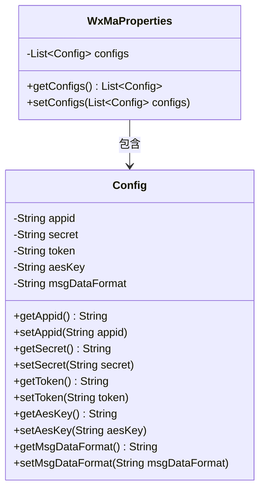
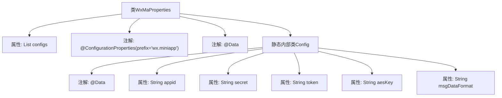

# 基础信息

|      |      |
|------|------|
| 名称 | WxMaProperties |
| 编码语言 | .java |
| 代码路径 | weixin-java-miniapp-demo/src/main/java/com/github/binarywang/demo/wx/miniapp/config/WxMaProperties.java |
| 包名 | com.github.binarywang.demo.wx.miniapp.config |
| 依赖项 | ['java.util.List', 'org.springframework.boot.context.properties.ConfigurationProperties', 'lombok.Data'] |
| 概述说明 | WxMaProperties类用于配置微信小程序属性，包含appid、secret、token、aesKey和msgDataFormat等字段。 |

# 说明

这是一个微信小程序配置属性的Java类定义。主类WxMaProperties使用@ConfigurationProperties注解绑定wx.miniapp前缀的配置，包含一个Config类型的列表configs。Config静态内部类定义了小程序相关配置项：appid（小程序ID）、secret（小程序密钥）、token（消息服务器令牌）、aesKey（消息加密密钥）、msgDataFormat（消息格式XML/JSON）。所有字段均使用@Data注解自动生成getter/setter方法。

# 类列表 Class Summary

| 名称   | 类型  | 说明 |
|-------|------|-------------|
| WxMaProperties | class | WxMaProperties类用于配置微信小程序属性，包含多个Config配置项，每个配置项包括appid、secret、token、aesKey和msgDataFormat等字段。 |

## 类 WxMaProperties

|      |      |
|------|------|
| 访问范围 | @Data;@ConfigurationProperties(prefix = "wx.miniapp");public |
| 类型 | class |
| 名称 | WxMaProperties |
| 说明 | WxMaProperties类用于配置微信小程序属性，包含多个Config配置项，每个配置项包括appid、secret、token、aesKey和msgDataFormat等字段。 |

### UML类图

这段代码定义了一个微信小程序配置类WxMaProperties，使用@ConfigurationProperties注解绑定"wx.miniapp"前缀的配置。它包含一个静态嵌套类Config，用于存储单个小程序的appid、secret、token等核心配置项。WxMaProperties通过List<Config>支持多小程序配置，利用Lombok的@Data注解自动生成getter/setter方法。类图清晰地展示了WxMaProperties对Config的聚合关系，以及Config类中所有字符串类型的配置字段。

### 内部方法调用关系图

这段代码定义了一个Spring Boot配置类WxMaProperties，用于映射wx.miniapp前缀的配置项。类中包含一个Config静态内部类的列表，Config类封装了微信小程序所需的5个核心配置参数：appid、secret、token、aesKey和msgDataFormat。通过Lombok的@Data注解自动生成getter/setter方法，@ConfigurationProperties注解实现配置自动绑定。该结构支持多小程序配置，每个Config实例对应一个小程序的配置参数集。

### 字段列表 Field List

| 名称  | 类型  | 说明 |
|-------|-------|------|
| configs | List<Config> | 私有配置列表，存储Config对象集合。 |

### 方法列表

| 名称  | 类型  | 说明 |
|-------|-------|------|

