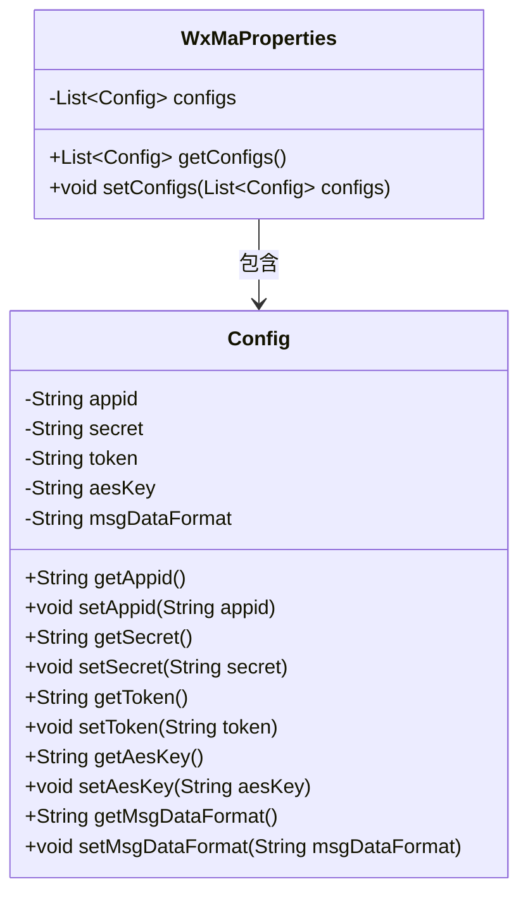
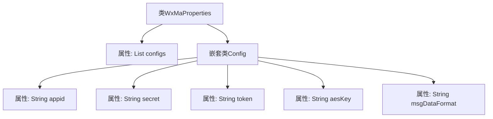

# 基础信息

|      |      |
|------|------|
| 名称 | WxMaProperties |
| 编码语言 | .java |
| 代码路径 | weixin-java-miniapp-demo/src/main/java/com/github/binarywang/demo/wx/miniapp/config/WxMaProperties.java |
| 包名 | com.github.binarywang.demo.wx.miniapp.config |
| 依赖项 | ['java.util.List', 'org.springframework.boot.context.properties.ConfigurationProperties', 'lombok.Data'] |
| 概述说明 | WxMaProperties类用于配置微信小程序属性，包含多个Config配置项，每个配置项有appid、secret、token、aesKey和msgDataFormat字段。 |

# 说明

该内容定义了一个微信小程序配置属性类WxMaProperties，使用@ConfigurationProperties注解绑定以wx.miniapp为前缀的配置。类中包含一个Config类型的列表configs，用于存储多个小程序配置。每个Config包含五个字段：appid（小程序ID）、secret（小程序密钥）、token（消息服务器令牌）、aesKey（消息加密密钥）和msgDataFormat（消息格式，XML或JSON）。通过@Data注解自动生成getter/setter方法。整体结构支持多小程序配置管理。

# 类列表 Class Summary

| 名称   | 类型  | 说明 |
|-------|------|-------------|
| WxMaProperties | class | WxMaProperties类定义微信小程序配置属性，包含多个Config对象，每个Config对象有appid、secret、token、aesKey和msgDataFormat字段。 |

## 类 WxMaProperties

|      |      |
|------|------|
| 访问范围 | @Data;@ConfigurationProperties(prefix = "wx.miniapp");public |
| 类型 | class |
| 名称 | WxMaProperties |
| 说明 | WxMaProperties类定义微信小程序配置属性，包含多个Config对象，每个Config对象有appid、secret、token、aesKey和msgDataFormat字段。 |

### UML类图

这段代码定义了一个微信小程序配置类WxMaProperties，使用@ConfigurationProperties注解绑定"wx.miniapp"前缀的配置。内部静态类Config封装了小程序的核心配置项：appid、secret、token、aesKey和消息格式msgDataFormat。类图展示了WxMaProperties通过聚合关系包含多个Config对象，所有字段都通过Lombok的@Data注解自动生成getter/setter方法，实现了配置属性的便捷管理。这种结构支持多小程序配置，适用于需要管理多个微信小程序参数的Spring Boot应用场景。

### 内部方法调用关系图

这段代码定义了一个Spring Boot配置类WxMaProperties，用于映射wx.miniapp前缀的配置项。核心结构包含一个主配置类和嵌套的Config静态类，主类通过configs列表管理多个小程序配置，每个Config对象存储appid、secret、token、aesKey和msgDataFormat等关键参数。通过Lombok的@Data注解自动生成getter/setter方法，简化了配置属性的封装逻辑。

### 字段列表 Field List

| 名称  | 类型  | 说明 |
|-------|-------|------|
| configs | List<Config> | 私有配置列表变量configs。 |

### 方法列表

| 名称  | 类型  | 说明 |
|-------|-------|------|

