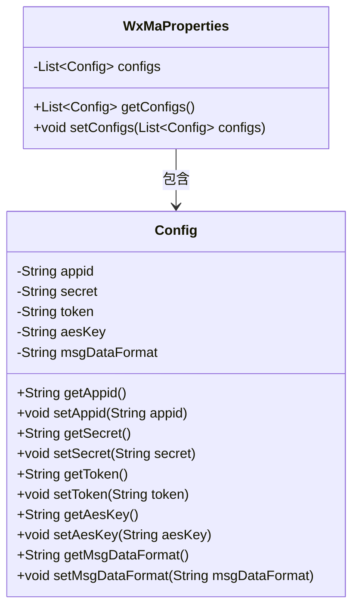

# 基础信息

|      |      |
|------|------|
| 名称 | WxMaProperties |
| 编码语言 | .java |
| 代码路径 | weixin-java-miniapp-demo/src/main/java/com/github/binarywang/demo/wx/miniapp/config/WxMaProperties.java |
| 包名 | com.github.binarywang.demo.wx.miniapp.config |
| 依赖项 | ['java.util.List', 'org.springframework.boot.context.properties.ConfigurationProperties', 'lombok.Data'] |
| 概述说明 | 这是一个微信小程序配置类，包含多个小程序配置项，每个配置项有appid、secret、token、aesKey和消息格式msgDataFormat等字段。 |

# 说明

这是一个用于配置微信小程序相关属性的Java类。主类WxMaProperties使用@ConfigurationProperties注解，前缀为wx.miniapp，包含一个Config类型的列表configs。Config类定义了微信小程序的核心配置项：appid（小程序ID）、secret（小程序密钥）、token（消息服务器令牌）、aesKey（消息加密密钥）和msgDataFormat（消息格式，支持XML或JSON）。所有字段都通过Lombok的@Data注解自动生成getter和setter方法。

# 类列表 Class Summary

| 名称   | 类型  | 说明 |
|-------|------|-------------|
| WxMaProperties | class | WxMaProperties类定义微信小程序配置属性，包含多个Config对象，每个Config设置appid、secret、token、aesKey和msgDataFormat等参数。 |

## 类 WxMaProperties

|      |      |
|------|------|
| 访问范围 | @Data;@ConfigurationProperties(prefix = "wx.miniapp");public |
| 类型 | class |
| 名称 | WxMaProperties |
| 说明 | WxMaProperties类定义微信小程序配置属性，包含多个Config对象，每个Config设置appid、secret、token、aesKey和msgDataFormat等参数。 |

### UML类图

这段代码描述了一个微信小程序配置类WxMaProperties，它包含一个Config类的列表configs。Config类封装了微信小程序的核心配置项，包括appid、secret、token、aesKey和msgDataFormat等属性。WxMaProperties类通过@ConfigurationProperties注解与配置文件绑定，Config作为其内部静态类，两者形成组合关系。所有字段都通过Lombok的@Data注解自动生成getter和setter方法，简化了代码结构。

### 内部方法调用关系图

该流程图展示了WxMaProperties类的结构及其嵌套类Config的组成。WxMaProperties作为主配置类，包含一个Config类型的列表属性configs。Config类则定义了微信小程序相关的5个核心配置属性：appid（应用ID）、secret（应用密钥）、token（消息验证令牌）、aesKey（加密密钥）和msgDataFormat（消息格式）。通过@ConfigurationProperties注解，该类支持从配置文件中自动注入以"wx.miniapp"为前缀的属性值。

### 字段列表 Field List

| 名称  | 类型  | 说明 |
|-------|-------|------|
| configs | List<Config> | 私有配置列表。 |

### 方法列表

| 名称  | 类型  | 说明 |
|-------|-------|------|

