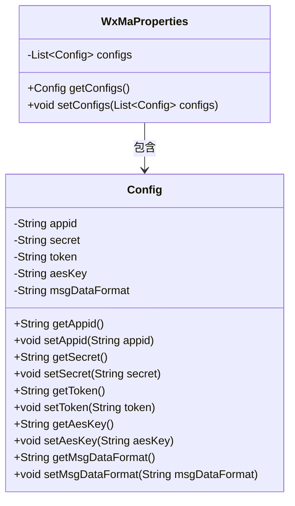
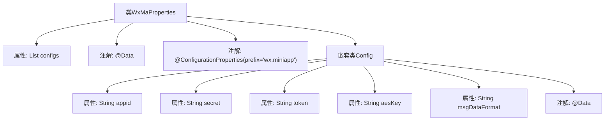

# 基础信息

|      |      |
|------|------|
| 名称 | WxMaProperties |
| 编码语言 | .java |
| 代码路径 | weixin-java-miniapp-demo/src/main/java/com/github/binarywang/demo/wx/miniapp/config/WxMaProperties.java |
| 包名 | com.github.binarywang.demo.wx.miniapp.config |
| 依赖项 | ['java.util.List', 'org.springframework.boot.context.properties.ConfigurationProperties', 'lombok.Data'] |
| 概述说明 | WxMaProperties类定义微信小程序配置属性，包含多个Config对象，每个Config对象有appid、secret、token、aesKey和msgDataFormat字段。 |

# 说明

该内容定义了一个名为WxMaProperties的Java类，用于配置微信小程序的相关属性。类使用了@Data和@ConfigurationProperties注解，前缀为wx.miniapp。包含一个Config类型的列表configs，每个Config对象包含五个字段：appid（小程序ID）、secret（小程序密钥）、token（消息服务器token）、aesKey（消息加密密钥）、msgDataFormat（消息格式，XML或JSON）。这些字段用于配置微信小程序的基本信息和消息服务器设置。

# 类列表 Class Summary

| 名称   | 类型  | 说明 |
|-------|------|-------------|
| WxMaProperties | class | WxMaProperties类定义微信小程序配置属性，包含多个Config对象，每个Config对象存储appid、secret、token、aesKey和msgDataFormat等配置信息。 |

## 类 WxMaProperties

|      |      |
|------|------|
| 访问范围 | @Data;@ConfigurationProperties(prefix = "wx.miniapp");public |
| 类型 | class |
| 名称 | WxMaProperties |
| 说明 | WxMaProperties类定义微信小程序配置属性，包含多个Config对象，每个Config对象存储appid、secret、token、aesKey和msgDataFormat等配置信息。 |

### UML类图

这段代码展示了一个微信小程序配置类WxMaProperties及其嵌套配置类Config的结构。WxMaProperties使用@ConfigurationProperties注解绑定"wx.miniapp"前缀的配置，包含一个Config类型的列表。Config类封装了小程序的appid、secret、token等核心配置项，所有字段均通过Lombok生成getter/setter。类图清晰地反映了主配置类与嵌套配置项的包含关系，以及各属性的访问控制权限。

### 内部方法调用关系图

这段代码定义了一个WxMaProperties类，用于配置微信小程序的相关属性。该类使用了Lombok的@Data注解自动生成getter/setter方法，并通过@ConfigurationProperties绑定"wx.miniapp"前缀的配置。内部嵌套了Config静态类，包含appid、secret、token等微信小程序核心配置项，同样使用@Data注解。流程图清晰展示了类结构、属性关系和注解的层级，体现了配置类的典型设计模式。

### 字段列表 Field List

| 名称  | 类型  | 说明 |
|-------|-------|------|
| configs | List<Config> | 声明一个私有列表变量configs，存储Config类型对象。 |

### 方法列表

| 名称  | 类型  | 说明 |
|-------|-------|------|

