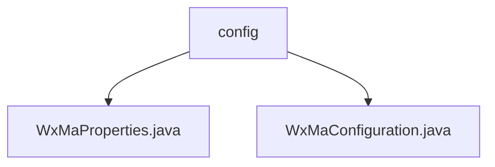

# 基础信息

|      |      |
|------|------|
| 名称 | config |
| 编码语言 | .java |
| 代码路径 | weixin-java-miniapp-demo/src/main/java/com/github/binarywang/demo/wx/miniapp/config |
| 包名 | docs.src.main.java.com.github.binarywang.demo.wx.miniapp.config |
| 概述说明 | WxMaProperties类配置微信小程序属性，含appid、secret等字段。WxMaConfiguration类初始化小程序服务和消息路由，处理订阅、文本等消息类型，含异常处理。 |

# 说明

## 概述  
该模块是微信小程序后端服务的配置中心，核心职责是管理多账号的小程序配置并初始化消息处理服务。接口规范遵循Spring Boot配置绑定，通过`@ConfigurationProperties`加载`wx.miniapp`前缀的配置项。关键数据结构包括`WxMaProperties`中的`Config`列表，包含AppID、Secret等认证字段，以及消息格式设置。外部依赖主要为微信小程序Java SDK和Spring Boot配置模块。例如，支持XML/JSON消息格式配置，并验证字段有效性。

## 主要业务场景  
模块用于快速初始化多账号的小程序服务实例，类似工厂模式，同时构建消息路由规则链。业务流程包括：读取配置→校验参数→创建服务→注册处理器（如订阅消息、图片上传等）。交互模式通过路由规则匹配消息类型并分发到对应处理器，类似事件总线模式。典型应用包括发送客服消息、生成二维码等。例如，捕获`WxErrorException`统一处理微信API异常。

### 包内部结构视图

该流程图展示了微信小程序demo项目中配置模块的文件结构。config目录下包含两个Java配置文件：WxMaProperties.java用于存储小程序属性配置，WxMaConfiguration.java负责小程序相关配置的初始化。这种结构清晰地分离了配置属性和配置逻辑。

# 文件列表

| 名称   | 类型  | 说明 |
|-------|------|-------------|
| [WxMaProperties.java](WxMaProperties.md) | file | WxMaProperties类定义微信小程序配置属性，包含多个Config对象，每个Config对象有appid、secret、token、aesKey和msgDataFormat字段。 |
| [WxMaConfiguration.java](WxMaConfiguration.md) | file | 微信小程序配置类，包含服务初始化和消息路由设置。通过WxMaProperties加载配置，创建WxMaService处理多账号，定义消息处理器处理订阅、文本、图片和二维码消息。 |

