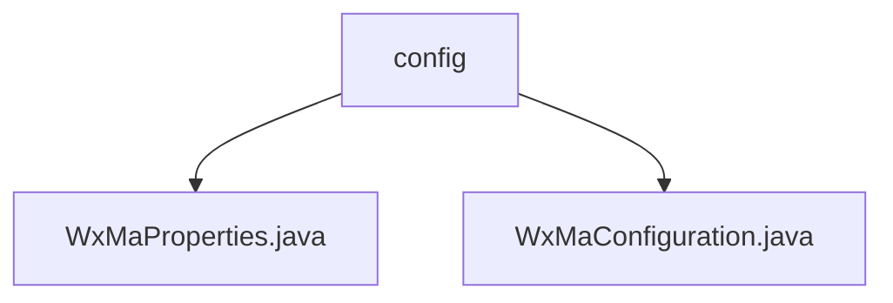

# 基础信息

|      |      |
|------|------|
| 名称 | config |
| 编码语言 | .java |
| 代码路径 | weixin-java-miniapp-demo/src/main/java/com/github/binarywang/demo/wx/miniapp/config |
| 包名 | docs.src.main.java.com.github.binarywang.demo.wx.miniapp.config |
| 概述说明 | WxMaProperties类配置微信小程序属性，含appid、secret等字段。WxMaConfiguration类初始化小程序服务，设置消息路由规则，处理文本、图片等消息。 |

# 说明

## 概述  
该模块是微信小程序后端服务的配置中心，核心职责是管理多账号配置和消息路由规则。通过WxMaProperties类定义小程序基础属性（如AppID/Secret），WxMaConfiguration类实现服务初始化和消息处理。关键数据结构包括Config列表（含5项认证字段）和消息路由器（类似事件总线模式）。依赖项仅微信SDK。例如支持多账号动态加载，消息处理涵盖文本/图片/二维码等场景。

## 主要业务场景  
模块主要处理两类流程：1) 服务初始化时校验配置并创建WxMaService实例；2) 消息路由时根据类型调用对应处理器（如上传图片到临时素材库）。典型交互模式为：用户消息→匹配处理器→通过客服接口响应。例如二维码消息触发生成并返回图片URL，订阅消息自动回复预设内容。完整功能覆盖从服务配置到消息分发的全链路。

### 包内部结构视图

该流程图展示了微信小程序demo项目中配置模块的层级结构。根节点为config目录，包含两个Java配置文件：WxMaProperties.java用于属性配置，WxMaConfiguration.java实现核心配置逻辑。这种结构体现了Spring Boot项目中典型的配置类组织方式。

# 文件列表

| 名称   | 类型  | 说明 |
|-------|------|-------------|
| [WxMaProperties.java](WxMaProperties.md) | file | WxMaProperties类定义微信小程序配置属性，包含多个Config对象，每个Config对象有appid、secret、token、aesKey和msgDataFormat字段。 |
| [WxMaConfiguration.java](WxMaConfiguration.md) | file | 微信小程序配置类，初始化服务及消息路由，处理订阅、文本、图片和二维码消息。 |

