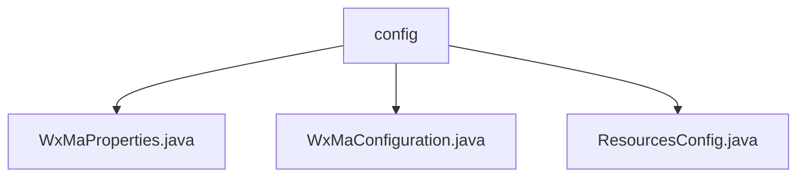

# 基础信息

|      |      |
|------|------|
| 名称 | config |
| 编码语言 | .java |
| 代码路径 | weixin-java-miniapp-demo/src/main/java/com/github/binarywang/demo/wx/miniapp/config |
| 包名 | docs.src.main.java.com.github.binarywang.demo.wx.miniapp.config |
| 概述说明 | 微信小程序Java配置类：WxMaProperties定义小程序核心配置项；WxMaConfiguration初始化多账号服务及消息路由；ResourcesConfig配置本地文件存储和跨域访问。 |

# 说明

## 概述  
该模块是微信小程序后端的Java配置中心，核心职责为管理小程序账号配置、初始化服务实例及处理消息路由。接口规范统一采用Spring Boot配置风格，例如`@ConfigurationProperties`定义小程序属性，`WebMvcConfigurer`处理资源映射。关键数据结构包括`WxMaProperties.Config`（含appid/secret等字段）和消息路由器规则。外部依赖Spring Boot、Lombok及微信SDK。例如通过`msgDataFormat`配置消息格式，或跨域设置允许GET访问资源。

## 主要业务场景  
模块支持多账号小程序服务初始化，类似微服务配置中心模式。业务流程包括：校验配置→创建服务实例→注册消息处理器（如文本/图片处理）。交互模式通过注解驱动，例如`@Value`注入文件路径。典型应用包含配置群发消息、生成二维码等微信生态功能。API类型涵盖REST资源映射（如本地文件访问）和消息路由API（如订阅消息回调）。例如图片上传后触发媒体文件处理器并返回CDN链接。

### 包内部结构视图

该流程图展示了微信小程序demo项目中config目录下的文件结构关系。顶层节点为config文件夹，其下包含三个配置文件：WxMaProperties.java、WxMaConfiguration.java和ResourcesConfig.java。这些文件都属于微信小程序的基础配置类，分别处理不同方面的配置信息，共同构成了项目的配置模块。

# 文件列表

| 名称   | 类型  | 说明 |
|-------|------|-------------|
| [WxMaProperties.java](WxMaProperties.md) | file | 这是一个微信小程序配置类，包含多个小程序配置项，每个配置项有appid、secret、token、aesKey和消息格式msgDataFormat等字段。 |
| [WxMaConfiguration.java](WxMaConfiguration.md) | file | 这是一个微信小程序配置类，包含服务初始化和消息路由设置。通过WxMaProperties加载配置，创建WxMaService实例处理多账号配置。消息路由器定义了不同内容类型的处理逻辑，包括订阅消息、文本、图片和二维码的响应处理。 |
| [ResourcesConfig.java](ResourcesConfig.md) | file | 资源配置类，定义本地文件路径和前缀，映射资源路径并启用跨域支持，允许GET请求访问。 |

