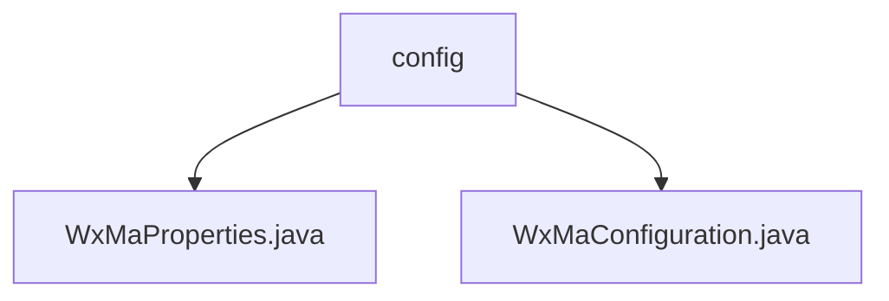

# 基础信息

|      |      |
|------|------|
| 名称 | config |
| 编码语言 | .java |
| 代码路径 | weixin-java-miniapp-demo/src/main/java/com/github/binarywang/demo/wx/miniapp/config |
| 包名 | docs.src.main.java.com.github.binarywang.demo.wx.miniapp.config |
| 概述说明 | 微信小程序Java配置类：WxMaProperties绑定小程序配置项（ID、密钥等），WxMaConfiguration初始化服务并处理消息路由（文本、图片等回复逻辑）。 |

# 说明

## 概述  
该模块是微信小程序后端服务的Java实现，核心职责是管理小程序配置属性和初始化消息处理服务。接口规范包括通过`wx.miniapp`前缀注入配置，以及定义消息路由规则链。关键数据结构为`WxMaProperties.Config`类，包含AppID、密钥等字段。外部依赖项包括Spring配置注解、Lombok和微信SDK。例如，配置类支持多账号参数校验，消息处理器实现二维码生成等逻辑。

## 主要业务场景  
模块主要处理小程序服务初始化和消息交互，类似事件总线模式。业务流程包括加载配置、创建`WxMaService`实例、注册消息处理器链。交互模式涵盖文本/图片回复、订阅消息推送等场景。例如，图片处理器会上传媒体文件，二维码处理器生成带参二维码。API类型集中在小程序服务配置和消息路由，集成案例展示多账号管理和链式消息响应。

### 包内部结构视图

该流程图展示了微信小程序demo项目中配置模块的层级结构。根节点为config目录，包含两个Java配置文件：WxMaProperties.java和WxMaConfiguration.java。这两个文件分别用于处理小程序属性配置和整体配置逻辑，共同构成了项目的基础配置模块。结构清晰体现了配置文件的组织方式，符合典型Spring Boot应用的配置管理规范。

# 文件列表

| 名称   | 类型  | 说明 |
|-------|------|-------------|
| [WxMaProperties.java](WxMaProperties.md) | file | WxMaProperties类用于配置微信小程序属性，包含appid、secret、token、aesKey和msgDataFormat等字段。 |
| [WxMaConfiguration.java](WxMaConfiguration.md) | file | 微信小程序配置类，包含服务初始化和消息路由设置，支持多种消息处理如文本、图片、二维码等。 |

