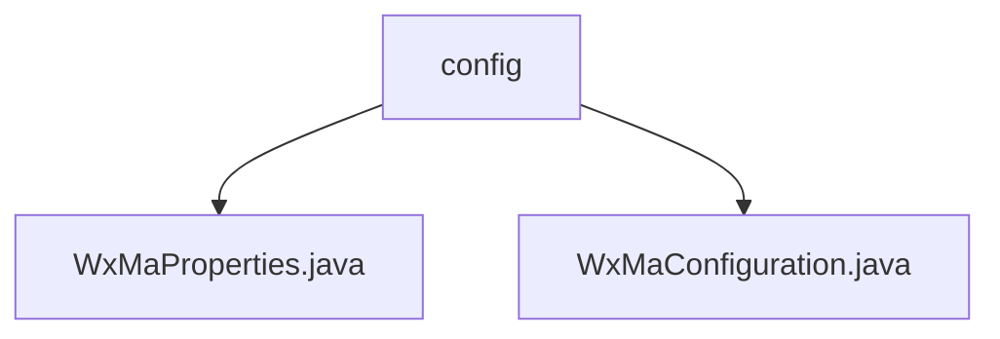

# 基础信息

|      |      |
|------|------|
| 名称 | config |
| 编码语言 | .java |
| 代码路径 | weixin-java-miniapp-demo/src/main/java/com/github/binarywang/demo/wx/miniapp/config |
| 包名 | docs.src.main.java.com.github.binarywang.demo.wx.miniapp.config |
| 概述说明 | 微信小程序配置类WxMaProperties绑定wx.miniapp前缀，含多小程序配置列表，每个配置含appid、secret等字段。WxMaConfiguration类初始化小程序服务并配置消息路由，处理文本、图片等消息类型，含上传和生成功能。 |

# 说明

## 概述  
该模块核心职责是管理微信小程序的多账号配置和消息路由，支持动态初始化服务及处理各类消息事件。采用Spring Boot的@ConfigurationProperties绑定配置，类似工厂模式创建多实例服务。关键数据结构包括WxMaProperties.Config（含appid/secret等字段）和消息路由器定义的处理器映射。外部依赖仅为微信小程序SDK。例如Config存储小程序密钥，消息处理器处理图片上传等操作。

## 主要业务场景  
模块主要实现多小程序账号的集中配置和消息分发，类似事件总线模式。业务流程包括：初始化时校验配置并创建服务实例；消息路由根据类型（文本/图片等）调用对应处理器，例如二维码消息触发媒体上传后生成响应。集成案例展示五类消息处理，均遵循"接收-处理-日志"模式，异常通过日志记录不阻断流程。

### 包内部结构视图

该流程图展示了微信小程序Demo项目中配置模块的层级结构。根节点为config目录，其下包含两个Java配置文件：WxMaProperties.java用于存储小程序属性配置，WxMaConfiguration.java负责初始化微信小程序相关配置。这种结构清晰体现了Spring Boot项目中典型的配置类组织方式，通过独立文件分离不同配置关注点。

# 文件列表

| 名称   | 类型  | 说明 |
|-------|------|-------------|
| [WxMaProperties.java](WxMaProperties.md) | file | WxMaProperties类用于配置微信小程序属性，包含多个Config配置项，每个配置项有appid、secret、token、aesKey和msgDataFormat字段。 |
| [WxMaConfiguration.java](WxMaConfiguration.md) | file | 微信小程序配置类，初始化WxMaService和消息路由，处理订阅、文本、图片、二维码等消息类型。 |

