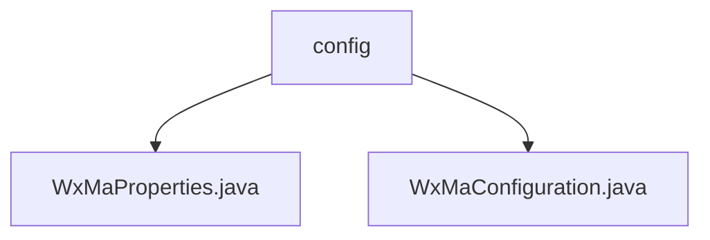

# 基础信息

|      |      |
|------|------|
| 名称 | config |
| 编码语言 | .java |
| 代码路径 | weixin-java-miniapp-demo/src/main/java/com/github/binarywang/demo/wx/miniapp/config |
| 包名 | docs.src.main.java.com.github.binarywang.demo.wx.miniapp.config |
| 概述说明 | WxMaProperties类配置微信小程序属性，含appid、secret等字段。WxMaConfiguration类初始化小程序服务和消息路由，定义各类消息处理器逻辑。 |

# 说明

## 概述  
该模块是微信小程序服务端的Java配置实现，核心职责是管理小程序的多账号配置和初始化消息处理服务。接口规范遵循Spring Boot的@ConfigurationProperties标准，支持XML/JSON消息格式。关键数据结构包括WxMaProperties（含Config列表）和消息路由器规则。外部依赖项包含Lombok和微信SDK。例如Config类定义了appid/secret等字段，消息路由器则处理订阅消息和媒体文件。

## 主要业务场景  
模块主要完成小程序服务的多账号初始化和消息路由配置，类似工厂模式创建服务实例。业务流程包括配置校验、服务实例化和处理器注册，例如文本消息触发客服响应，二维码生成使用Media API。典型应用模式为启动时加载配置，运行时通过路由器分发消息到对应处理器。API类型涵盖RESTful配置和事件回调，集成案例包括订阅消息推送和媒体文件管理。

### 包内部结构视图

该流程图展示了微信小程序demo项目中配置模块的层级结构。config目录下包含两个Java配置文件：WxMaProperties.java用于存储小程序属性配置，WxMaConfiguration.java负责小程序服务的初始化配置。这两个文件共同构成了小程序的基础配置体系。

# 文件列表

| 名称   | 类型  | 说明 |
|-------|------|-------------|
| [WxMaProperties.java](WxMaProperties.md) | file | 这是一个微信小程序配置类，包含多个小程序配置项，每个配置项有appid、secret、token、aesKey和消息格式msgDataFormat等字段。 |
| [WxMaConfiguration.java](WxMaConfiguration.md) | file | 这是一个微信小程序配置类，包含服务初始化和消息路由设置。通过WxMaProperties加载配置，创建WxMaService实例处理多账号配置。消息路由器定义了不同内容类型的处理逻辑，包括订阅消息、文本、图片和二维码的响应处理。 |

