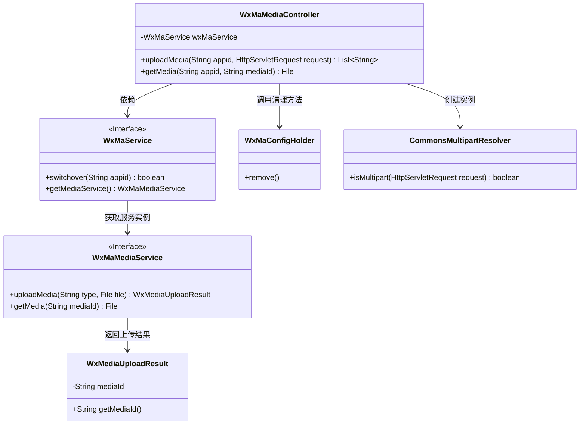
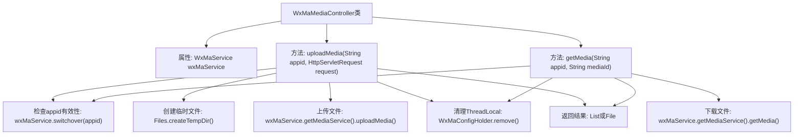

# 基础信息

|      |      |
|------|------|
| 名称 | WxMaMediaController |
| 编码语言 | .java |
| 代码路径 | weixin-java-miniapp-demo/src/main/java/com/github/binarywang/demo/wx/miniapp/controller/WxMaMediaController.java |
| 包名 | com.github.binarywang.demo.wx.miniapp.controller |
| 依赖项 | ['cn.binarywang.wx.miniapp.api.WxMaService', 'cn.binarywang.wx.miniapp.constant.WxMaConstants', 'cn.binarywang.wx.miniapp.util.WxMaConfigHolder', 'com.google.common.collect.Lists', 'com.google.common.io.Files', 'lombok.AllArgsConstructor', 'lombok.extern.slf4j.Slf4j', 'me.chanjar.weixin.common.bean.result.WxMediaUploadResult', 'me.chanjar.weixin.common.error.WxErrorException', 'org.springframework.web.bind.annotation', 'org.springframework.web.multipart.MultipartFile', 'org.springframework.web.multipart.MultipartHttpServletRequest', 'org.springframework.web.multipart.commons.CommonsMultipartResolver', 'javax.servlet.http.HttpServletRequest', 'java.io.File', 'java.io.IOException', 'java.util.Iterator', 'java.util.List'] |
| 概述说明 | 这是一个微信小程序媒体控制器类，包含上传和下载临时素材功能。上传方法接收appid和请求，验证配置后处理多文件上传，返回media_id列表。下载方法根据appid和mediaId获取素材文件。操作后清理ThreadLocal。 |

# 说明

这是一个微信小程序媒体文件管理的控制器类，包含上传和下载临时素材的功能。上传功能通过POST请求接收多文件，验证appid有效性后，将文件保存到临时目录并上传至微信服务器，返回media_id列表。下载功能通过GET请求根据mediaId获取对应的媒体文件。两个操作完成后都会清理ThreadLocal中的配置信息。类中使用了日志记录关键操作信息，并对异常情况进行处理。

# 类列表 Class Summary

| 名称   | 类型  | 说明 |
|-------|------|-------------|
| WxMaMediaController | class | WxMaMediaController处理微信小程序临时素材上传和下载。上传接口接收文件并返回media_id，下载接口根据media_id获取文件。包含appid校验和ThreadLocal清理。 |

## 类 WxMaMediaController

|      |      |
|------|------|
| 访问范围 | @RestController;@AllArgsConstructor;@Slf4j;@RequestMapping("/wx/media/{appid}");public |
| 类型 | class |
| 名称 | WxMaMediaController |
| 说明 | WxMaMediaController处理微信小程序临时素材上传和下载。上传接口接收文件并返回media_id，下载接口根据media_id获取文件。包含appid校验和ThreadLocal清理。 |

### UML类图

该类图展示了微信小程序素材管理控制器的核心结构。WxMaMediaController作为REST控制器，通过WxMaService接口操作媒体服务，依赖CommonsMultipartResolver处理文件上传，并使用WxMaConfigHolder管理线程局部变量。WxMaMediaService接口定义了素材上传下载方法，返回WxMediaUploadResult对象包含媒体ID。整个设计采用分层架构，控制器层与业务服务层解耦，符合Spring MVC的典型模式。

### 内部方法调用关系图

流程图描述：该流程图展示了WxMaMediaController类的核心结构，包含两个主要方法uploadMedia和getMedia。上传流程首先验证appid，处理多部分请求并迭代上传文件到临时目录，最后返回media_id列表；下载流程同样验证appid后直接获取媒体文件。两个方法均包含ThreadLocal清理操作，确保线程安全。箭头清晰表示了从方法调用到结果返回的完整链路。

### 字段列表 Field List

| 名称  | 类型  | 说明 |
|-------|-------|------|
| wxMaService | WxMaService | 私有不可变的微信小程序服务实例变量wxMaService。 |

### 方法列表

| 名称  | 类型  | 说明 |
|-------|-------|------|
| uploadMedia | List<String> | Java方法：处理微信小程序上传媒体文件，验证appid，解析多部分请求，保存临时文件并返回媒体ID列表。 |
| getMedia | File | 该代码是一个基于Spring的GET接口，用于下载媒体文件。首先检查appid配置是否存在，不存在则抛出异常；存在则通过微信服务获取媒体文件，最后清理ThreadLocal并返回文件。 |

