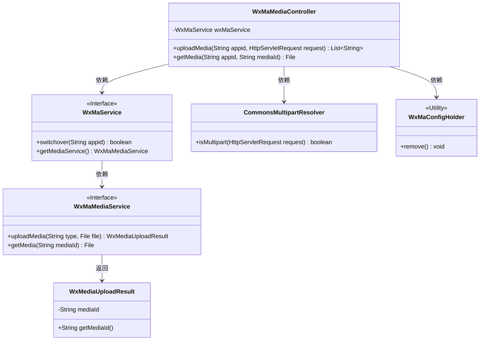
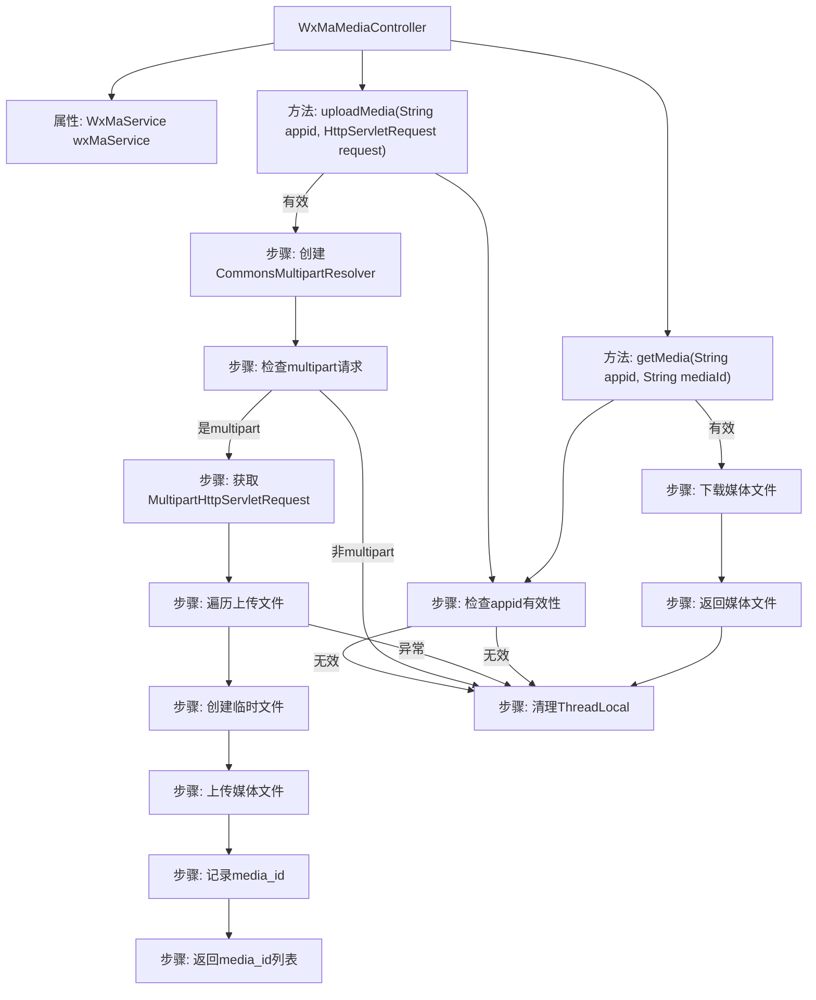

# 基础信息

|      |      |
|------|------|
| 名称 | WxMaMediaController |
| 编码语言 | .java |
| 代码路径 | weixin-java-miniapp-demo/src/main/java/com/github/binarywang/demo/wx/miniapp/controller/WxMaMediaController.java |
| 包名 | com.github.binarywang.demo.wx.miniapp.controller |
| 依赖项 | ['cn.binarywang.wx.miniapp.api.WxMaService', 'cn.binarywang.wx.miniapp.constant.WxMaConstants', 'cn.binarywang.wx.miniapp.util.WxMaConfigHolder', 'com.google.common.collect.Lists', 'com.google.common.io.Files', 'lombok.AllArgsConstructor', 'lombok.extern.slf4j.Slf4j', 'me.chanjar.weixin.common.bean.result.WxMediaUploadResult', 'me.chanjar.weixin.common.error.WxErrorException', 'org.springframework.web.bind.annotation', 'org.springframework.web.multipart.MultipartFile', 'org.springframework.web.multipart.MultipartHttpServletRequest', 'org.springframework.web.multipart.commons.CommonsMultipartResolver', 'javax.servlet.http.HttpServletRequest', 'java.io.File', 'java.io.IOException', 'java.util.Iterator', 'java.util.List'] |
| 概述说明 | 微信小程序媒体控制器，提供上传和下载临时素材功能。上传需验证appid，支持多文件处理，返回media_id列表。下载需验证appid和media_id，返回媒体文件。操作后清理ThreadLocal。 |

# 说明

这是一个微信小程序媒体文件管理的控制器类，提供上传和下载临时素材的功能。上传接口接收多文件请求，验证appid有效性后，将文件保存到临时目录并上传至微信服务器，返回media_id列表。下载接口根据mediaId获取媒体文件。两个操作都包含ThreadLocal清理逻辑，确保线程安全。

# 类列表 Class Summary

| 名称   | 类型  | 说明 |
|-------|------|-------------|
| WxMaMediaController | class | 微信小程序素材控制器，提供上传和下载临时素材功能。上传返回media_id列表，下载返回文件。检查appid有效性，处理多文件上传，清理ThreadLocal。 |

## 类 WxMaMediaController

|      |      |
|------|------|
| 访问范围 | @RestController;@AllArgsConstructor;@Slf4j;@RequestMapping("/wx/media/{appid}");public |
| 类型 | class |
| 名称 | WxMaMediaController |
| 说明 | 微信小程序素材控制器，提供上传和下载临时素材功能。上传返回media_id列表，下载返回文件。检查appid有效性，处理多文件上传，清理ThreadLocal。 |

### UML类图

类图描述：该图展示了一个微信小程序多媒体控制器（WxMaMediaController）的核心结构，它通过WxMaService接口操作多媒体服务，依赖CommonsMultipartResolver处理文件上传，并使用WxMaConfigHolder管理线程局部变量。控制器提供上传/下载临时素材功能，与WxMaMediaService交互并返回WxMediaUploadResult结果对象，体现了清晰的层级和依赖关系。

### 内部方法调用关系图

这段代码是一个微信小程序媒体文件上传和下载的控制器，主要包含两个核心方法：uploadMedia用于处理多文件上传，将文件临时存储后调用微信接口获取media_id；getMedia则根据media_id下载对应的媒体文件。流程中严格检查appid有效性，使用ThreadLocal管理配置，并妥善处理文件操作和异常情况，最后都会清理ThreadLocal资源。

### 字段列表 Field List

| 名称  | 类型  | 说明 |
|-------|-------|------|
| wxMaService | WxMaService | 微信小程序服务实例，私有不可变。 |

### 方法列表

| 名称  | 类型  | 说明 |
|-------|-------|------|
| uploadMedia | List<String> | 处理上传媒体文件的接口，验证appid后解析多部分请求，逐个上传文件并返回媒体ID列表，最后清理线程本地存储。 |
| getMedia | File | 这是一个微信小程序媒体文件下载接口，通过appid和mediaId获取文件，检查配置后返回媒体文件并清理线程本地存储。 |

