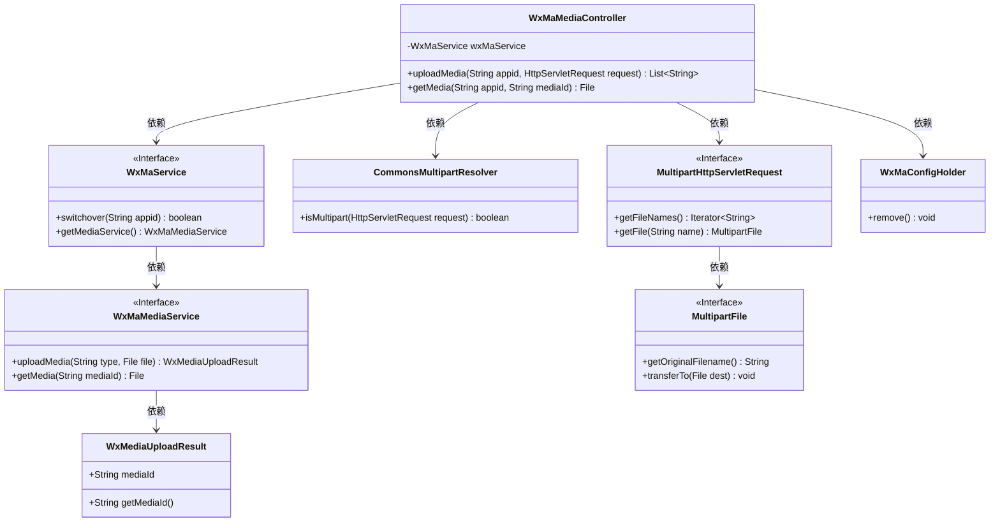
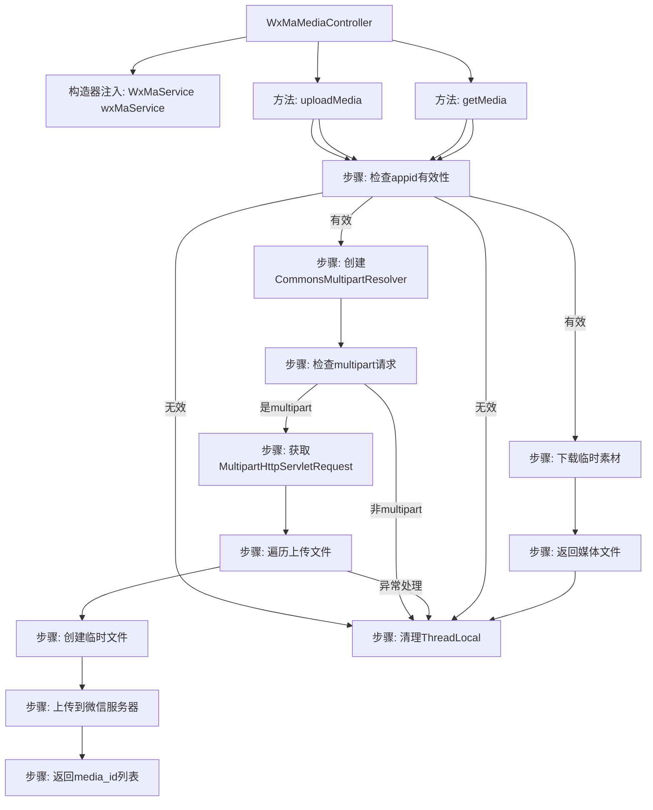
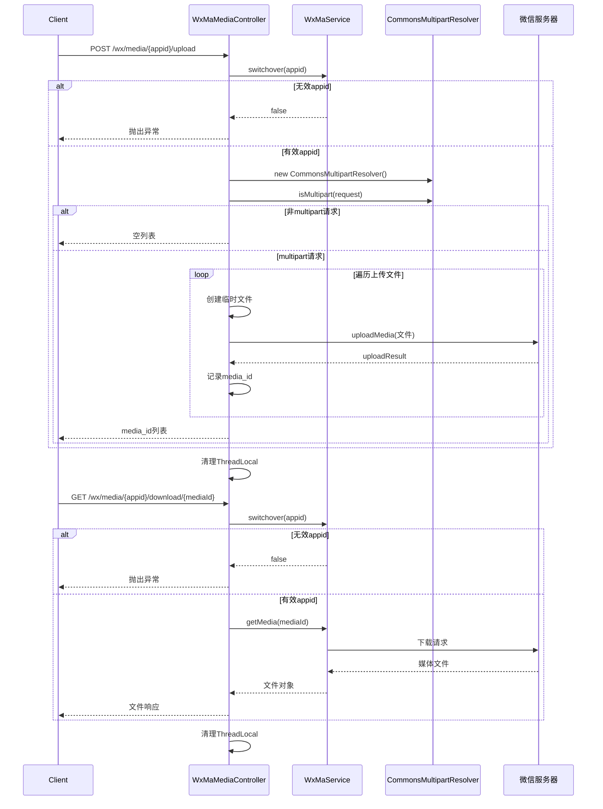

# 基础信息

|      |      |
|------|------|
| 名称 | WxMaMediaController |
| 编码语言 | .java |
| 代码路径 | weixin-java-miniapp-demo/src/main/java/com/github/binarywang/demo/wx/miniapp/controller/WxMaMediaController.java |
| 包名 | com.github.binarywang.demo.wx.miniapp.controller |
| 依赖项 | ['cn.binarywang.wx.miniapp.api.WxMaService', 'cn.binarywang.wx.miniapp.constant.WxMaConstants', 'cn.binarywang.wx.miniapp.util.WxMaConfigHolder', 'com.google.common.collect.Lists', 'com.google.common.io.Files', 'lombok.AllArgsConstructor', 'lombok.extern.slf4j.Slf4j', 'me.chanjar.weixin.common.bean.result.WxMediaUploadResult', 'me.chanjar.weixin.common.error.WxErrorException', 'org.springframework.web.bind.annotation', 'org.springframework.web.multipart.MultipartFile', 'org.springframework.web.multipart.MultipartHttpServletRequest', 'org.springframework.web.multipart.commons.CommonsMultipartResolver', 'javax.servlet.http.HttpServletRequest', 'java.io.File', 'java.io.IOException', 'java.util.Iterator', 'java.util.List'] |
| 概述说明 | 微信小程序媒体控制器，提供上传和下载临时素材功能。上传需校验appid，支持多文件处理，返回media_id列表。下载需校验appid和media_id，返回媒体文件。操作后清理ThreadLocal。 |

# 说明

这是一个微信小程序媒体文件管理控制器类，包含上传和下载临时素材功能。上传接口接收多文件请求，验证appid有效性后保存到临时目录并返回media_id列表。下载接口根据mediaId返回对应文件。两个方法都包含ThreadLocal清理逻辑，上传过程会记录文件路径和media_id，异常时记录错误日志。

# 类列表 Class Summary

| 名称   | 类型  | 说明 |
|-------|------|-------------|
| WxMaMediaController | class | 这是一个微信小程序媒体文件控制器，包含上传和下载临时素材功能。上传接口接收文件并返回media_id，下载接口通过media_id获取文件。处理前后会清理ThreadLocal数据。 |

## 类 WxMaMediaController

|      |      |
|------|------|
| 访问范围 | @RestController;@AllArgsConstructor;@Slf4j;@RequestMapping("/wx/media/{appid}");public |
| 类型 | class |
| 名称 | WxMaMediaController |
| 说明 | 这是一个微信小程序媒体文件控制器，包含上传和下载临时素材功能。上传接口接收文件并返回media_id，下载接口通过media_id获取文件。处理前后会清理ThreadLocal数据。 |

### UML类图

该代码是一个微信小程序媒体文件上传下载的控制器，主要包含两个核心功能：通过HTTP接口上传临时素材到微信服务器（返回media_id列表）和根据media_id下载临时素材。控制器依赖WxMaService进行微信API操作，使用CommonsMultipartResolver处理多部分请求，并通过ThreadLocal机制管理配置。整个设计遵循Spring MVC模式，包含完善的异常处理和日志记录，特别注意了资源清理和线程安全。

### 内部方法调用关系图

流程图描述了微信素材控制器的两个核心方法：文件上传和下载。上传流程包含11个关键步骤，从参数校验到分块处理多文件上传；下载流程包含6个步骤，同样需要先验证appid有效性。两个方法最后都会清理ThreadLocal存储的配置信息，时序图则详细展示了客户端与服务器间的交互过程，包括异常处理分支和微信服务调用。

### 字段列表 Field List

| 名称  | 类型  | 说明 |
|-------|-------|------|
| wxMaService | WxMaService | 微信小程序服务实例，不可修改。 |

### 方法列表

| 名称  | 类型  | 说明 |
|-------|-------|------|
| getMedia | File | 这是一个基于Spring框架的GET接口，用于下载媒体文件。接口接收appid和mediaId参数，验证配置后返回媒体文件，并清理ThreadLocal。 |
| uploadMedia | List<String> | 上传媒体文件接口，校验appid后处理多文件上传，返回微信媒体ID列表。异常时记录日志并清理线程变量。 |

