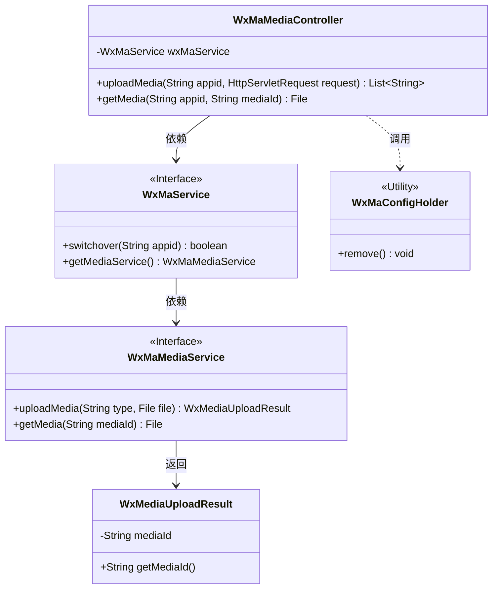
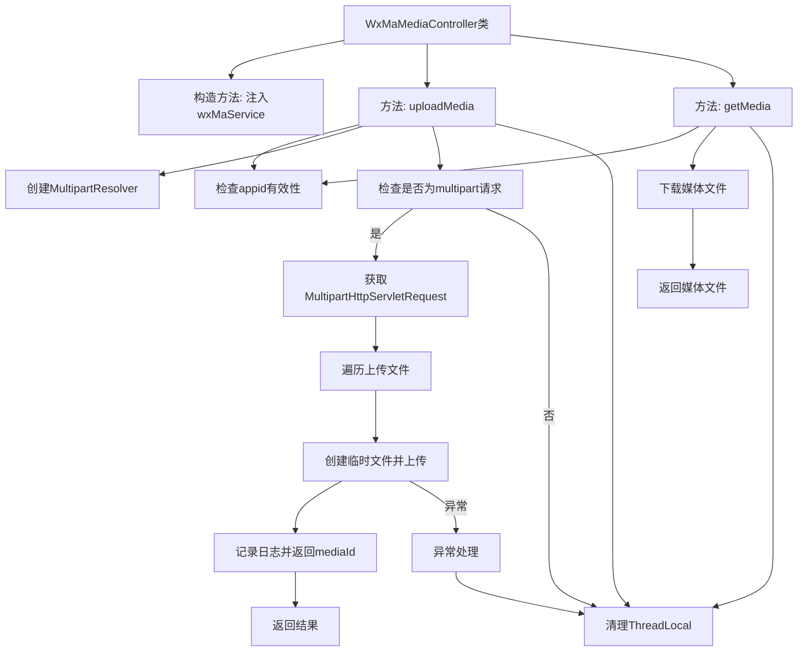

# 基础信息

|      |      |
|------|------|
| 名称 | WxMaMediaController |
| 编码语言 | .java |
| 代码路径 | weixin-java-miniapp-demo/src/main/java/com/github/binarywang/demo/wx/miniapp/controller/WxMaMediaController.java |
| 包名 | com.github.binarywang.demo.wx.miniapp.controller |
| 依赖项 | ['cn.binarywang.wx.miniapp.api.WxMaService', 'cn.binarywang.wx.miniapp.constant.WxMaConstants', 'cn.binarywang.wx.miniapp.util.WxMaConfigHolder', 'com.google.common.collect.Lists', 'com.google.common.io.Files', 'lombok.AllArgsConstructor', 'lombok.extern.slf4j.Slf4j', 'me.chanjar.weixin.common.bean.result.WxMediaUploadResult', 'me.chanjar.weixin.common.error.WxErrorException', 'org.springframework.web.bind.annotation', 'org.springframework.web.multipart.MultipartFile', 'org.springframework.web.multipart.MultipartHttpServletRequest', 'org.springframework.web.multipart.commons.CommonsMultipartResolver', 'javax.servlet.http.HttpServletRequest', 'java.io.File', 'java.io.IOException', 'java.util.Iterator', 'java.util.List'] |
| 概述说明 | 微信小程序媒体控制器，提供上传和下载临时素材功能。上传返回media_id列表，下载返回媒体文件。检查appid有效性，处理多文件上传，清理ThreadLocal资源。 |

# 说明

这是一个微信小程序媒体文件管理的控制器类，包含上传和下载临时素材功能。上传接口接收多部分文件请求，验证appid配置后，将文件保存到临时目录并上传至微信服务器，返回media_id列表。下载接口根据mediaId获取对应媒体文件。两个操作都包含ThreadLocal清理逻辑，确保线程安全。上传过程记录文件路径和media_id，异常时记录错误日志。

# 类列表 Class Summary

| 名称   | 类型  | 说明 |
|-------|------|-------------|
| WxMaMediaController | class | 微信小程序媒体控制器，提供上传和下载临时素材功能。上传需验证appid，支持多文件处理，返回media_id列表。下载需验证appid和media_id，返回媒体文件。操作后清理ThreadLocal。 |

## 类 WxMaMediaController

|      |      |
|------|------|
| 访问范围 | @RestController;@AllArgsConstructor;@Slf4j;@RequestMapping("/wx/media/{appid}");public |
| 类型 | class |
| 名称 | WxMaMediaController |
| 说明 | 微信小程序媒体控制器，提供上传和下载临时素材功能。上传需验证appid，支持多文件处理，返回media_id列表。下载需验证appid和media_id，返回媒体文件。操作后清理ThreadLocal。 |

### UML类图

类图描述：该图展示了一个微信小程序媒体控制器(WxMaMediaController)的结构，它通过WxMaService接口操作媒体服务，包含上传和下载临时素材的方法。控制器依赖WxMaService来切换应用配置和获取媒体服务实例，WxMaMediaService接口定义了具体的媒体操作，返回WxMediaUploadResult对象。WxMaConfigHolder作为工具类用于清理线程本地变量。整个设计遵循了依赖接口编程的原则。

### 内部方法调用关系图

这段代码是一个微信小程序媒体文件上传下载的控制器，主要包含两个核心方法：uploadMedia用于处理多文件上传，将文件暂存到临时目录后调用微信接口获取mediaId；getMedia则根据mediaId下载对应的媒体文件。流程中严格检查appid有效性，使用ThreadLocal管理配置，并包含完善的异常处理和日志记录。所有操作完成后都会清理ThreadLocal资源，确保线程安全。

### 字段列表 Field List

| 名称  | 类型  | 说明 |
|-------|-------|------|
| wxMaService | WxMaService | 微信小程序服务实例私有常量。 |

### 方法列表

| 名称  | 类型  | 说明 |
|-------|-------|------|
| uploadMedia | List<String> | 该代码是一个处理文件上传的Spring接口，验证appid后接收多文件请求，将文件暂存并上传至微信服务器，返回媒体ID列表，最后清理线程本地变量。 |
| getMedia | File | Java方法：通过appid和mediaId下载微信媒体文件，验证配置后返回文件并清理ThreadLocal。 |

