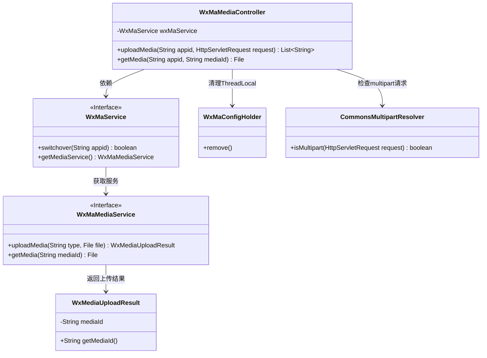
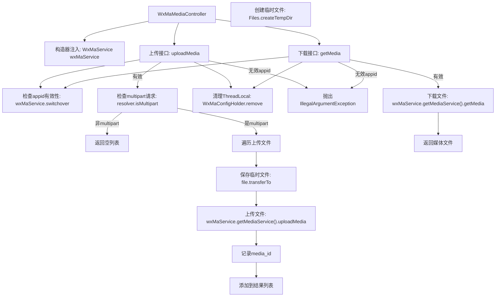
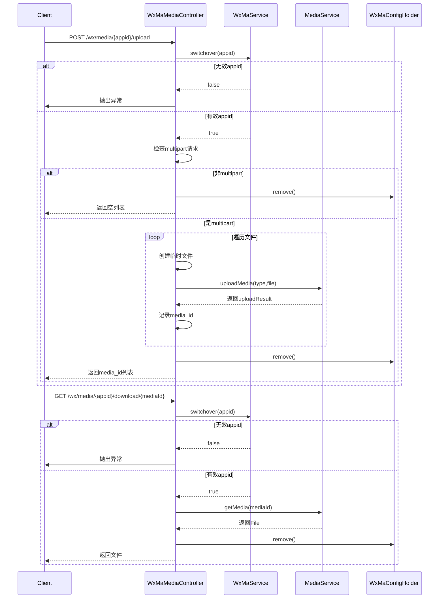

# 基础信息

|      |      |
|------|------|
| 名称 | WxMaMediaController |
| 编码语言 | .java |
| 代码路径 | weixin-java-miniapp-demo/src/main/java/com/github/binarywang/demo/wx/miniapp/controller/WxMaMediaController.java |
| 包名 | com.github.binarywang.demo.wx.miniapp.controller |
| 依赖项 | ['cn.binarywang.wx.miniapp.api.WxMaService', 'cn.binarywang.wx.miniapp.constant.WxMaConstants', 'cn.binarywang.wx.miniapp.util.WxMaConfigHolder', 'com.google.common.collect.Lists', 'com.google.common.io.Files', 'lombok.AllArgsConstructor', 'lombok.extern.slf4j.Slf4j', 'me.chanjar.weixin.common.bean.result.WxMediaUploadResult', 'me.chanjar.weixin.common.error.WxErrorException', 'org.springframework.web.bind.annotation', 'org.springframework.web.multipart.MultipartFile', 'org.springframework.web.multipart.MultipartHttpServletRequest', 'org.springframework.web.multipart.commons.CommonsMultipartResolver', 'javax.servlet.http.HttpServletRequest', 'java.io.File', 'java.io.IOException', 'java.util.Iterator', 'java.util.List'] |
| 概述说明 | 微信小程序素材控制器，提供上传和下载临时素材功能。上传返回media_id列表，下载返回文件。需校验appid有效性，操作后清理ThreadLocal。 |

# 说明

这是一个微信小程序媒体文件管理的控制器类，包含上传和下载临时素材的功能。上传接口接收appid和HTTP请求，验证配置后处理多文件上传，返回media_id列表。下载接口根据appid和mediaId获取媒体文件。两个操作都包含ThreadLocal清理逻辑，上传过程涉及临时文件创建和异常处理，下载直接返回文件对象。类使用Lombok简化日志和构造器代码。

# 类列表 Class Summary

| 名称   | 类型  | 说明 |
|-------|------|-------------|
| WxMaMediaController | class | 这是一个微信小程序媒体控制器类，包含上传和下载临时素材功能。上传接口接收文件并返回media_id列表，下载接口通过media_id获取文件。处理前后会清理ThreadLocal，并验证appid配置是否存在。 |

## 类 WxMaMediaController

|      |      |
|------|------|
| 访问范围 | @RestController;@AllArgsConstructor;@Slf4j;@RequestMapping("/wx/media/{appid}");public |
| 类型 | class |
| 名称 | WxMaMediaController |
| 说明 | 这是一个微信小程序媒体控制器类，包含上传和下载临时素材功能。上传接口接收文件并返回media_id列表，下载接口通过media_id获取文件。处理前后会清理ThreadLocal，并验证appid配置是否存在。 |

### UML类图

类图描述：该图展示了一个微信小程序素材管理控制器(WxMaMediaController)的核心结构，通过依赖WxMaService接口实现多账号切换和素材服务获取。控制器包含上传/下载素材方法，涉及文件处理、ThreadLocal清理及异常处理。WxMaService通过接口隔离具体实现，与媒体服务(WxMaMediaService)交互，返回包含mediaId的上传结果(WxMediaUploadResult)。整体采用分层设计，符合Spring MVC架构风格。

### 内部方法调用关系图

流程图描述：该流程图展示了微信素材管理控制器的核心逻辑，包含上传和下载两个主要接口。上传流程会验证appid有效性、检查multipart请求、处理多文件上传并返回media_id列表；下载流程同样验证appid后获取媒体文件。两个流程最后都会清理ThreadLocal存储的配置信息，体现了完整的请求处理周期和资源管理机制。

时序图描述：时序图详细呈现了客户端与控制器间的交互过程，包括appid验证、文件处理操作及资源清理。上传流程展示了多文件循环处理机制，下载流程显示简单查询逻辑，两者均通过WxMaService进行配置切换，最终由WxMaConfigHolder完成线程局部变量的清理，确保系统状态的一致性。

### 字段列表 Field List

| 名称  | 类型  | 说明 |
|-------|-------|------|
| wxMaService | WxMaService | 私有不可变的微信小程序服务实例变量wxMaService。 |

### 方法列表

| 名称  | 类型  | 说明 |
|-------|-------|------|
| uploadMedia | List<String> | 上传媒体文件接口，校验appid后处理多文件上传，返回media_id列表，清理ThreadLocal。 |
| getMedia | File | 这是一个基于Spring框架的GET接口，用于下载媒体文件。接口接收appid和mediaId参数，验证appid有效性后，通过微信小程序服务获取对应媒体文件，最后清理线程本地存储并返回文件。 |

