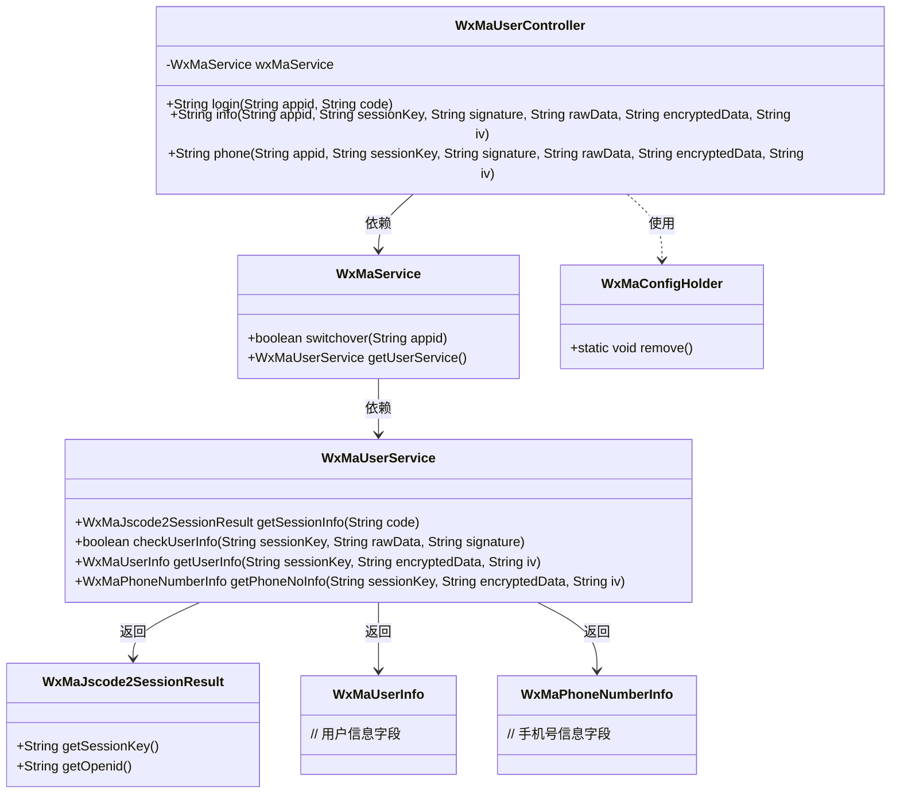
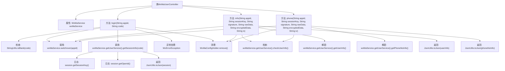

# 基础信息

|      |      |
|------|------|
| 名称 | WxMaUserController |
| 编码语言 | .java |
| 代码路径 | weixin-java-miniapp-demo/src/main/java/com/github/binarywang/demo/wx/miniapp/controller/WxMaUserController.java |
| 包名 | com.github.binarywang.demo.wx.miniapp.controller |
| 依赖项 | ['cn.binarywang.wx.miniapp.api.WxMaService', 'cn.binarywang.wx.miniapp.bean.WxMaJscode2SessionResult', 'cn.binarywang.wx.miniapp.bean.WxMaPhoneNumberInfo', 'cn.binarywang.wx.miniapp.bean.WxMaUserInfo', 'cn.binarywang.wx.miniapp.util.WxMaConfigHolder', 'com.github.binarywang.demo.wx.miniapp.utils.JsonUtils', 'lombok.AllArgsConstructor', 'lombok.extern.slf4j.Slf4j', 'me.chanjar.weixin.common.error.WxErrorException', 'org.apache.commons.lang3.StringUtils', 'org.springframework.web.bind.annotation.GetMapping', 'org.springframework.web.bind.annotation.PathVariable', 'org.springframework.web.bind.annotation.RequestMapping', 'org.springframework.web.bind.annotation.RestController'] |
| 概述说明 | 微信小程序用户控制器，提供登录、获取用户信息和手机号接口，验证appid和用户数据，返回JSON结果，清理ThreadLocal。 |

# 说明

这是一个微信小程序用户管理控制器类，包含三个接口：登录接口验证用户凭证并返回会话信息；用户信息接口校验并解密返回用户数据；手机号接口校验并解密返回用户绑定手机号信息。所有接口都需验证appid有效性，并在处理完成后清理ThreadLocal存储的配置信息。

# 类列表 Class Summary

| 名称   | 类型  | 说明 |
|-------|------|-------------|
| WxMaUserController | class | 微信小程序用户控制器，提供登录、获取用户信息和手机号接口，验证appid和用户数据后返回JSON结果，每次请求后清理ThreadLocal。 |

## 类 WxMaUserController

|      |      |
|------|------|
| 访问范围 | @RestController;@AllArgsConstructor;@Slf4j;@RequestMapping("/wx/user/{appid}");public |
| 类型 | class |
| 名称 | WxMaUserController |
| 说明 | 微信小程序用户控制器，提供登录、获取用户信息和手机号接口，验证appid和用户数据后返回JSON结果，每次请求后清理ThreadLocal。 |

### UML类图

类图描述：该图展示了一个微信小程序用户管理控制器WxMaUserController，通过WxMaService调用微信相关服务。控制器提供登录、获取用户信息和手机号三个接口，依赖WxMaService完成核心业务逻辑。WxMaService通过WxMaUserService实现具体微信API调用，返回会话信息、用户数据和手机号信息等。所有操作最后都会清理ThreadLocal中的配置信息。类间关系清晰展现了Spring Boot控制器与微信服务层的协作方式。

### 内部方法调用关系图

这段代码是一个微信小程序用户相关的控制器，包含三个主要接口：登录(login)、获取用户信息(info)和获取用户手机号(phone)。每个接口都首先检查appid配置是否存在，然后进行相应的业务处理，最后清理ThreadLocal资源。登录接口通过code获取session信息，用户信息接口需要校验签名并解密数据，手机号接口同样需要校验签名后解密手机号数据。所有接口都返回JSON格式的结果，并在处理过程中记录日志和异常信息。

### 字段列表 Field List

| 名称  | 类型  | 说明 |
|-------|-------|------|
| wxMaService | WxMaService | 微信小程序服务实例，私有不可变。 |

### 方法列表

| 名称  | 类型  | 说明 |
|-------|-------|------|
| login | String | 这是一个微信小程序登录接口，接收appid和code参数。校验code非空后切换对应appid配置，获取用户会话信息并返回。异常时记录日志并返回错误，最后清理ThreadLocal。 |
| info | String | 该代码是一个微信小程序后端接口，用于验证用户信息并解密返回用户数据。首先检查appid配置，然后校验用户信息签名，最后解密数据并返回JSON格式的用户信息。 |
| phone | String | 该代码是一个微信小程序获取用户手机号的API接口，首先验证appid和用户信息，校验失败返回错误，成功则解密手机号并返回JSON格式结果。 |

