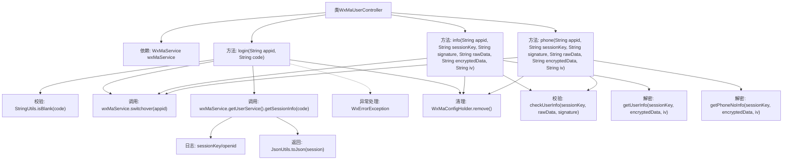

# 基础信息

|      |      |
|------|------|
| 名称 | WxMaUserController |
| 编码语言 | .java |
| 代码路径 | weixin-java-miniapp-demo/src/main/java/com/github/binarywang/demo/wx/miniapp/controller/WxMaUserController.java |
| 包名 | com.github.binarywang.demo.wx.miniapp.controller |
| 依赖项 | ['cn.binarywang.wx.miniapp.api.WxMaService', 'cn.binarywang.wx.miniapp.bean.WxMaJscode2SessionResult', 'cn.binarywang.wx.miniapp.bean.WxMaPhoneNumberInfo', 'cn.binarywang.wx.miniapp.bean.WxMaUserInfo', 'cn.binarywang.wx.miniapp.util.WxMaConfigHolder', 'com.github.binarywang.demo.wx.miniapp.utils.JsonUtils', 'lombok.AllArgsConstructor', 'lombok.extern.slf4j.Slf4j', 'me.chanjar.weixin.common.error.WxErrorException', 'org.apache.commons.lang3.StringUtils', 'org.springframework.web.bind.annotation.GetMapping', 'org.springframework.web.bind.annotation.PathVariable', 'org.springframework.web.bind.annotation.RequestMapping', 'org.springframework.web.bind.annotation.RestController'] |
| 概述说明 | 微信小程序用户控制器，提供登录、获取用户信息和手机号接口，验证appid和用户数据，返回JSON格式结果，处理异常并清理ThreadLocal。 |

# 说明

该控制器类处理微信小程序用户相关功能，包含三个接口。登录接口通过code获取用户会话信息，验证appid有效性后返回sessionKey和openid。用户信息接口校验sessionKey和签名后解密返回用户数据。手机号接口同样校验后解密返回用户手机号信息。每个操作都会清理ThreadLocal存储的配置，确保线程安全。所有接口路径包含appid参数，返回结果均为JSON格式字符串。

# 类列表 Class Summary

| 名称   | 类型  | 说明 |
|-------|------|-------------|
| WxMaUserController | class | 微信小程序用户控制器，提供登录、用户信息和手机号获取接口，验证appid和用户数据后返回JSON结果，每次请求后清理ThreadLocal。 |

## 类 WxMaUserController

|      |      |
|------|------|
| 访问范围 | @RestController;@AllArgsConstructor;@Slf4j;@RequestMapping("/wx/user/{appid}");public |
| 类型 | class |
| 名称 | WxMaUserController |
| 说明 | 微信小程序用户控制器，提供登录、用户信息和手机号获取接口，验证appid和用户数据后返回JSON结果，每次请求后清理ThreadLocal。 |

### UML类图

类图描述：该图展示了一个微信小程序用户控制器(WxMaUserController)及其相关依赖。控制器通过WxMaService接口访问微信服务，后者进一步依赖WxMaUserService接口处理用户相关操作。控制器还使用WxMaConfigHolder管理线程本地变量，以及JsonUtils进行JSON序列化。整体结构体现了清晰的层级关系和服务边界，符合RESTful设计风格。

### 内部方法调用关系图

流程图描述：
该流程图展示了WxMaUserController类的核心结构和三个主要接口方法的调用流程。login方法处理微信小程序登录，先校验code有效性，再通过wxMaService获取会话信息；info和phone方法分别获取用户信息和手机号，均需先校验appid有效性，再进行用户信息校验和解密操作。所有方法最后都会清理ThreadLocal存储的配置。异常处理和日志记录贯穿整个流程，体现了完整的业务逻辑和安全校验机制。

### 字段列表 Field List

| 名称  | 类型  | 说明 |
|-------|-------|------|
| wxMaService | WxMaService | 微信小程序服务实例，私有不可变。 |

### 方法列表

| 名称  | 类型  | 说明 |
|-------|-------|------|
| info | String | 该代码是一个微信小程序后端接口，用于验证用户信息并解密返回用户数据。首先检查appid配置，然后校验用户信息签名，最后解密数据并返回JSON格式的用户信息。 |
| login | String | 这是一个微信小程序登录接口，通过code获取用户session信息。验证code非空和appid有效性后，返回包含sessionKey和openid的JSON。异常时返回错误信息，最后清理ThreadLocal。 |
| phone | String | 获取微信手机号接口：校验appid和用户信息，解密手机号数据并返回。失败返回错误信息，成功返回手机号JSON。 |

