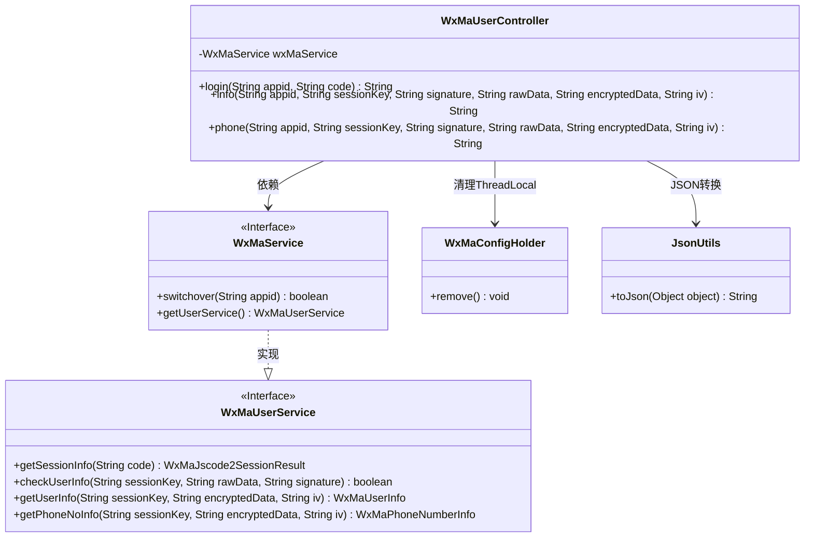
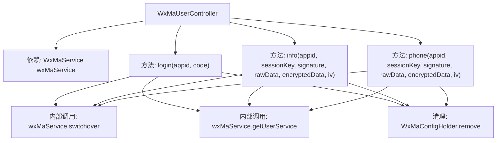
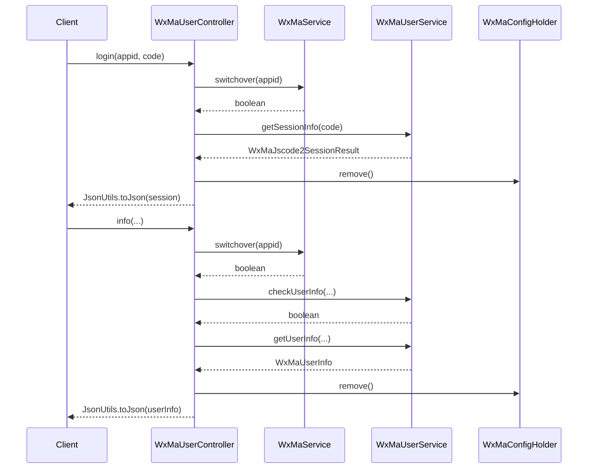

# 基础信息

|      |      |
|------|------|
| 名称 | WxMaUserController |
| 编码语言 | .java |
| 代码路径 | weixin-java-miniapp-demo/src/main/java/com/github/binarywang/demo/wx/miniapp/controller/WxMaUserController.java |
| 包名 | com.github.binarywang.demo.wx.miniapp.controller |
| 依赖项 | ['cn.binarywang.wx.miniapp.api.WxMaService', 'cn.binarywang.wx.miniapp.bean.WxMaJscode2SessionResult', 'cn.binarywang.wx.miniapp.bean.WxMaPhoneNumberInfo', 'cn.binarywang.wx.miniapp.bean.WxMaUserInfo', 'cn.binarywang.wx.miniapp.util.WxMaConfigHolder', 'com.github.binarywang.demo.wx.miniapp.utils.JsonUtils', 'lombok.AllArgsConstructor', 'lombok.extern.slf4j.Slf4j', 'me.chanjar.weixin.common.error.WxErrorException', 'org.apache.commons.lang3.StringUtils', 'org.springframework.web.bind.annotation.GetMapping', 'org.springframework.web.bind.annotation.PathVariable', 'org.springframework.web.bind.annotation.RequestMapping', 'org.springframework.web.bind.annotation.RestController'] |
| 概述说明 | 微信小程序用户控制器，提供登录、用户信息和手机号获取接口，验证appid和用户数据后返回JSON结果，每次请求后清理ThreadLocal。 |

# 说明

WxMaUserController是一个基于Spring Boot的微信小程序用户管理控制器，包含三个核心接口。login接口通过code获取用户会话信息，验证appid有效性后返回sessionKey和openid。info接口校验用户数据签名后解密返回用户信息。phone接口同样校验签名后解密返回用户手机号信息。所有接口均会清理ThreadLocal存储的配置信息，确保线程安全。控制器使用Lombok简化代码，并通过日志记录关键操作。

# 类列表 Class Summary

| 名称   | 类型  | 说明 |
|-------|------|-------------|
| WxMaUserController | class | 微信小程序用户控制器，提供登录、用户信息和手机号获取接口，需校验appid和sessionKey，返回JSON数据并清理ThreadLocal。 |

## 类 WxMaUserController

|      |      |
|------|------|
| 访问范围 | @RestController;@AllArgsConstructor;@Slf4j;@RequestMapping("/wx/user/{appid}");public |
| 类型 | class |
| 名称 | WxMaUserController |
| 说明 | 微信小程序用户控制器，提供登录、用户信息和手机号获取接口，需校验appid和sessionKey，返回JSON数据并清理ThreadLocal。 |

### UML类图

该代码是一个微信小程序用户管理控制器，包含登录、获取用户信息和获取手机号三个核心功能。类图展示了WxMaUserController通过WxMaService接口访问微信服务，依赖WxMaConfigHolder管理线程局部变量，使用JsonUtils进行数据序列化。WxMaService接口实现了WxMaUserService接口，提供用户相关操作。整体设计符合Spring MVC架构，通过接口隔离实现细节，具有清晰的依赖关系和职责划分。

### 内部方法调用关系图

该流程图展示了微信小程序用户控制器的核心结构和调用关系，包含三个主要接口方法（login/info/phone）的统一处理流程。所有方法都遵循"配置切换→业务处理→线程清理"的调用链，通过WxMaService进行微信API交互，最终返回JSON格式数据。时序图则详细描述了login和info方法的完整调用序列，包括异常处理和线程本地变量清理的关键步骤。

### 字段列表 Field List

| 名称  | 类型  | 说明 |
|-------|-------|------|
| wxMaService | WxMaService | 私有不可变的微信小程序服务实例变量wxMaService。 |

### 方法列表

| 名称  | 类型  | 说明 |
|-------|-------|------|
| login | String | 这是一个微信小程序登录接口，通过code获取用户session信息。验证code和appid后返回session数据，异常时记录错误并清理ThreadLocal。 |
| info | String | 这是一个微信小程序后端接口，用于验证用户信息并解密返回用户数据。首先检查appid配置，然后校验用户信息签名，最后解密数据并返回JSON格式的用户信息。 |
| phone | String | 这是一个微信小程序获取用户手机号的接口，校验appid和用户信息后解密返回手机号数据。 |

