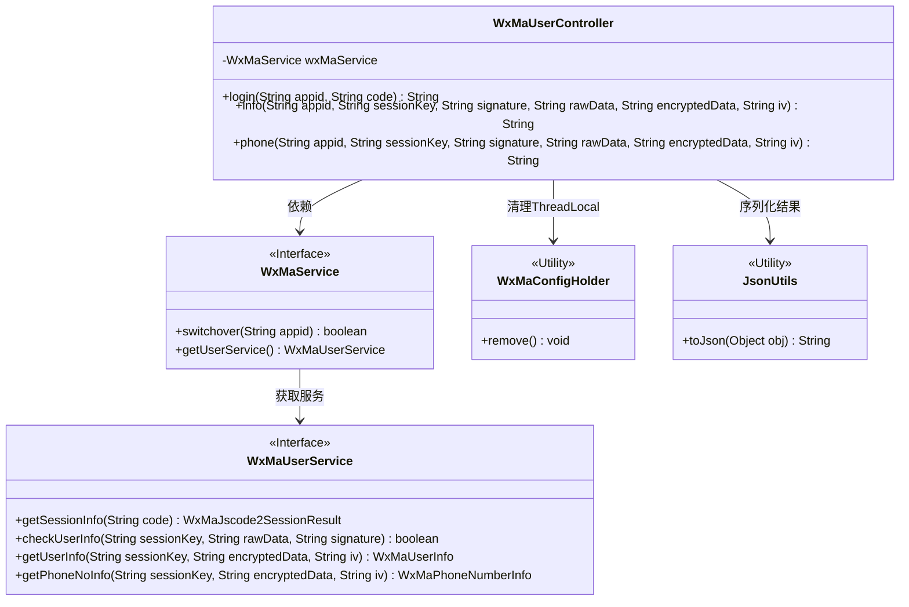
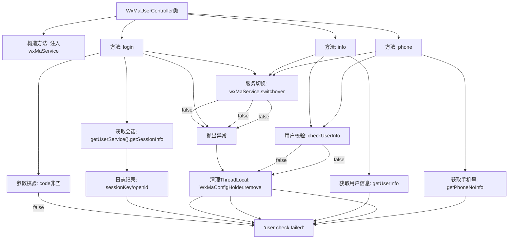

# 基础信息

|      |      |
|------|------|
| 名称 | WxMaUserController |
| 编码语言 | .java |
| 代码路径 | weixin-java-miniapp-demo/src/main/java/com/github/binarywang/demo/wx/miniapp/controller/WxMaUserController.java |
| 包名 | com.github.binarywang.demo.wx.miniapp.controller |
| 依赖项 | ['cn.binarywang.wx.miniapp.api.WxMaService', 'cn.binarywang.wx.miniapp.bean.WxMaJscode2SessionResult', 'cn.binarywang.wx.miniapp.bean.WxMaPhoneNumberInfo', 'cn.binarywang.wx.miniapp.bean.WxMaUserInfo', 'cn.binarywang.wx.miniapp.util.WxMaConfigHolder', 'com.github.binarywang.demo.wx.miniapp.utils.JsonUtils', 'lombok.AllArgsConstructor', 'lombok.extern.slf4j.Slf4j', 'me.chanjar.weixin.common.error.WxErrorException', 'org.apache.commons.lang3.StringUtils', 'org.springframework.web.bind.annotation.GetMapping', 'org.springframework.web.bind.annotation.PathVariable', 'org.springframework.web.bind.annotation.RequestMapping', 'org.springframework.web.bind.annotation.RestController'] |
| 概述说明 | 微信小程序用户控制器，提供登录、获取用户信息和手机号接口，验证appid和用户数据后返回JSON结果，每次请求后清理ThreadLocal。 |

# 说明

这是一个微信小程序用户管理控制器类，提供三个核心接口。登录接口通过code获取用户会话信息，包括sessionKey和openid，并验证appid有效性。用户信息接口通过sessionKey等参数校验并解密用户数据。手机号接口同样进行校验后解密获取用户手机号信息。所有接口都会在操作后清理ThreadLocal存储的配置，确保线程安全。异常情况下返回错误信息，成功时返回JSON格式数据。

# 类列表 Class Summary

| 名称   | 类型  | 说明 |
|-------|------|-------------|
| WxMaUserController | class | 微信小程序用户控制器，提供登录、用户信息和手机号获取接口，验证appid并处理数据解密，清理ThreadLocal。 |


## 类 WxMaUserController

|      |      |
|------|------|
| 访问范围 | @RestController;@AllArgsConstructor;@Slf4j;@RequestMapping("/wx/user/{appid}");public |
| 类型 | class |
| 名称 | WxMaUserController |
| 说明 | 微信小程序用户控制器，提供登录、用户信息和手机号获取接口，验证appid并处理数据解密，清理ThreadLocal。 |


### UML类图



这段代码展示了一个微信小程序用户管理控制器`WxMaUserController`，通过`WxMaService`接口实现用户登录、信息获取和手机号解密功能。控制器依赖`WxMaUserService`处理核心业务逻辑，使用`WxMaConfigHolder`管理线程局部变量，并通过`JsonUtils`进行结果序列化。所有操作都包含appid校验和ThreadLocal清理机制，确保线程安全和配置隔离。类图清晰地展现了各组件间的依赖关系和接口契约。


### 内部方法调用关系图



```mermaid
sequenceDiagram
    participant Client
    participant Controller as WxMaUserController
    participant Service as WxMaService
    participant UserService
    participant Config as WxMaConfigHolder

    Client->>Controller: GET /login(appid, code)
    alt code为空
        Controller-->>Client: "empty jscode"
    else
        Controller->>Service: switchover(appid)
        Service-->>Controller: false
        Controller-->>Client: 抛出异常
    else
        Controller->>Service: getUserService()
        Service->>UserService: getSessionInfo(code)
        UserService-->>Service: sessionResult
        Service-->>Controller: sessionResult
        Controller->>Config: remove()
        Controller-->>Client: JSON(sessionResult)
    end

    Client->>Controller: GET /info(appid, params)
    Controller->>Service: switchover(appid)
    Service-->>Controller: false
    Controller-->>Client: 抛出异常
    else
        Controller->>UserService: checkUserInfo(...)
        UserService-->>Controller: false
        Controller->>Config: remove()
        Controller-->>Client: "user check failed"
    else
        Controller->>UserService: getUserInfo(...)
        UserService-->>Controller: userInfo
        Controller->>Config: remove()
        Controller-->>Client: JSON(userInfo)
    end
```

流程图描述：该流程图展示了微信小程序用户控制器的三个核心接口调用流程。login接口处理用户登录，先校验code参数，再通过wxMaService获取会话信息；info和phone接口都需要先校验appid配置，然后进行用户信息验证，最后分别获取用户基本信息和手机号。所有接口调用结束后都会清理ThreadLocal存储的配置信息，确保线程安全。

时序图描述：时序图详细呈现了客户端与WxMaUserController的交互过程，包括参数校验、服务切换、用户服务调用等关键步骤。展示了正常流程和异常处理分支，特别是switchover验证、用户信息校验等关键环节，以及始终执行的ThreadLocal清理操作。

### 字段列表 Field List

| 名称  | 类型  | 说明 |
|-------|-------|------|
| wxMaService | WxMaService | 私有不可变的微信小程序服务实例变量。 |

### 方法列表

| 名称  | 类型  | 说明 |
|-------|-------|------|
| login | String | 这是一个微信小程序登录接口，接收appid和code参数，验证code非空后切换对应appid配置，获取用户会话信息并返回JSON结果，异常时记录日志并清理ThreadLocal。 |
| info | String | 这是一个微信小程序后端接口，用于验证用户信息并解密返回用户数据。首先检查appid配置，然后校验用户信息签名，最后解密数据并返回JSON格式的用户信息。 |
| phone | String | 这是一个微信小程序获取用户手机号的接口。首先检查appid配置，然后校验用户信息，最后解密手机号数据并返回。失败时返回错误信息。 |


