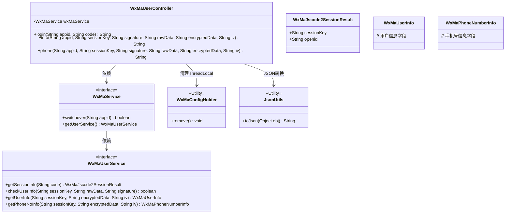
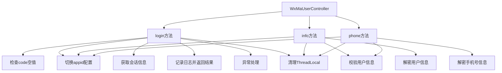

# 基础信息

|      |      |
|------|------|
| 名称 | WxMaUserController |
| 编码语言 | .java |
| 代码路径 | weixin-java-miniapp-demo/src/main/java/com/github/binarywang/demo/wx/miniapp/controller/WxMaUserController.java |
| 包名 | com.github.binarywang.demo.wx.miniapp.controller |
| 依赖项 | ['cn.binarywang.wx.miniapp.api.WxMaService', 'cn.binarywang.wx.miniapp.bean.WxMaJscode2SessionResult', 'cn.binarywang.wx.miniapp.bean.WxMaPhoneNumberInfo', 'cn.binarywang.wx.miniapp.bean.WxMaUserInfo', 'cn.binarywang.wx.miniapp.util.WxMaConfigHolder', 'com.github.binarywang.demo.wx.miniapp.utils.JsonUtils', 'lombok.AllArgsConstructor', 'lombok.extern.slf4j.Slf4j', 'me.chanjar.weixin.common.error.WxErrorException', 'org.apache.commons.lang3.StringUtils', 'org.springframework.web.bind.annotation.GetMapping', 'org.springframework.web.bind.annotation.PathVariable', 'org.springframework.web.bind.annotation.RequestMapping', 'org.springframework.web.bind.annotation.RestController'] |
| 概述说明 | 微信小程序用户控制器，提供登录、获取用户信息和手机号接口，需校验appid和参数，返回JSON数据，处理异常并清理ThreadLocal。 |

# 说明

这是一个微信小程序用户相关的控制器类，包含三个接口。登录接口通过code获取用户会话信息，包括sessionKey和openid。获取用户信息接口通过sessionKey等参数校验并解密用户信息。获取用户手机号接口同样校验后解密手机号信息。所有接口都先检查appid配置是否存在，并在处理完成后清理ThreadLocal。异常时会返回错误信息。

# 类列表 Class Summary

| 名称   | 类型  | 说明 |
|-------|------|-------------|
| WxMaUserController | class | 微信小程序用户控制器，提供登录、用户信息和手机号获取接口，验证appid和用户数据，返回JSON结果，每次请求后清理ThreadLocal。 |

## 类 WxMaUserController

|      |      |
|------|------|
| 访问范围 | @RestController;@AllArgsConstructor;@Slf4j;@RequestMapping("/wx/user/{appid}");public |
| 类型 | class |
| 名称 | WxMaUserController |
| 说明 | 微信小程序用户控制器，提供登录、用户信息和手机号获取接口，验证appid和用户数据，返回JSON结果，每次请求后清理ThreadLocal。 |

### UML类图

该类图展示了微信小程序用户控制器的核心结构。WxMaUserController作为REST控制器，通过WxMaService接口访问微信小程序服务，包含登录、获取用户信息和手机号三个核心方法。控制器依赖WxMaUserService进行会话管理、用户验证和数据解密，同时使用WxMaConfigHolder管理线程本地配置，JsonUtils处理JSON转换。整体设计遵循依赖倒置原则，通过接口隔离具体实现。

### 内部方法调用关系图

流程图描述了WxMaUserController的三个主要API接口流程：login处理微信登录并获取会话信息，info获取用户基本信息，phone获取用户手机号信息。所有接口都包含appid配置检查和ThreadLocal清理，核心差异在于数据处理逻辑：login侧重会话管理，info和phone则分别处理用户基础数据和手机号解密验证。异常处理和资源清理贯穿始终，体现健壮性设计。

### 字段列表 Field List

| 名称  | 类型  | 说明 |
|-------|-------|------|
| wxMaService | WxMaService | 微信小程序服务实例，私有不可变。 |

### 方法列表

| 名称  | 类型  | 说明 |
|-------|-------|------|
| info | String | 微信小程序用户信息接口：校验appid和用户数据，解密后返回用户信息。失败返回错误提示。 |
| login | String | 这是一个微信小程序登录接口，接收appid和code参数。验证code非空后，检查appid配置是否存在。获取用户会话信息并记录日志，返回JSON格式结果。异常时记录错误并清理ThreadLocal。 |
| phone | String | 这是一个微信小程序获取用户手机号的接口。首先检查appid配置，然后校验用户信息，最后解密手机号数据并返回。失败时返回错误信息。 |

