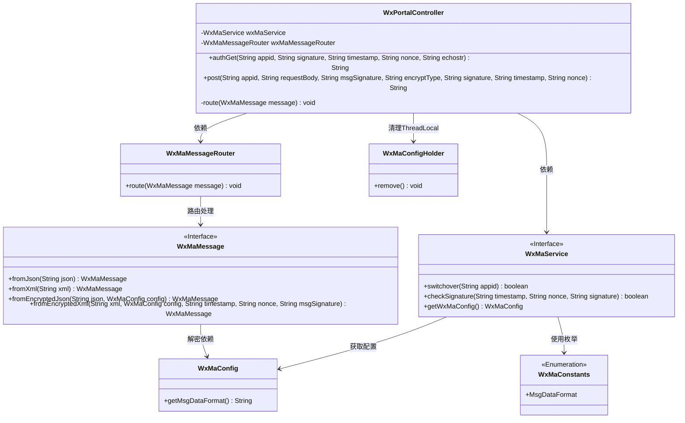
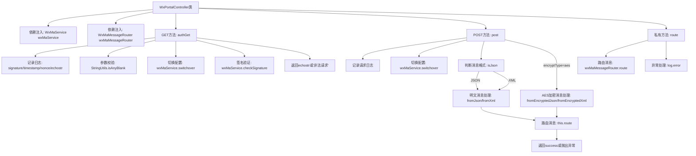

# 基础信息

|      |      |
|------|------|
| 名称 | WxPortalController |
| 编码语言 | .java |
| 代码路径 | weixin-java-miniapp-demo/src/main/java/com/github/binarywang/demo/wx/miniapp/controller/WxPortalController.java |
| 包名 | com.github.binarywang.demo.wx.miniapp.controller |
| 依赖项 | ['cn.binarywang.wx.miniapp.api.WxMaService', 'cn.binarywang.wx.miniapp.bean.WxMaMessage', 'cn.binarywang.wx.miniapp.constant.WxMaConstants', 'cn.binarywang.wx.miniapp.message.WxMaMessageRouter', 'cn.binarywang.wx.miniapp.util.WxMaConfigHolder', 'lombok.AllArgsConstructor', 'lombok.extern.slf4j.Slf4j', 'org.apache.commons.lang3.StringUtils', 'org.springframework.web.bind.annotation', 'java.util.Objects'] |
| 概述说明 | 微信小程序控制器类，处理GET/POST请求，验证签名并路由消息，支持明文和AES加密，异常时返回错误信息。 |

# 说明

该代码定义了一个微信小程序门户控制器类，包含两个主要接口。GET接口用于微信服务器认证验证，接收签名、时间戳、随机字符串等参数，验证通过返回原始字符串。POST接口处理微信消息推送，支持明文和AES加密两种格式，根据配置自动解析JSON或XML格式消息，并通过消息路由器处理。两个接口都会检查appid有效性，并在处理完成后清理线程本地存储。控制器记录了详细的请求日志，对非法请求会抛出异常或返回错误提示。

# 类列表 Class Summary

| 名称   | 类型  | 说明 |
|-------|------|-------------|
| WxPortalController | class | 微信小程序控制器，处理认证和消息请求，验证签名并路由消息，支持明文和AES加密格式。 |

## 类 WxPortalController

|      |      |
|------|------|
| 访问范围 | @RestController;@AllArgsConstructor;@RequestMapping("/wx/portal/{appid}");@Slf4j;public |
| 类型 | class |
| 名称 | WxPortalController |
| 说明 | 微信小程序控制器，处理认证和消息请求，验证签名并路由消息，支持明文和AES加密格式。 |

### UML类图

类图描述：该图展示了一个微信小程序门户控制器(WxPortalController)的核心结构，它依赖WxMaService处理微信服务切换和签名验证，使用WxMaMessageRouter路由消息。控制器包含GET/POST请求处理方法，处理明文/AES加密消息，并通过WxMaMessage工厂方法转换消息格式。所有操作后都会清理ThreadLocal存储的配置(WxMaConfigHolder)。系统通过WxMaConfig获取消息格式配置，并遵循WxMaConstants定义的枚举规范。

### 内部方法调用关系图

该流程图展示了微信门户控制器的完整处理逻辑。GET方法(authGet)用于微信服务器验证，包含参数校验、配置切换和签名验证；POST方法(post)处理业务消息，根据加密类型和格式(json/xml)进行不同解析，最终路由处理；私有方法(route)负责实际消息路由并处理异常。所有方法最后都会清理ThreadLocal存储的配置信息。

### 字段列表 Field List

| 名称  | 类型  | 说明 |
|-------|-------|------|
| wxMaService | WxMaService | 微信小程序服务实例，私有不可变。 |
| wxMaMessageRouter | WxMaMessageRouter | 微信小程序消息路由器的私有不可变实例。 |

### 方法列表

| 名称  | 类型  | 说明 |
|-------|-------|------|
| post | String | 处理微信请求的POST接口，验证appid并解析明文或AES加密的XML/JSON消息，路由处理后返回成功或错误。 |
| authGet | String | 这是一个处理微信认证的GET接口，验证签名参数后返回echostr或错误信息，包含参数校验和ThreadLocal清理。 |
| route | void | 路由微信小程序消息，异常时记录错误日志。 |

