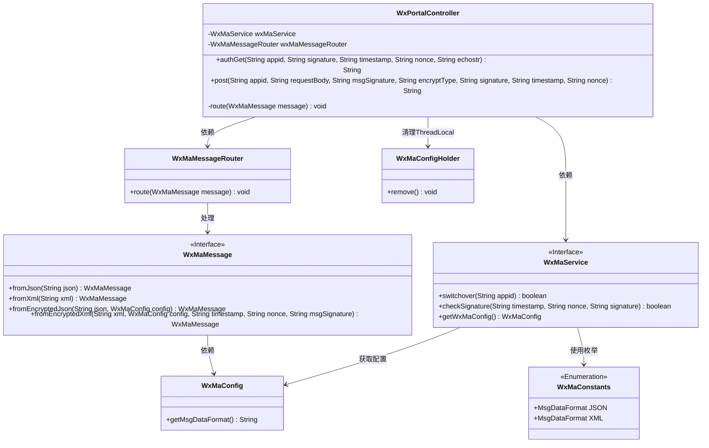
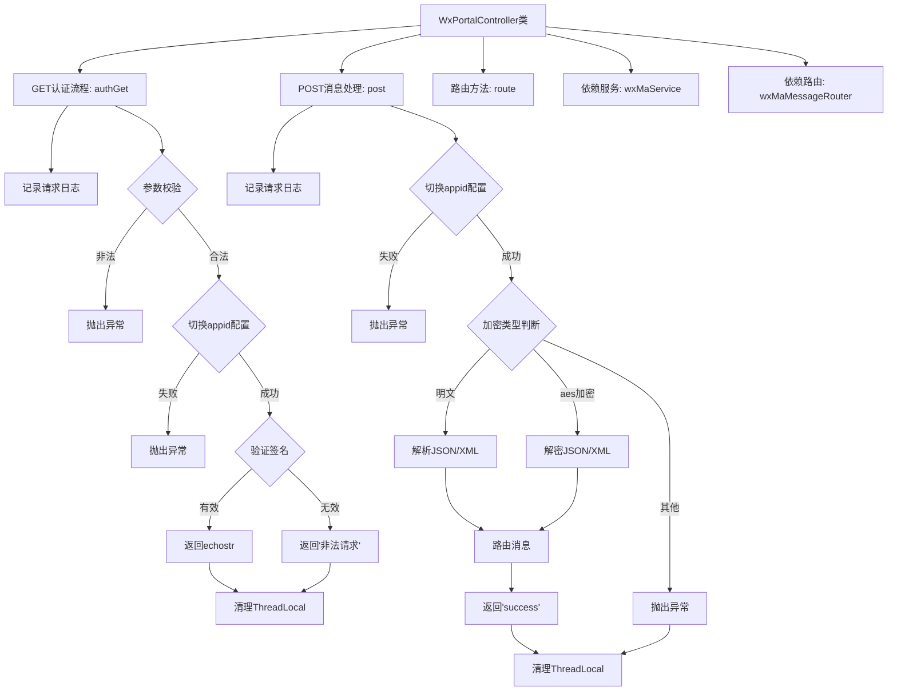
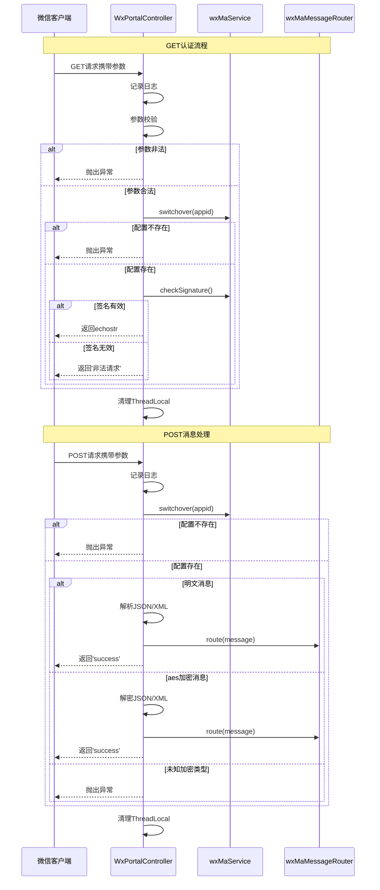

# 基础信息

|      |      |
|------|------|
| 名称 | WxPortalController |
| 编码语言 | .java |
| 代码路径 | weixin-java-miniapp-demo/src/main/java/com/github/binarywang/demo/wx/miniapp/controller/WxPortalController.java |
| 包名 | com.github.binarywang.demo.wx.miniapp.controller |
| 依赖项 | ['cn.binarywang.wx.miniapp.api.WxMaService', 'cn.binarywang.wx.miniapp.bean.WxMaMessage', 'cn.binarywang.wx.miniapp.constant.WxMaConstants', 'cn.binarywang.wx.miniapp.message.WxMaMessageRouter', 'cn.binarywang.wx.miniapp.util.WxMaConfigHolder', 'lombok.AllArgsConstructor', 'lombok.extern.slf4j.Slf4j', 'org.apache.commons.lang3.StringUtils', 'org.springframework.web.bind.annotation', 'java.util.Objects'] |
| 概述说明 | 微信小程序控制器类，处理GET/POST请求，验证签名并路由消息。GET用于认证，POST处理明文或AES加密消息，校验appid后转发消息并返回结果。每次请求后清理ThreadLocal。 |

# 说明

这是一个微信小程序后台控制器类，包含两个主要接口。GET接口用于微信服务器认证，验证签名参数后返回echostr字符串。POST接口处理微信消息请求，支持明文和AES加密两种格式，根据消息格式进行解析后路由处理，并返回success响应。两个接口都会检查appid有效性，并在处理完成后清理ThreadLocal存储的配置信息。

# 类列表 Class Summary

| 名称   | 类型  | 说明 |
|-------|------|-------------|
| WxPortalController | class | 微信小程序控制器，处理认证和消息请求，验证签名并路由消息，支持明文和AES加密，返回成功或错误信息。 |

## 类 WxPortalController

|      |      |
|------|------|
| 访问范围 | @RestController;@AllArgsConstructor;@RequestMapping("/wx/portal/{appid}");@Slf4j;public |
| 类型 | class |
| 名称 | WxPortalController |
| 说明 | 微信小程序控制器，处理认证和消息请求，验证签名并路由消息，支持明文和AES加密，返回成功或错误信息。 |

### UML类图

类图描述：
该图展示了一个微信小程序门户控制器(WxPortalController)的核心结构，它通过WxMaService处理微信服务器认证和消息加解密，使用WxMaMessageRouter路由消息。控制器包含GET/POST两个公开方法，分别处理验证请求和消息推送，依赖WxMaConfigHolder管理线程局部变量。系统采用接口隔离原则，WxMaService和WxMaMessage为关键接口，支持JSON/XML两种数据格式，通过WxMaConstants枚举维护常量。整体架构体现了清晰的职责划分和模块化设计。

### 内部方法调用关系图

该流程图和时序图展示了微信小程序后台控制器的完整处理逻辑。GET认证流程包含参数校验、配置切换和签名验证三个关键阶段，POST消息处理则区分明文和加密两种消息类型进行不同处理。两个流程都包含ThreadLocal清理机制，确保线程安全。时序图清晰呈现了客户端、控制器、服务组件之间的交互顺序和条件分支，完整覆盖了微信消息推送的认证和消息处理场景。

### 字段列表 Field List

| 名称  | 类型  | 说明 |
|-------|-------|------|
| wxMaService | WxMaService | 微信小程序服务实例，私有不可变。 |
| wxMaMessageRouter | WxMaMessageRouter | 微信小程序消息路由器的私有不可变实例。 |

### 方法列表

| 名称  | 类型  | 说明 |
|-------|-------|------|
| route | void | 方法route处理微信消息，调用路由功能并捕获异常记录日志。 |
| post | String | 处理微信请求的POST接口，验证appid并解析明文或AES加密的XML/JSON消息，处理后返回success，异常时清理ThreadLocal并报错。 |
| authGet | String | 这是一个处理微信服务器认证请求的GET接口，验证签名参数后返回echostr或错误信息。 |

