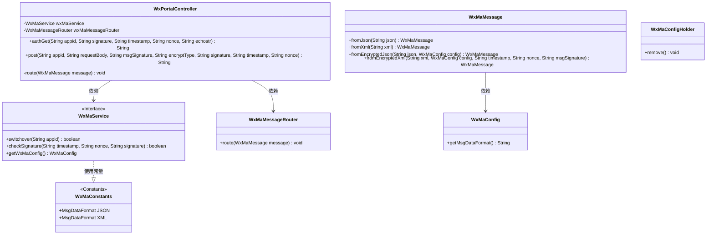
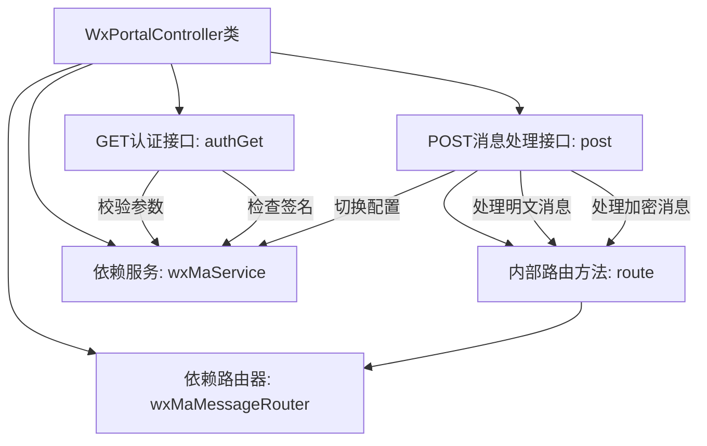
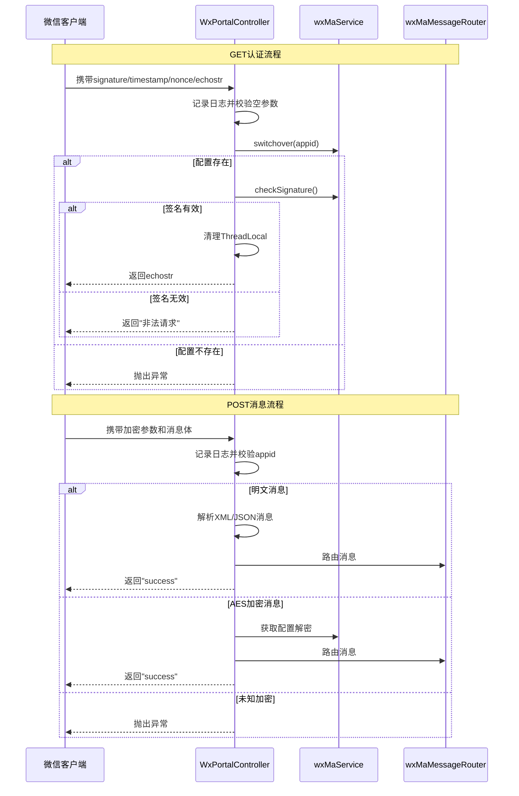

# 基础信息

|      |      |
|------|------|
| 名称 | WxPortalController |
| 编码语言 | .java |
| 代码路径 | weixin-java-miniapp-demo/src/main/java/com/github/binarywang/demo/wx/miniapp/controller/WxPortalController.java |
| 包名 | com.github.binarywang.demo.wx.miniapp.controller |
| 依赖项 | ['cn.binarywang.wx.miniapp.api.WxMaService', 'cn.binarywang.wx.miniapp.bean.WxMaMessage', 'cn.binarywang.wx.miniapp.constant.WxMaConstants', 'cn.binarywang.wx.miniapp.message.WxMaMessageRouter', 'cn.binarywang.wx.miniapp.util.WxMaConfigHolder', 'lombok.AllArgsConstructor', 'lombok.extern.slf4j.Slf4j', 'org.apache.commons.lang3.StringUtils', 'org.springframework.web.bind.annotation', 'java.util.Objects'] |
| 概述说明 | 微信小程序控制器，处理认证和消息请求，验证签名并路由消息，支持明文和AES加密，返回成功或错误响应。 |

# 说明

这是一个微信小程序后台控制器类，包含两个核心接口。GET接口用于微信服务器认证验证，接收签名、时间戳、随机数和随机字符串参数，验证通过返回随机字符串。POST接口处理微信消息推送，支持明文和AES加密两种格式，根据配置自动解析JSON或XML格式消息，通过消息路由器处理消息后返回success。两个接口都会在最后清理ThreadLocal存储的配置信息。

# 类列表 Class Summary

| 名称   | 类型  | 说明 |
|-------|------|-------------|
| WxPortalController | class | 微信小程序控制器类，处理认证和消息请求，验证签名并路由消息，支持明文和AES加密格式，自动清理线程变量。 |

## 类 WxPortalController

|      |      |
|------|------|
| 访问范围 | @RestController;@AllArgsConstructor;@RequestMapping("/wx/portal/{appid}");@Slf4j;public |
| 类型 | class |
| 名称 | WxPortalController |
| 说明 | 微信小程序控制器类，处理认证和消息请求，验证签名并路由消息，支持明文和AES加密格式，自动清理线程变量。 |

### UML类图

类图描述：该图展示了一个微信小程序门户控制器(WxPortalController)的结构，它通过依赖关系使用微信小程序服务(WxMaService)和消息路由器(WxMaMessageRouter)。控制器包含两个主要方法：处理GET认证请求的authGet()和处理POST消息的post()。系统通过WxMaMessage类处理不同格式(JSON/XML)的消息转换，并依赖WxMaConfig获取配置信息。所有类都遵循明确的职责分离，通过接口和工具类实现松散耦合。

### 内部方法调用关系图

流程图描述：该流程图展示了微信小程序消息处理控制器的核心结构，包含GET认证和POST消息处理两个主要接口。GET接口负责验证微信服务器签名，通过wxMaService进行配置切换和签名校验；POST接口处理明文和AES加密消息，使用wxMaMessageRouter进行消息路由。两个流程最后都会清理ThreadLocal存储的配置信息，体现了完整的请求处理生命周期和异常处理机制。

时序图描述：时序图详细描述了微信客户端与控制器的交互过程，分为认证和消息处理两个场景。认证流程严格校验参数和签名，消息处理流程根据加密类型分别处理明文和加密消息，最终都通过路由组件分发消息。整个过程展示了服务组件的协同工作、配置管理和异常处理逻辑，体现了微信生态系统的安全通信机制。

### 字段列表 Field List

| 名称  | 类型  | 说明 |
|-------|-------|------|
| wxMaService | WxMaService | 微信小程序服务实例 |
| wxMaMessageRouter | WxMaMessageRouter | 微信小程序消息路由器的私有不可变实例。 |

### 方法列表

| 名称  | 类型  | 说明 |
|-------|-------|------|
| route | void | 该方法用于路由微信小程序消息，捕获并记录异常。 |
| post | String | 处理微信消息的POST接口，支持明文和AES加密，校验appid后根据消息格式（JSON/XML）解析并路由，最后清理ThreadLocal返回成功或错误。 |
| authGet | String | 处理微信认证请求，验证参数和签名，返回echostr或错误信息。 |

