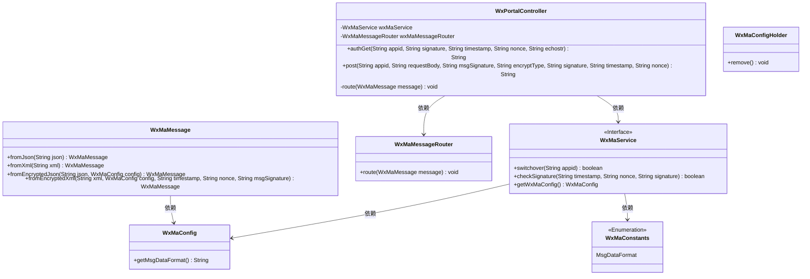
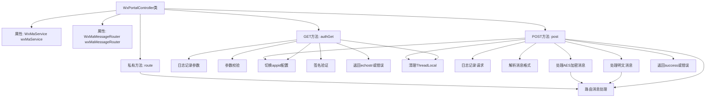

# 基础信息

|      |      |
|------|------|
| 名称 | WxPortalController |
| 编码语言 | .java |
| 代码路径 | weixin-java-miniapp-demo/src/main/java/com/github/binarywang/demo/wx/miniapp/controller/WxPortalController.java |
| 包名 | com.github.binarywang.demo.wx.miniapp.controller |
| 依赖项 | ['cn.binarywang.wx.miniapp.api.WxMaService', 'cn.binarywang.wx.miniapp.bean.WxMaMessage', 'cn.binarywang.wx.miniapp.constant.WxMaConstants', 'cn.binarywang.wx.miniapp.message.WxMaMessageRouter', 'cn.binarywang.wx.miniapp.util.WxMaConfigHolder', 'lombok.AllArgsConstructor', 'lombok.extern.slf4j.Slf4j', 'org.apache.commons.lang3.StringUtils', 'org.springframework.web.bind.annotation', 'java.util.Objects'] |
| 概述说明 | 微信小程序控制器类，处理GET/POST请求，验证签名并路由消息。GET用于微信服务器认证，POST处理明文或AES加密消息，校验appid后转发消息并返回成功或错误响应。 |

# 说明

该控制器是一个微信小程序的后端接口，包含两个主要方法。authGet方法处理微信服务器的认证请求，验证签名参数后返回echostr字符串。post方法处理微信消息，支持明文和AES加密两种格式，根据配置解析JSON或XML消息体，并通过消息路由器处理消息。两个方法都会在完成后清理ThreadLocal存储的配置。异常情况下会返回错误提示或抛出异常。日志记录详细请求信息便于调试。

# 类列表 Class Summary

| 名称   | 类型  | 说明 |
|-------|------|-------------|
| WxPortalController | class | 微信小程序控制器类，处理GET/POST请求，验证签名并路由消息。GET用于服务器认证，POST处理明文或AES加密消息，校验appid后转交消息路由器，最后清理ThreadLocal。 |

## 类 WxPortalController

|      |      |
|------|------|
| 访问范围 | @RestController;@AllArgsConstructor;@RequestMapping("/wx/portal/{appid}");@Slf4j;public |
| 类型 | class |
| 名称 | WxPortalController |
| 说明 | 微信小程序控制器类，处理GET/POST请求，验证签名并路由消息。GET用于服务器认证，POST处理明文或AES加密消息，校验appid后转交消息路由器，最后清理ThreadLocal。 |

### UML类图

这段类图展示了微信小程序门户控制器的核心结构。WxPortalController作为REST控制器，依赖WxMaService处理微信服务配置和签名验证，依赖WxMaMessageRouter进行消息路由。系统通过WxMaMessage处理不同格式（JSON/XML）和加密类型（明文/AES）的微信消息，使用WxMaConfigHolder管理线程局部配置。整个设计体现了微信消息处理的完整流程，包括认证、消息解析、路由和线程安全清理。

### 内部方法调用关系图

该流程图展示了微信门户控制器的核心处理逻辑。GET方法用于微信服务器认证，包含参数校验、签名验证和响应返回；POST方法处理消息推送，支持JSON/XML格式的明文和AES加密消息处理，通过路由分发后返回处理结果。两个方法均包含ThreadLocal清理机制，确保线程安全。私有route方法封装了消息路由的核心逻辑，异常时记录错误日志但不中断流程。

### 字段列表 Field List

| 名称  | 类型  | 说明 |
|-------|-------|------|
| wxMaMessageRouter | WxMaMessageRouter | 微信小程序消息路由器的私有不可变实例。 |
| wxMaService | WxMaService | 微信小程序服务实例，私有不可变。 |

### 方法列表

| 名称  | 类型  | 说明 |
|-------|-------|------|
| post | String | 处理微信请求的接口，支持明文和AES加密消息，验证appid后根据消息格式（JSON/XML）解析并路由，最后清理线程数据返回成功或错误。 |
| authGet | String | 这是一个微信认证接口，接收微信服务器的验证请求，校验参数和签名后返回响应字符串。若参数缺失或签名不合法则抛出异常或返回非法请求提示。 |
| route | void | 私有方法route处理微信消息路由，异常时记录错误日志。 |

