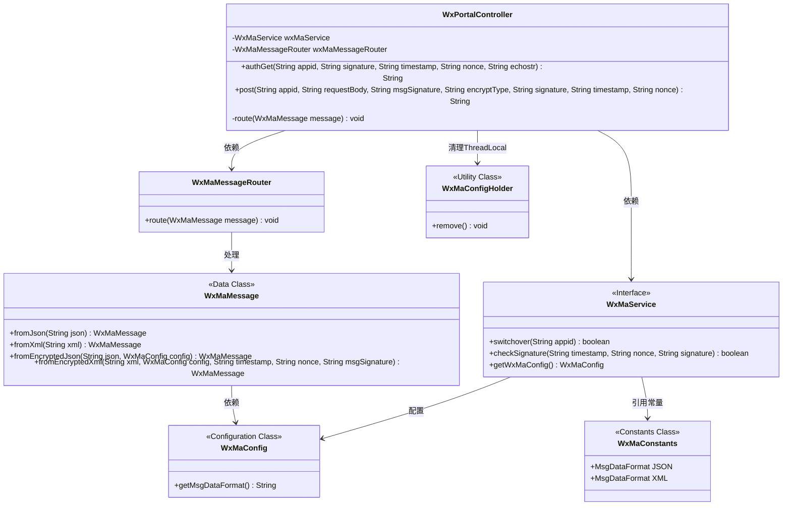
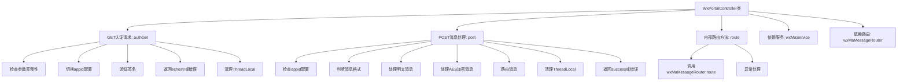
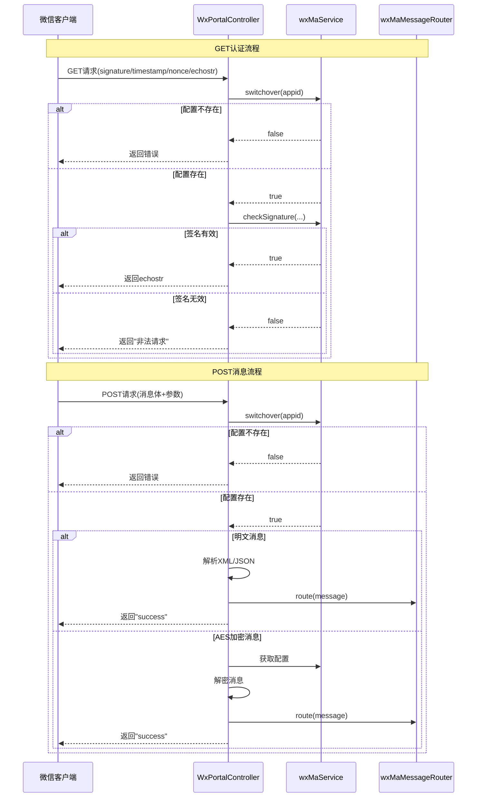

# 基础信息

|      |      |
|------|------|
| 名称 | WxPortalController |
| 编码语言 | .java |
| 代码路径 | weixin-java-miniapp-demo/src/main/java/com/github/binarywang/demo/wx/miniapp/controller/WxPortalController.java |
| 包名 | com.github.binarywang.demo.wx.miniapp.controller |
| 依赖项 | ['cn.binarywang.wx.miniapp.api.WxMaService', 'cn.binarywang.wx.miniapp.bean.WxMaMessage', 'cn.binarywang.wx.miniapp.constant.WxMaConstants', 'cn.binarywang.wx.miniapp.message.WxMaMessageRouter', 'cn.binarywang.wx.miniapp.util.WxMaConfigHolder', 'lombok.AllArgsConstructor', 'lombok.extern.slf4j.Slf4j', 'org.apache.commons.lang3.StringUtils', 'org.springframework.web.bind.annotation', 'java.util.Objects'] |
| 概述说明 | 这是一个微信小程序后台控制器类，处理微信服务器的认证和消息请求。包含GET和POST方法，分别用于验证服务器和接收用户消息，支持明文和AES加密消息，验证签名后路由处理并返回响应。 |

# 说明

该代码定义了一个微信小程序门户控制器类，包含GET和POST两个请求处理方法。GET方法用于微信服务器认证，验证签名参数后返回echostr字符串。POST方法处理微信消息，支持明文和AES加密两种格式，根据配置转换为消息对象后路由处理，最后返回success。两个方法都会在结束时清理线程本地存储的配置。控制器通过路径变量appid区分不同小程序配置，若配置不存在则抛出异常。所有操作均记录详细日志。

# 类列表 Class Summary

| 名称   | 类型  | 说明 |
|-------|------|-------------|
| WxPortalController | class | 微信小程序控制器，处理认证和消息请求，验证签名并路由消息，支持明文和AES加密消息。 |

## 类 WxPortalController

|      |      |
|------|------|
| 访问范围 | @RestController;@AllArgsConstructor;@RequestMapping("/wx/portal/{appid}");@Slf4j;public |
| 类型 | class |
| 名称 | WxPortalController |
| 说明 | 微信小程序控制器，处理认证和消息请求，验证签名并路由消息，支持明文和AES加密消息。 |

### UML类图

这段代码展示了一个微信小程序后台控制器(WxPortalController)，主要处理微信服务器的认证和消息推送请求。类图清晰地呈现了控制器与WxMaService服务接口、WxMaMessageRouter路由器的依赖关系，以及消息处理过程中涉及的WxMaMessage数据类、WxMaConfig配置类和工具类WxMaConfigHolder。控制器提供authGet和post两个核心方法，分别处理GET验证请求和POST消息推送，通过WxMaService进行签名验证和配置切换，并最终通过WxMaMessageRouter路由处理消息。整个设计体现了清晰的职责划分和模块化思想。

### 内部方法调用关系图

该流程图展示了微信小程序消息控制器WxPortalController的核心处理逻辑，包含GET请求的微信服务器认证和POST消息处理两大流程。GET流程通过签名验证确保请求合法性，POST流程根据加密类型分别处理明文和AES加密消息，最终通过消息路由器进行业务分发。两个流程都包含ThreadLocal清理机制，体现了完整的请求生命周期管理。时序图则详细呈现了客户端与服务端交互时各组件间的调用顺序和条件分支。

### 字段列表 Field List

| 名称  | 类型  | 说明 |
|-------|-------|------|
| wxMaMessageRouter | WxMaMessageRouter | 微信小程序消息路由对象，用于处理消息。 |
| wxMaService | WxMaService | 微信小程序服务实例（私有不可变） |

### 方法列表

| 名称  | 类型  | 说明 |
|-------|-------|------|
| post | String | 处理微信XML/JSON请求，支持明文和AES加密消息，验证appid后路由消息并返回成功响应。 |
| authGet | String | 处理微信认证请求，验证参数和签名，返回echostr或错误信息。 |
| route | void | 私有方法route接收WxMaMessage消息，调用wxMaMessageRouter.route处理，异常时记录错误日志。 |

