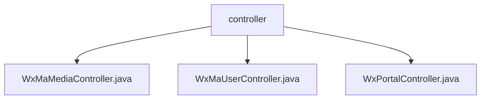

# 基础信息

|      |      |
|------|------|
| 名称 | controller |
| 编码语言 | .java |
| 代码路径 | weixin-java-miniapp-demo/src/main/java/com/github/binarywang/demo/wx/miniapp/controller |
| 包名 | docs.src.main.java.com.github.binarywang.demo.wx.miniapp.controller |
| 概述说明 | 微信小程序三个控制器类：媒体管理类处理文件上传下载；用户管理类提供登录、用户信息和手机号接口；后台类处理微信认证和消息推送。均清理ThreadLocal配置，记录日志并处理异常。 |

# 说明

## 概述  
该模块是微信小程序后端核心控制器集合，采用ThreadLocal管理线程安全配置，类似事件总线模式。主要提供媒体文件管理（上传/下载）、用户会话管理（登录/信息解密）和微信服务器交互（认证/消息处理）三大功能。统一接口规范包括：POST/PGET请求处理、AppID有效性校验、操作后自动清理ThreadLocal、JSON格式响应及异常处理。关键数据结构包含MediaID列表、用户会话信息（SessionKey/OpenID）和微信消息体（JSON/XML）。依赖微信JSSDK、AES加密库和消息路由器，例如通过JNI调用微信服务器接口。

## 主要业务场景  
典型应用模式为：用户登录后获取SessionKey，解密个人信息或手机号；媒体文件上传至微信临时素材库，通过MediaID下载；后台自动处理微信服务器推送消息。业务流程均遵循"校验-处理-清理"模式，例如上传文件时先验证AppID，再调用微信API，最后清除线程配置。集成案例包括：使用code换取sessionKey的OAuth2.0流程、AES-ECB解密用户数据、多文件批量上传等。所有接口均保持无状态设计，类似RESTful风格，确保高并发下的线程安全。

### 包内部结构视图

该流程图展示了微信小程序demo项目中控制器的层级结构，包含三个主要控制器文件：WxMaMediaController、WxMaUserController和WxPortalController，它们都位于controller目录下，用于处理不同类型的微信小程序请求。这种结构是典型Spring Boot项目的控制器组织方式，每个控制器负责特定业务模块的功能实现。

# 文件列表

| 名称   | 类型  | 说明 |
|-------|------|-------------|
| [WxMaMediaController.java](WxMaMediaController.md) | file | 这是一个微信小程序媒体控制器类，包含上传和下载临时素材功能。上传方法接收appid和请求，验证配置后处理多文件上传，返回media_id列表。下载方法根据appid和mediaId获取素材文件。操作后清理ThreadLocal。 |
| [WxMaUserController.java](WxMaUserController.md) | file | 微信小程序用户控制器，提供登录、获取用户信息和手机号接口，验证appid和用户数据后返回JSON结果，每次请求后清理ThreadLocal。 |
| [WxPortalController.java](WxPortalController.md) | file | 微信小程序控制器，处理认证和消息请求，验证签名并路由消息，支持明文和AES加密，返回成功或错误响应。 |

