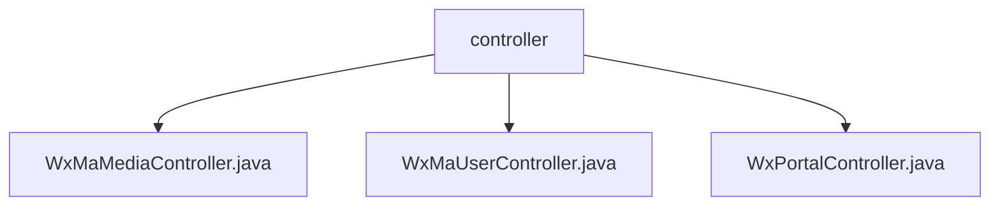

# 基础信息

|      |      |
|------|------|
| 名称 | controller |
| 编码语言 | .java |
| 代码路径 | weixin-java-miniapp-demo/src/main/java/com/github/binarywang/demo/wx/miniapp/controller |
| 包名 | docs.src.main.java.com.github.binarywang.demo.wx.miniapp.controller |
| 概述说明 | 微信小程序控制器类：媒体控制器处理文件上传下载，用户控制器管理登录/信息/手机号功能，门户控制器负责认证和消息处理。所有接口验证appid并确保线程安全。 |

# 说明

## 概述  
该模块是微信小程序后端核心控制器集合，主要负责媒体文件管理、用户会话处理和微信消息交互三大功能。接口规范统一采用RESTful风格，包含appid参数校验和ThreadLocal清理机制，返回JSON格式数据。关键数据结构包括Media_id列表、用户会话信息（sessionKey/openid）和微信消息体（JSON/XML）。外部依赖微信服务器API、AES加密库和消息路由器。例如媒体控制器处理文件上传下载，用户控制器管理登录授权，门户控制器验证消息合法性。

## 主要业务场景  
模块支持三类典型交互：媒体文件传输（类似FTP服务）、用户身份认证（类似OAuth流程）和微信消息处理（类似事件总线模式）。业务流程均遵循"校验-处理-清理"模式，例如用户登录先验证code，再获取会话信息，最后清理线程数据。集成案例包括上传临时素材、解密用户手机号和处理加密推送消息。所有接口严格校验appid，确保多租户隔离，异常时记录详细日志便于排查。

### 包内部结构视图

该流程图展示了微信小程序demo项目中controller目录下的三个控制器文件结构。WxMaMediaController、WxMaUserController和WxPortalController三个Java控制器文件都直接隶属于controller目录，没有更深层级的子目录结构。这三个控制器分别处理媒体、用户和门户相关的业务逻辑。

# 文件列表

| 名称   | 类型  | 说明 |
|-------|------|-------------|
| [WxMaMediaController.java](WxMaMediaController.md) | file | 微信小程序媒体控制器，提供上传和下载临时素材功能。上传返回media_id列表，下载返回媒体文件。检查appid有效性，处理多文件上传，清理ThreadLocal资源。 |
| [WxMaUserController.java](WxMaUserController.md) | file | 微信小程序用户控制器，提供登录、获取用户信息和手机号接口，验证appid和用户数据，返回JSON格式结果，处理异常并清理ThreadLocal。 |
| [WxPortalController.java](WxPortalController.md) | file | 微信小程序控制器类，处理GET/POST请求，验证签名并路由消息，支持明文和AES加密，异常时返回错误信息。 |

