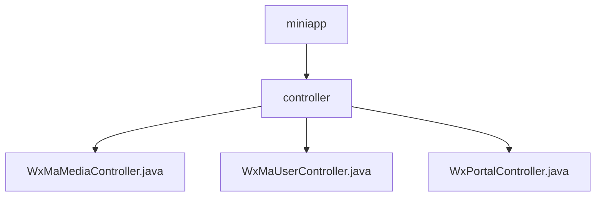

# 基础信息

|      |      |
|------|------|
| 名称 | controller |
| 编码语言 | .java |
| 代码路径 | weixin-java-miniapp-demo/src/main/java/com/github/binarywang/demo/wx/miniapp/controller |
| 包名 | docs.src.main.java.com.github.binarywang.demo.wx.miniapp.controller |
| 概述说明 | 微信小程序控制器类：媒体控制器处理文件上传下载；用户控制器管理登录、用户信息和手机号；门户控制器处理微信服务器认证和消息路由。均包含线程安全清理和异常处理。 |

# 说明

## 概述  
该模块是微信小程序后端核心控制器，提供媒体管理、用户服务和消息门户三大功能。采用ThreadLocal保证线程安全，所有接口均验证appid有效性并自动清理资源。关键数据结构包括MediaId列表、用户会话信息（sessionKey/openid）和微信消息对象。依赖微信服务器API进行媒体上传/下载、用户信息解密等操作。例如媒体控制器处理临时素材，用户控制器解密敏感数据，门户控制器验证消息签名。

## 主要业务场景  
媒体管理支持批量上传和下载临时文件，类似CDN中转服务。用户服务通过code实现登录链，校验后解密敏感信息（如手机号）。消息门户采用双工通信，GET完成服务器认证，POST处理加密/明文消息路由。典型流程如：用户登录→获取信息→上传媒体→接收消息。API类型包含RESTful接口和微信回调接口，例如通过appid区分多租户配置，异常时返回标准化错误。

### 包内部结构视图

该流程图展示了微信小程序demo项目的控制器模块结构，顶层节点为miniapp，其下包含controller目录，controller目录中包含三个Java控制器文件：WxMaMediaController、WxMaUserController和WxPortalController，分别处理媒体、用户和门户相关功能。

# 文件列表

| 名称   | 类型  | 说明 |
|-------|------|-------------|
| [WxMaMediaController.java](WxMaMediaController.md) | file | 微信小程序媒体控制器，提供上传和下载临时素材功能。上传需验证appid，支持多文件处理，返回media_id列表。下载需验证appid和media_id，返回媒体文件。操作后清理ThreadLocal。 |
| [WxMaUserController.java](WxMaUserController.md) | file | 微信小程序用户控制器，提供登录、获取用户信息和手机号接口，需校验appid和参数，返回JSON数据，处理异常并清理ThreadLocal。 |
| [WxPortalController.java](WxPortalController.md) | file | 这是一个微信小程序后台控制器类，处理微信服务器的认证和消息请求。包含GET和POST方法，分别用于验证服务器和接收用户消息，支持明文和AES加密消息，验证签名后路由处理并返回响应。 |

