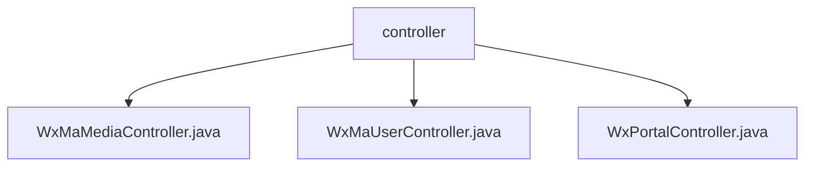

# 基础信息

|      |      |
|------|------|
| 名称 | controller |
| 编码语言 | .java |
| 代码路径 | weixin-java-miniapp-demo/src/main/java/com/github/binarywang/demo/wx/miniapp/controller |
| 包名 | docs.src.main.java.com.github.binarywang.demo.wx.miniapp.controller |
| 概述说明 | 微信小程序三个控制器类：媒体控制器处理文件上传下载；用户控制器管理登录、用户信息和手机号；门户控制器处理认证和消息路由。均包含ThreadLocal清理和日志记录。 |

# 说明

## 概述  
该模块是微信小程序后端核心控制器集合，主要负责媒体文件管理、用户信息处理和消息路由三大功能。接口规范遵循微信开放平台标准，包含签名验证、数据解密和ThreadLocal清理等通用逻辑。关键数据结构包括Media_id列表、用户会话信息（sessionKey/openid）和消息路由配置。外部依赖微信JSSDK、Spring Boot和Lombok。例如上传临时素材返回media_id，用户登录返回sessionKey，消息处理支持AES加密。

## 主要业务场景  
模块完整覆盖小程序后端典型交互：媒体文件上传下载（类似CDN管理）、用户登录与信息获取（类似OAuth2.0流程）、消息接收与路由（类似事件总线模式）。业务流程均包含请求验证-业务处理-资源清理三阶段，例如用户登录需校验code有效性，消息处理支持JSON/XML双格式。典型应用包括：通过code换取用户openid，解密获取加密手机号，处理微信公众号消息事件等。API类型涵盖RESTful接口和微信回调接口。

### 包内部结构视图

该流程图展示了微信小程序demo项目中控制器的层级结构，包含三个主要控制器文件：WxMaMediaController处理媒体相关请求，WxMaUserController管理用户操作，WxPortalController作为门户入口。所有控制器都位于同一层级，没有更深层次的子目录结构，体现了简洁的MVC架构设计模式。

# 文件列表

| 名称   | 类型  | 说明 |
|-------|------|-------------|
| [WxMaMediaController.java](WxMaMediaController.md) | file | 微信小程序媒体控制器，提供上传和下载临时素材功能。上传需校验appid，支持多文件处理，返回media_id列表。下载需校验appid和media_id，返回媒体文件。操作后清理ThreadLocal。 |
| [WxMaUserController.java](WxMaUserController.md) | file | 微信小程序用户控制器，提供登录、用户信息和手机号获取接口，验证appid和用户数据后返回JSON结果，每次请求后清理ThreadLocal。 |
| [WxPortalController.java](WxPortalController.md) | file | 微信小程序控制器类，处理GET/POST请求，验证签名并路由消息。GET用于微信服务器认证，POST处理明文或AES加密消息，校验appid后转发消息并返回成功或错误响应。 |

