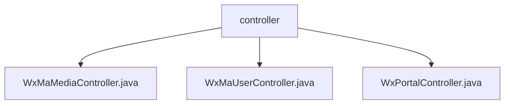

# 基础信息

|      |      |
|------|------|
| 名称 | controller |
| 编码语言 | .java |
| 代码路径 | weixin-java-miniapp-demo/src/main/java/com/github/binarywang/demo/wx/miniapp/controller |
| 包名 | docs.src.main.java.com.github.binarywang.demo.wx.miniapp.controller |
| 概述说明 | 微信小程序三个控制器类：媒体管理类处理文件上传下载；用户管理类提供登录、用户信息和手机号接口；后台类处理微信服务器认证和消息路由。均验证appid并清理ThreadLocal。 |

# 说明

## 概述  
该模块是微信小程序后端核心控制器集合，主要负责媒体文件管理、用户会话管理和微信服务器交互三大功能。接口规范统一要求验证appid有效性，并在处理完成后清理ThreadLocal存储的配置信息。关键数据结构包括media_id（媒体标识符）、用户会话信息对象和微信消息封装体。外部依赖微信开放平台SDK和Lombok工具库。例如媒体控制器处理多文件上传返回media_id列表，用户控制器解密返回手机号信息。

## 主要业务场景  
模块支持三类典型交互：媒体文件上传下载（类似网盘接口）、用户身份认证流程（类似OAuth2.0）和微信服务器消息路由（类似事件总线模式）。完整业务流程包含凭证校验→业务处理→资源清理三阶段，例如用户登录时验证code并返回openid。集成案例覆盖文件传输、会话管理和消息推送，如通过POST接口处理加密微信消息并返回success响应。

### 包内部结构视图

该流程图展示了一个微信小程序demo项目中controller目录下的三个控制器文件结构。顶层节点为controller文件夹，其下直接包含三个Java控制器类文件：WxMaMediaController、WxMaUserController和WxPortalController，分别处理媒体管理、用户管理和门户请求的业务逻辑。

# 文件列表

| 名称   | 类型  | 说明 |
|-------|------|-------------|
| [WxMaMediaController.java](WxMaMediaController.md) | file | 微信小程序素材控制器，提供上传和下载临时素材功能。上传返回media_id列表，下载返回文件。需校验appid有效性，操作后清理ThreadLocal。 |
| [WxMaUserController.java](WxMaUserController.md) | file | 微信小程序用户控制器，提供登录、获取用户信息和手机号接口，验证appid和用户数据，返回JSON结果，清理ThreadLocal。 |
| [WxPortalController.java](WxPortalController.md) | file | 微信小程序控制器类，处理GET/POST请求，验证签名并路由消息。GET用于认证，POST处理明文或AES加密消息，校验appid后转发消息并返回结果。每次请求后清理ThreadLocal。 |

