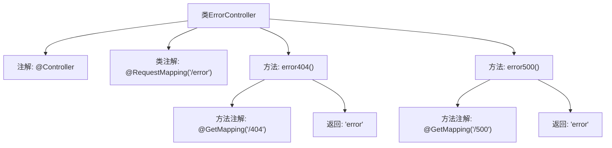

# 基础信息

|      |      |
|------|------|
| 名称 | ErrorController |
| 编码语言 | .java |
| 代码路径 | weixin-java-miniapp-demo/src/main/java/com/github/binarywang/demo/wx/miniapp/error/ErrorController.java |
| 包名 | com.github.binarywang.demo.wx.miniapp.error |
| 依赖项 | ['org.springframework.stereotype.Controller', 'org.springframework.web.bind.annotation.GetMapping', 'org.springframework.web.bind.annotation.RequestMapping'] |
| 概述说明 | Spring控制器处理404和500错误，返回统一错误页面。 |

# 说明

这是一个Spring MVC控制器类，用于处理错误页面请求。类上标注了@Controller注解，表明这是一个控制器组件。通过@RequestMapping注解将根路径映射到"/error"。类中包含两个处理GET请求的方法：error404()方法处理"/404"路径的请求，返回"error"视图；error500()方法处理"/500"路径的请求，同样返回"error"视图。这两个方法分别对应HTTP 404和500错误状态码的页面处理。

# 类列表 Class Summary

| 名称   | 类型  | 说明 |
|-------|------|-------------|
| ErrorController | class | Java控制器类，处理404和500错误请求，返回错误页面。 |


## 类 ErrorController

|      |      |
|------|------|
| 访问范围 | @Controller;@RequestMapping("/error");public |
| 类型 | class |
| 名称 | ErrorController |
| 说明 | Java控制器类，处理404和500错误请求，返回错误页面。 |


### UML类图

```mermaid
classDiagram
    class ErrorController {
        <<Controller>>
        +error404() String
        +error500() String
    }
    ErrorController --> "Spring Framework" : 依赖
```

这段代码展示了一个Spring MVC控制器类ErrorController，它处理两种HTTP错误状态码(404和500)的请求。该类被标记为@Controller注解，表明这是一个Spring MVC控制器，并映射到"/error"路径。包含两个公共方法：error404()和error500()，分别处理GET请求"/error/404"和"/error/500"路径，都返回相同的"error"视图名称。这个控制器依赖于Spring框架的基础设施来实现请求映射和视图解析功能，主要用于集中处理系统错误页面请求。


### 内部方法调用关系图



该流程图展示了Spring MVC中ErrorController类的结构。控制器类通过@Controller和@RequestMapping注解标记，包含两个处理GET请求的方法：error404()和error500()，分别映射到"/error/404"和"/error/500"路径。两个方法均返回名为"error"的视图字符串，用于渲染错误页面。图中清晰呈现了类与方法的注解关系及返回值流向。

### 字段列表 Field List

| 名称  | 类型  | 说明 |
|-------|-------|------|

### 方法列表

| 名称  | 类型  | 说明 |
|-------|-------|------|
| error500 | String | 这是一个Spring MVC的GET请求处理方法，映射路径为"/500"，返回字符串"error"。 |
| error404 | String | Spring MVC控制器方法，处理GET请求路径"/404"，返回字符串"error"。 |


