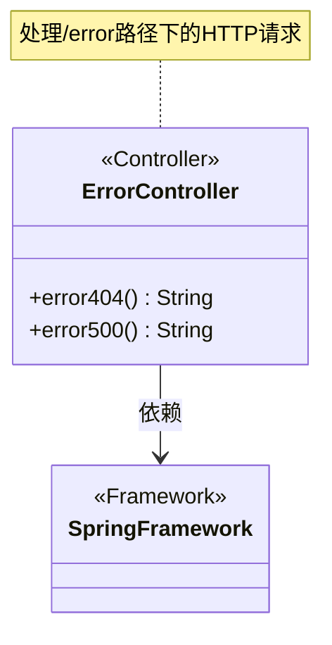
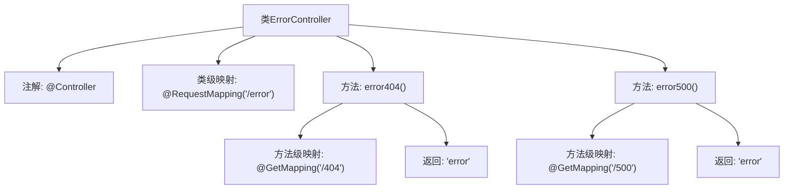

# 基础信息

|      |      |
|------|------|
| 名称 | ErrorController |
| 编码语言 | .java |
| 代码路径 | weixin-java-miniapp-demo/src/main/java/com/github/binarywang/demo/wx/miniapp/error/ErrorController.java |
| 包名 | com.github.binarywang.demo.wx.miniapp.error |
| 依赖项 | ['org.springframework.stereotype.Controller', 'org.springframework.web.bind.annotation.GetMapping', 'org.springframework.web.bind.annotation.RequestMapping'] |
| 概述说明 | 这是一个Spring MVC控制器，处理404和500错误请求，返回错误页面。 |

# 说明

这是一个Spring MVC控制器类，专门处理错误页面请求。类名为ErrorController，通过@RequestMapping注解映射到"/error"路径。包含两个GET请求处理方法：error404()处理404错误路径"/error/404"，error500()处理500错误路径"/error/500"。两个方法都返回名为"error"的视图字符串，用于渲染错误页面。

# 类列表 Class Summary

| 名称   | 类型  | 说明 |
|-------|------|-------------|
| ErrorController | class | ErrorController处理404和500错误，返回统一错误页面。 |

## 类 ErrorController

|      |      |
|------|------|
| 访问范围 | @Controller;@RequestMapping("/error");public |
| 类型 | class |
| 名称 | ErrorController |
| 说明 | ErrorController处理404和500错误，返回统一错误页面。 |

### UML类图

类图描述：该图展示了一个Spring MVC的ErrorController类，它被标记为@Controller注解，处理"/error"路径下的HTTP请求。类中包含两个公共方法error404()和error500()，分别对应GET请求的"/404"和"/500"路径，都返回"error"视图字符串。该类依赖于Spring框架的基础功能，是典型的MVC控制器实现结构。

### 内部方法调用关系图

该流程图展示了Spring MVC控制器`ErrorController`的结构，包含类级别的`@RequestMapping`和两个处理不同HTTP错误码的方法。每个方法通过`@GetMapping`指定路径映射（/404和/500），均返回"error"视图名称。类标注`@Controller`表明这是一个处理HTTP请求的组件，整体设计用于集中处理404和500错误页面的路由逻辑。

### 字段列表 Field List

| 名称  | 类型  | 说明 |
|-------|-------|------|

### 方法列表

| 名称  | 类型  | 说明 |
|-------|-------|------|
| error500 | String | 这是一个Spring MVC的GET请求处理方法，路径为"/500"，返回字符串"error"。 |
| error404 | String | Spring控制器方法，处理GET请求路径"/404"，返回字符串"error"。 |

