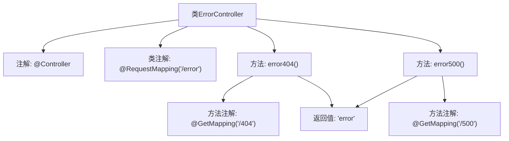

# 基础信息

|      |      |
|------|------|
| 名称 | ErrorController |
| 编码语言 | .java |
| 代码路径 | weixin-java-miniapp-demo/src/main/java/com/github/binarywang/demo/wx/miniapp/error/ErrorController.java |
| 包名 | com.github.binarywang.demo.wx.miniapp.error |
| 依赖项 | ['org.springframework.stereotype.Controller', 'org.springframework.web.bind.annotation.GetMapping', 'org.springframework.web.bind.annotation.RequestMapping'] |
| 概述说明 | ErrorController处理404和500错误，返回统一错误页面。 |

# 说明

这是一个Spring MVC控制器类，专门用于处理错误页面请求。类上标注了Controller注解，表明这是一个控制器组件。RequestMapping注解指定了基础路径为/error。类中包含两个方法：error404方法处理HTTP 404错误的GET请求，映射路径为/error/404；error500方法处理HTTP 500错误的GET请求，映射路径为/error/500。两个方法都返回名为error的视图字符串，表示将渲染error模板页面来显示错误信息。

# 类列表 Class Summary

| 名称   | 类型  | 说明 |
|-------|------|-------------|
| ErrorController | class | ErrorController处理404和500错误，返回统一错误页面。 |


## 类 ErrorController

|      |      |
|------|------|
| 访问范围 | @Controller;@RequestMapping("/error");public |
| 类型 | class |
| 名称 | ErrorController |
| 说明 | ErrorController处理404和500错误，返回统一错误页面。 |


### UML类图

```mermaid
classDiagram
    class ErrorController {
        <<Controller>>
        +error404() String
        +error500() String
    }
    ErrorController --> SpringFramework : 依赖
    note for ErrorController "处理/404和/500错误请求的控制器"

    <<Interface>> SpringFramework {
        <<Spring MVC框架接口>>
    }
```

这段代码展示了一个Spring MVC的错误控制器类，用于处理404和500错误请求。ErrorController类标注了@Controller注解，表明这是一个Spring MVC控制器，并通过@RequestMapping定义了基础路径"/error"。类中包含两个处理GET请求的方法：error404()和error500()，分别对应404和500错误路径，两者都返回相同的"error"视图名称。该类依赖于Spring框架提供的MVC功能来实现请求映射和处理。


### 内部方法调用关系图



该流程图展示了Spring MVC控制器ErrorController的结构，包含两个处理不同错误路径的方法。类级别使用@Controller和@RequestMapping注解定义基础路径，两个方法分别通过@GetMapping处理404和500错误请求，均返回"error"视图名称。箭头清晰表示了注解、方法和返回值之间的关联关系。

### 字段列表 Field List

| 名称  | 类型  | 说明 |
|-------|-------|------|

### 方法列表

| 名称  | 类型  | 说明 |
|-------|-------|------|
| error500 | String | 这是一个Spring MVC的GET请求处理方法，映射路径为"/500"，返回字符串"error"。 |
| error404 | String | 这是一个Spring MVC的GET请求处理方法，路径为"/404"，返回字符串"error"。 |


