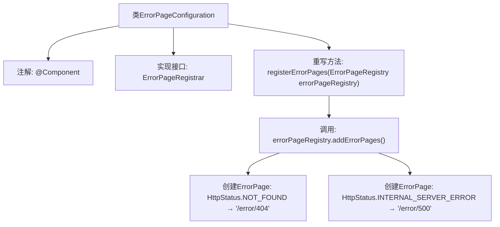

# 基础信息

|      |      |
|------|------|
| 名称 | ErrorPageConfiguration |
| 编码语言 | .java |
| 代码路径 | weixin-java-miniapp-demo/src/main/java/com/github/binarywang/demo/wx/miniapp/error/ErrorPageConfiguration.java |
| 包名 | com.github.binarywang.demo.wx.miniapp.error |
| 依赖项 | ['org.springframework.boot.web.server.ErrorPage', 'org.springframework.boot.web.server.ErrorPageRegistrar', 'org.springframework.boot.web.server.ErrorPageRegistry', 'org.springframework.http.HttpStatus', 'org.springframework.stereotype.Component'] |
| 概述说明 | 定义错误页面配置类，注册404和500错误对应的处理路径。 |

# 说明

该代码定义了一个名为ErrorPageConfiguration的Spring组件类，实现了ErrorPageRegistrar接口。它重写了registerErrorPages方法，通过传入的ErrorPageRegistry对象注册了两个错误页面：当出现404状态码时跳转到/error/404路径，出现500状态码时跳转到/error/500路径。这个配置类用于自定义应用程序的错误页面处理逻辑。

# 类列表 Class Summary

| 名称   | 类型  | 说明 |
|-------|------|-------------|
| ErrorPageConfiguration | class | ErrorPageConfiguration类注册404和500错误页，分别指向/error/404和/error/500路径。 |


## 类 ErrorPageConfiguration

|      |      |
|------|------|
| 访问范围 | @Component;public |
| 类型 | class |
| 名称 | ErrorPageConfiguration |
| 说明 | ErrorPageConfiguration类注册404和500错误页，分别指向/error/404和/error/500路径。 |


### UML类图

```mermaid
classDiagram
    class ErrorPageConfiguration {
        +registerErrorPages(ErrorPageRegistry errorPageRegistry) void
    }
    <<Interface>> ErrorPageRegistrar {
        +registerErrorPages(ErrorPageRegistry errorPageRegistry) void
    }
    class ErrorPageRegistry {
        +addErrorPages(ErrorPage... errorPages) void
    }
    class ErrorPage {
        -HttpStatus status
        -String path
        +ErrorPage(HttpStatus status, String path)
    }
    class HttpStatus {
        <<enumeration>>
        NOT_FOUND
        INTERNAL_SERVER_ERROR
        // ...其他状态码
    }

    ErrorPageConfiguration --> ErrorPageRegistrar : 实现
    ErrorPageConfiguration --> ErrorPageRegistry : 依赖
    ErrorPageConfiguration --> ErrorPage : 创建
    ErrorPage --> HttpStatus : 使用枚举
```

类图描述：该图展示了Spring Boot错误页面配置的核心结构。ErrorPageConfiguration作为@Component实现了ErrorPageRegistrar接口，通过registerErrorPages方法向ErrorPageRegistry注册多个ErrorPage实例。每个ErrorPage绑定特定HTTP状态码（如404/500）与错误处理路径，其中HttpStatus是枚举类型。整体体现了错误页面的声明式注册机制，层级清晰且符合Spring的依赖注入模式。


### 内部方法调用关系图



这段代码是一个Spring组件类，实现了ErrorPageRegistrar接口，用于注册自定义错误页面。当系统出现404或500错误时，会自动跳转到指定的错误处理路径。流程图展示了从类声明到方法实现的完整调用链，包括组件注解标记、接口实现关系、错误页面注册逻辑以及两个具体错误页面的配置过程。整个过程体现了Spring Boot的错误处理机制，通过集中配置简化了错误页面的管理。

### 字段列表 Field List

| 名称  | 类型  | 说明 |
|-------|-------|------|

### 方法列表

| 名称  | 类型  | 说明 |
|-------|-------|------|
| registerErrorPages | void | 注册错误页面，404跳转/error/404，500跳转/error/500。 |


