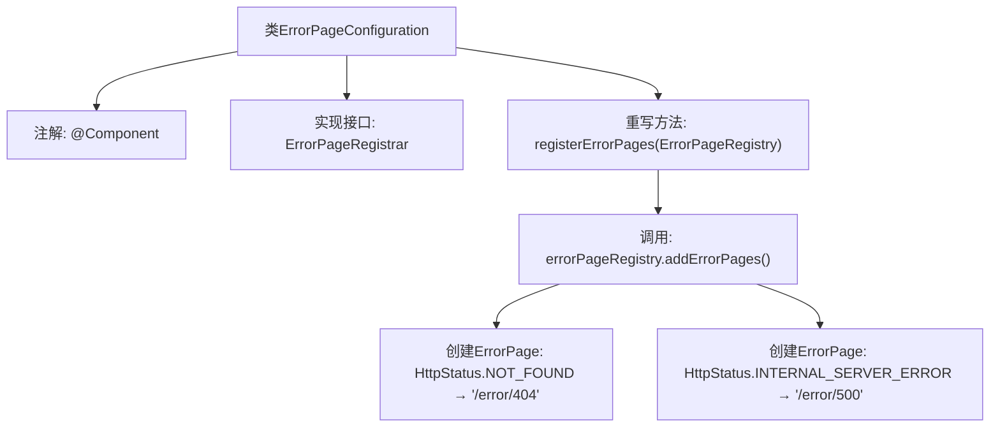

# 基础信息

|      |      |
|------|------|
| 名称 | ErrorPageConfiguration |
| 编码语言 | .java |
| 代码路径 | weixin-java-miniapp-demo/src/main/java/com/github/binarywang/demo/wx/miniapp/error/ErrorPageConfiguration.java |
| 包名 | com.github.binarywang.demo.wx.miniapp.error |
| 依赖项 | ['org.springframework.boot.web.server.ErrorPage', 'org.springframework.boot.web.server.ErrorPageRegistrar', 'org.springframework.boot.web.server.ErrorPageRegistry', 'org.springframework.http.HttpStatus', 'org.springframework.stereotype.Component'] |
| 概述说明 | ErrorPageConfiguration类注册404和500错误页，分别指向/error/404和/error/500路径。 |

# 说明

该代码定义了一个名为ErrorPageConfiguration的Spring组件类，实现了ErrorPageRegistrar接口。它重写了registerErrorPages方法，通过ErrorPageRegistry注册了两个错误页面：当出现404状态码时跳转到/error/404路径，出现500状态码时跳转到/error/500路径。这个配置类用于处理Web应用中的常见HTTP错误。

# 类列表 Class Summary

| 名称   | 类型  | 说明 |
|-------|------|-------------|
| ErrorPageConfiguration | class | Java类ErrorPageConfiguration实现ErrorPageRegistrar接口，注册404和500错误页面对应的处理路径。 |


## 类 ErrorPageConfiguration

|      |      |
|------|------|
| 访问范围 | @Component;public |
| 类型 | class |
| 名称 | ErrorPageConfiguration |
| 说明 | Java类ErrorPageConfiguration实现ErrorPageRegistrar接口，注册404和500错误页面对应的处理路径。 |


### UML类图

```mermaid
classDiagram
    class ErrorPageConfiguration {
        +registerErrorPages(ErrorPageRegistry errorPageRegistry) void
    }
    <<Interface>> ErrorPageRegistrar
    ErrorPageConfiguration ..|> ErrorPageRegistrar : 实现
    class ErrorPageRegistry {
        +addErrorPages(ErrorPage... errorPages) void
    }
    class ErrorPage {
        +ErrorPage(HttpStatus status, String path)
    }
    class HttpStatus {
        <<enumeration>>
        NOT_FOUND
        INTERNAL_SERVER_ERROR
    }
    ErrorPageConfiguration --> ErrorPageRegistry : 使用
    ErrorPageConfiguration --> ErrorPage : 创建
    ErrorPage --> HttpStatus : 依赖
```

这段代码展示了一个Spring Boot错误页面配置类ErrorPageConfiguration，它实现了ErrorPageRegistrar接口，通过registerErrorPages方法向ErrorPageRegistry注册404和500错误对应的处理路径。类图中包含核心组件：配置类、接口、注册器、错误页实体和HTTP状态枚举，清晰地反映了它们之间的实现、依赖和组合关系。


### 内部方法调用关系图



该流程图展示了Spring组件ErrorPageConfiguration的注册过程。作为ErrorPageRegistrar接口的实现类，它通过重写registerErrorPages方法，向容器注册了两个错误页面：404状态码映射到/error/404路径，500状态码映射到/error/500路径。整个过程体现了Spring Boot对错误页面的集中式配置机制。

### 字段列表 Field List

| 名称  | 类型  | 说明 |
|-------|-------|------|

### 方法列表

| 名称  | 类型  | 说明 |
|-------|-------|------|
| registerErrorPages | void | 注册错误页面，404跳转/error/404，500跳转/error/500。 |


