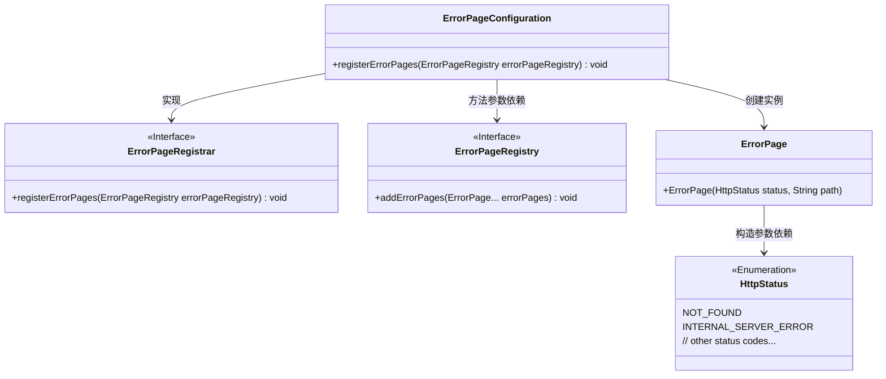
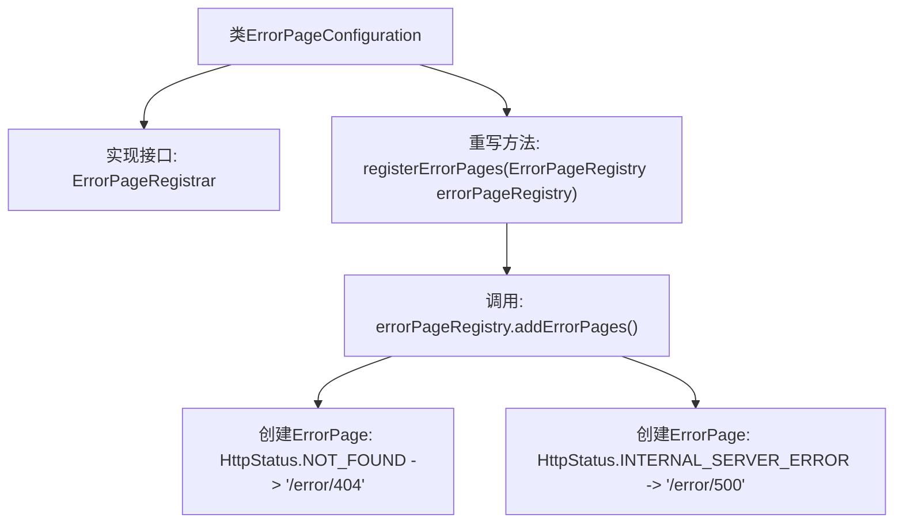

# 基础信息

|      |      |
|------|------|
| 名称 | ErrorPageConfiguration |
| 编码语言 | .java |
| 代码路径 | weixin-java-miniapp-demo/src/main/java/com/github/binarywang/demo/wx/miniapp/error/ErrorPageConfiguration.java |
| 包名 | com.github.binarywang.demo.wx.miniapp.error |
| 依赖项 | ['org.springframework.boot.web.server.ErrorPage', 'org.springframework.boot.web.server.ErrorPageRegistrar', 'org.springframework.boot.web.server.ErrorPageRegistry', 'org.springframework.http.HttpStatus', 'org.springframework.stereotype.Component'] |
| 概述说明 | 定义错误页面配置类，注册404和500错误对应的处理路径。 |

# 说明

该代码定义了一个Spring组件类ErrorPageConfiguration，实现了ErrorPageRegistrar接口。它通过重写registerErrorPages方法，向错误页面注册器添加了两个自定义错误页面映射：当发生404状态码错误时跳转至/error/404路径，发生500状态码错误时跳转至/error/500路径。该配置类用于集中管理系统的错误页面路由。

# 类列表 Class Summary

| 名称   | 类型  | 说明 |
|-------|------|-------------|
| ErrorPageConfiguration | class | 错误页配置类，注册404和500错误对应的处理路径。 |

## 类 ErrorPageConfiguration

|      |      |
|------|------|
| 访问范围 | @Component;public |
| 类型 | class |
| 名称 | ErrorPageConfiguration |
| 说明 | 错误页配置类，注册404和500错误对应的处理路径。 |

### UML类图

类图描述：该图展示了Spring框架中错误页面配置的核心结构。ErrorPageConfiguration作为组件实现了ErrorPageRegistrar接口，通过registerErrorPages方法向ErrorPageRegistry注册多个ErrorPage实例。每个ErrorPage关联特定的HttpStatus枚举值和错误处理路径，形成完整的错误处理机制。图中清晰体现了接口实现、参数依赖和枚举使用的关键关系。

### 内部方法调用关系图

这段代码定义了一个Spring组件ErrorPageConfiguration，用于注册自定义错误页面。该类实现了ErrorPageRegistrar接口，通过重写registerErrorPages方法，向系统注册了两个错误页面：404状态码对应/error/404路径，500状态码对应/error/500路径。当应用发生相应错误时，会自动跳转到配置的路径进行处理。

### 字段列表 Field List

| 名称  | 类型  | 说明 |
|-------|-------|------|

### 方法列表

| 名称  | 类型  | 说明 |
|-------|-------|------|
| registerErrorPages | void | 注册错误页面，404和500错误分别跳转到/error/404和/error/500。 |

