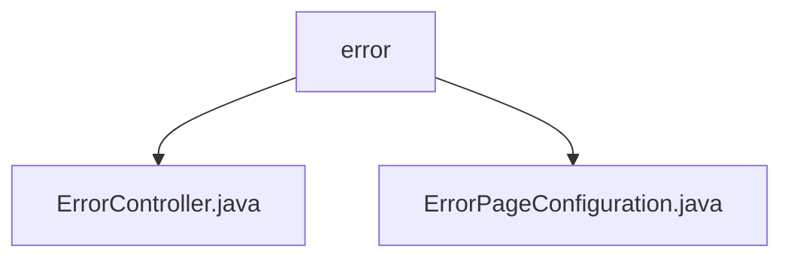

# 基础信息

|      |      |
|------|------|
| 名称 | error |
| 编码语言 | .java |
| 代码路径 | weixin-java-miniapp-demo/src/main/java/com/github/binarywang/demo/wx/miniapp/error |
| 包名 | docs.src.main.java.com.github.binarywang.demo.wx.miniapp.error |
| 概述说明 | Spring MVC控制器处理404/500错误，返回error视图。配置类注册错误页面，404跳/error/404，500跳/error/500。 |

# 说明

## 概述  
该模块核心职责是统一处理Web应用的HTTP错误响应，包含错误页面路由配置和视图渲染功能。接口规范遵循Spring MVC模式，通过Controller暴露/error/404和/error/500两个端点，配合ErrorPageRegistrar实现自动错误路径跳转。关键数据结构为Spring的ErrorPageRegistry，用于绑定状态码与错误路径。外部依赖仅需Spring Web框架。例如ErrorController渲染error模板，ErrorPageConfiguration注册404/500跳转逻辑。

## 主要业务场景  
模块通过"错误码映射+统一视图"模式处理异常流程，类似前端路由拦截器。当用户访问不存在的URL触发404时，系统自动跳转至/error/404并渲染错误页；服务端异常触发500则导向/error/500。典型应用包括微信小程序后端服务的错误兜底，例如接口超时返回500状态码时展示友好错误页。API类型均为同步HTTP GET请求，集成案例可见微信小程序Demo的错误处理链路。

### 包内部结构视图

该流程图展示了微信小程序demo项目中error目录下的文件结构。error作为父节点，包含两个子节点：ErrorController.java和ErrorPageConfiguration.java，这两个文件分别处理错误控制和错误页面配置功能。整个结构简洁明了，体现了错误处理模块的基本组成。

# 文件列表

| 名称   | 类型  | 说明 |
|-------|------|-------------|
| [ErrorController.java](ErrorController.md) | file | ErrorController处理404和500错误，返回统一错误页面。 |
| [ErrorPageConfiguration.java](ErrorPageConfiguration.md) | file | ErrorPageConfiguration类注册404和500错误页，分别指向/error/404和/error/500路径。 |

