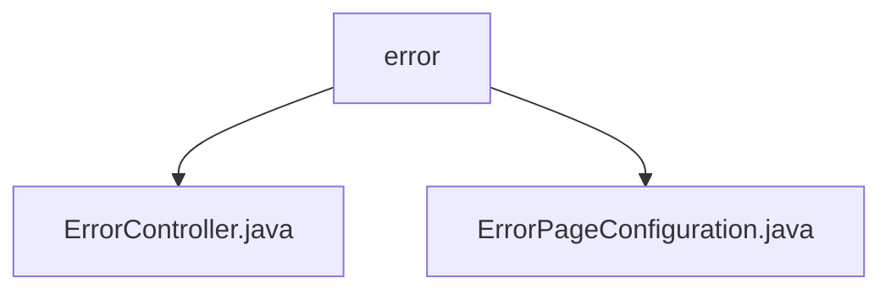

# 基础信息

|      |      |
|------|------|
| 名称 | error |
| 编码语言 | .java |
| 代码路径 | weixin-java-miniapp-demo/src/main/java/com/github/binarywang/demo/wx/miniapp/error |
| 包名 | docs.src.main.java.com.github.binarywang.demo.wx.miniapp.error |
| 概述说明 | Spring MVC控制器ErrorController处理/error路径，包含404和500错误处理方法返回error视图。ErrorPageConfiguration类配置404和500错误页面跳转路径。 |

# 说明

## 概述  
该模块核心职责是统一处理Web应用错误页面，包含错误请求路由和页面跳转配置。接口规范遵循Spring MVC标准，通过Controller映射错误路径（如/error/404）和Registrar配置状态码跳转逻辑。关键数据结构为ErrorPage对象，用于维护状态码与路径的映射关系。外部依赖仅Spring Web框架。例如ErrorController处理具体错误请求，ErrorPageConfiguration实现全局错误路由。

## 主要业务场景  
模块主要实现HTTP错误状态码（404/500）的标准化处理流程，类似网关错误拦截模式。业务交互分为两层：Controller响应具体错误请求返回视图，Registrar预置状态码跳转规则形成闭环。典型应用场景包括页面不存在或服务异常时的友好提示，例如访问无效URL自动跳转至404页面。API类型均为服务端渲染接口，集成案例可见微信小程序Demo的错误处理子系统。

### 包内部结构视图

该流程图展示了微信小程序demo项目中错误处理模块的目录结构。根节点为error文件夹，包含两个子文件：ErrorController.java（错误控制器）和ErrorPageConfiguration.java（错误页面配置类）。这两个文件共同构成了小程序错误处理的核心功能模块，用于统一管理异常处理和错误页面展示逻辑。

# 文件列表

| 名称   | 类型  | 说明 |
|-------|------|-------------|
| [ErrorController.java](ErrorController.md) | file | 这是一个Spring MVC控制器，处理404和500错误请求，返回错误页面。 |
| [ErrorPageConfiguration.java](ErrorPageConfiguration.md) | file | ErrorPageConfiguration类实现ErrorPageRegistrar接口，注册404和500错误页面对应的处理路径。 |

