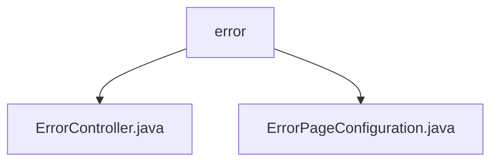

# 基础信息

|      |      |
|------|------|
| 名称 | error |
| 编码语言 | .java |
| 代码路径 | weixin-java-miniapp-demo/src/main/java/com/github/binarywang/demo/wx/miniapp/error |
| 包名 | docs.src.main.java.com.github.binarywang.demo.wx.miniapp.error |
| 概述说明 | Spring MVC控制器处理错误页面，映射/error路径，提供404和500错误处理方法。配置类实现错误页面注册，将404和500错误分别重定向到指定路径。 |

# 说明

## 概述  
该模块核心职责是统一处理HTTP错误页面响应，包含错误请求路由映射和视图返回功能。接口规范遵循Spring MVC标准，通过@Controller和@RequestMapping注解定义路由，例如/404和/500路径分别映射到对应错误处理方法。关键数据结构包括ErrorPageRegistrar接口实现和视图名称"error"。外部依赖仅Spring框架。例如ErrorController返回统一错误视图，ErrorPageConfiguration配置错误路径跳转逻辑。

## 主要业务场景  
模块主要处理两类HTTP错误场景：404资源未找到和500服务器内部错误，类似Web服务器的默认错误页机制。业务流程为：当系统抛出异常时，ErrorPageConfiguration自动重定向到预设路径，ErrorController接收请求并返回静态错误视图。典型应用模式包括API调用失败或页面不存在时的友好提示，例如微信小程序后端统一错误处理。所有交互均通过GET请求完成。

### 包内部结构视图

该流程图展示了微信小程序demo项目中error目录下的文件结构。error作为父节点，包含两个子节点：ErrorController.java和ErrorPageConfiguration.java，分别代表错误处理控制器和错误页面配置类。整个结构简洁明了，体现了错误处理模块的基本组成。

# 文件列表

| 名称   | 类型  | 说明 |
|-------|------|-------------|
| [ErrorController.java](ErrorController.md) | file | Spring控制器处理404和500错误，返回统一错误页面。 |
| [ErrorPageConfiguration.java](ErrorPageConfiguration.md) | file | 定义错误页面配置类，注册404和500错误对应的处理路径。 |

