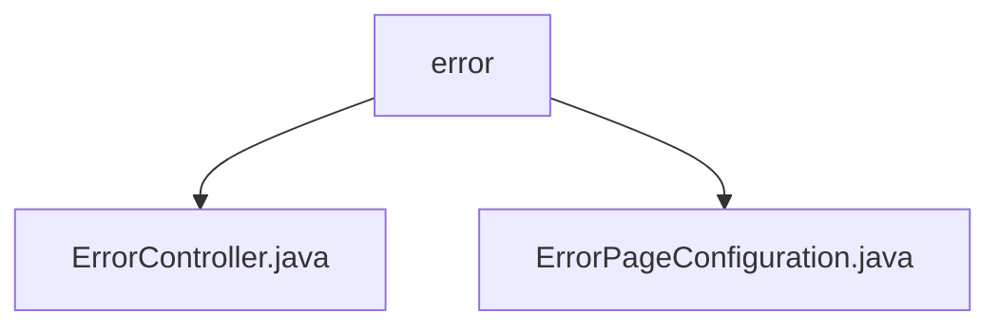

# 基础信息

|      |      |
|------|------|
| 名称 | error |
| 编码语言 | .java |
| 代码路径 | weixin-java-miniapp-demo/src/main/java/com/github/binarywang/demo/wx/miniapp/error |
| 包名 | docs.src.main.java.com.github.binarywang.demo.wx.miniapp.error |
| 概述说明 | ErrorController类处理/error路径请求，包含404和500错误处理方法，返回error视图。ErrorPageConfiguration类注册404和500错误页面的跳转路径。 |

# 说明

## 概述  
该模块核心职责是统一处理HTTP错误状态码（如404/500），通过Spring MVC实现自定义错误页面的路由与渲染。接口规范包含ErrorController的路径映射（"/error"）和ErrorPageConfiguration的错误路径注册，两者协同完成错误请求转发。关键数据结构为ErrorPageRegistry管理的错误页面跳转规则。外部依赖仅Spring Web框架。例如ErrorController渲染统一错误模板，ErrorPageConfiguration绑定状态码与路径。

## 主要业务场景  
模块通过"状态码识别→路径重定向→模板渲染"流程处理错误，类似前端路由拦截模式。典型场景包括用户访问不存在资源触发404，或服务异常触发500时展示友好页面。交互模式为Spring内部错误页面注册机制与控制器协作，例如404状态码自动路由至/error/404。完整功能覆盖常见HTTP错误状态的自定义展示需求。

### 包内部结构视图

该流程图展示了微信小程序demo项目中错误处理模块的层级结构。根节点为error目录，包含两个子文件：ErrorController.java（错误控制器）和ErrorPageConfiguration.java（错误页面配置）。这两个文件共同构成了小程序错误处理的核心功能模块，用于统一管理异常处理和错误页面展示逻辑。

# 文件列表

| 名称   | 类型  | 说明 |
|-------|------|-------------|
| [ErrorController.java](ErrorController.md) | file | ErrorController处理404和500错误，返回统一错误页面。 |
| [ErrorPageConfiguration.java](ErrorPageConfiguration.md) | file | 定义错误页面配置类，注册404和500错误对应的处理路径。 |

