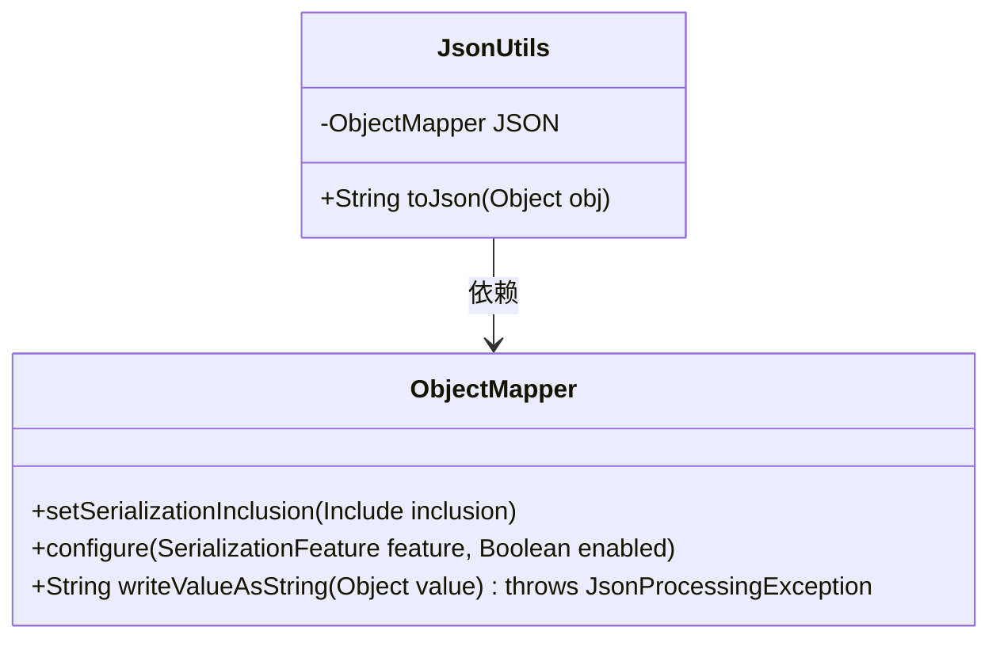
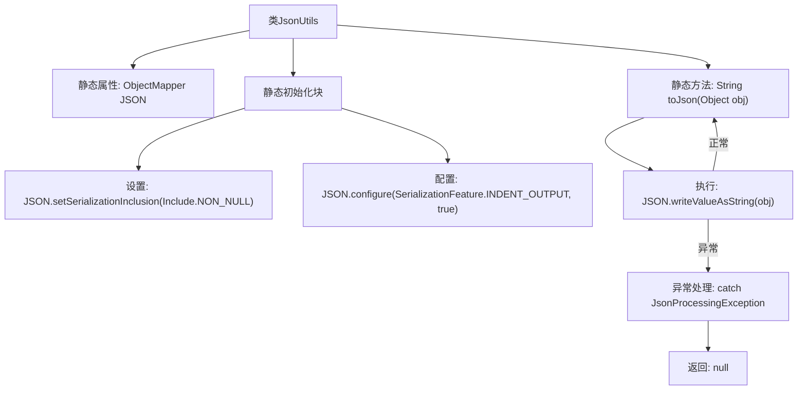

# 基础信息

|      |      |
|------|------|
| 名称 | JsonUtils |
| 编码语言 | .java |
| 代码路径 | weixin-java-miniapp-demo/src/main/java/com/github/binarywang/demo/wx/miniapp/utils/JsonUtils.java |
| 包名 | com.github.binarywang.demo.wx.miniapp.utils |
| 依赖项 | ['com.fasterxml.jackson.annotation.JsonInclude.Include', 'com.fasterxml.jackson.core.JsonProcessingException', 'com.fasterxml.jackson.databind.ObjectMapper', 'com.fasterxml.jackson.databind.SerializationFeature'] |
| 概述说明 | JsonUtils类提供静态JSON序列化方法，使用ObjectMapper配置忽略null值并格式化输出，异常时返回null。 |

# 说明

JsonUtils是一个工具类，用于处理JSON序列化。它使用ObjectMapper作为核心组件，并在静态初始化块中配置了两个关键选项：一是设置序列化时忽略null值，二是启用缩进输出以提高可读性。该类提供了一个静态方法toJson，用于将任意对象转换为JSON字符串。若转换过程中发生JsonProcessingException异常，会打印异常堆栈并返回null。整个类设计简洁，专注于JSON序列化的基础功能。

# 类列表 Class Summary

| 名称   | 类型  | 说明 |
|-------|------|-------------|
| JsonUtils | class | JsonUtils类提供静态JSON序列化方法，使用ObjectMapper配置非空字段输出和格式化，异常时返回null。 |

## 类 JsonUtils

|      |      |
|------|------|
| 访问范围 | public |
| 类型 | class |
| 名称 | JsonUtils |
| 说明 | JsonUtils类提供静态JSON序列化方法，使用ObjectMapper配置非空字段输出和格式化，异常时返回null。 |

### UML类图

类图描述：该图展示了一个JsonUtils工具类，它封装了Jackson库的ObjectMapper对象用于JSON序列化操作。JsonUtils通过静态初始化块配置ObjectMapper实例（忽略NULL值、启用缩进输出），并提供了toJson()方法将对象转换为JSON字符串。ObjectMapper类展示了关键的配置和序列化方法，两者之间存在明确的依赖关系。

### 内部方法调用关系图

流程图描述了JsonUtils工具类的结构和执行流程。该类通过静态初始化块配置ObjectMapper实例，设置非空值序列化和缩进输出。核心方法toJson()通过writeValueAsString转换对象为JSON字符串，异常时返回null。整体展现了从类初始化到方法调用的完整路径，突出异常处理分支。

### 字段列表 Field List

| 名称  | 类型  | 说明 |
|-------|-------|------|
| JSON = new ObjectMapper() | ObjectMapper | 定义私有静态不可变JSON对象映射器实例。 |

### 方法列表

| 名称  | 类型  | 说明 |
|-------|-------|------|
| toJson | String | 将对象转为JSON字符串，失败返回null。 |

