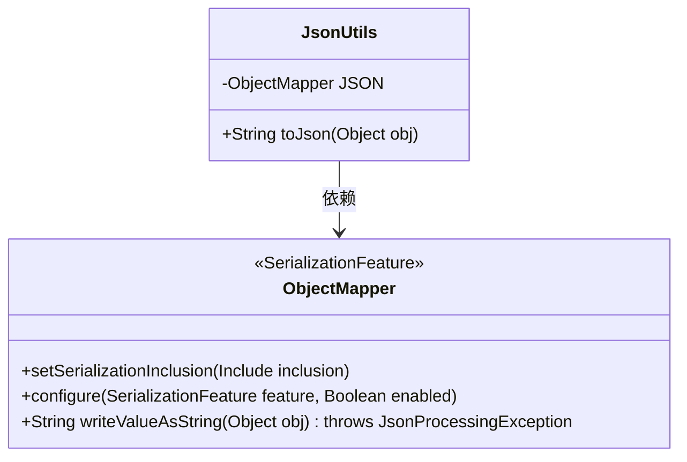
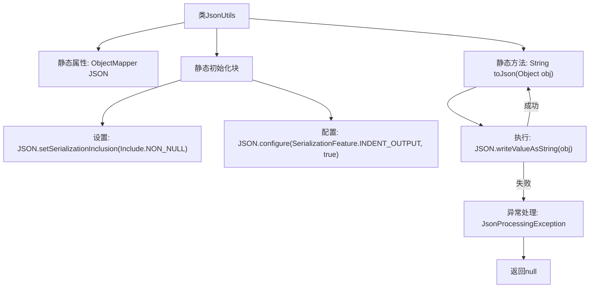

# 基础信息

|      |      |
|------|------|
| 名称 | JsonUtils |
| 编码语言 | .java |
| 代码路径 | weixin-java-miniapp-demo/src/main/java/com/github/binarywang/demo/wx/miniapp/utils/JsonUtils.java |
| 包名 | com.github.binarywang.demo.wx.miniapp.utils |
| 依赖项 | ['com.fasterxml.jackson.annotation.JsonInclude.Include', 'com.fasterxml.jackson.core.JsonProcessingException', 'com.fasterxml.jackson.databind.ObjectMapper', 'com.fasterxml.jackson.databind.SerializationFeature'] |
| 概述说明 | JsonUtils工具类使用ObjectMapper实现对象转JSON字符串，自动忽略null值并格式化输出，异常时返回null。 |

# 说明

JsonUtils是一个工具类，用于处理JSON序列化。它使用ObjectMapper作为核心组件，并在静态初始化块中配置了两个关键选项：忽略空值字段和启用缩进格式化输出。该类提供了一个静态方法toJson，可将任意对象转换为JSON字符串。若转换过程中发生JsonProcessingException异常，会打印异常堆栈并返回null。整个类设计简洁，专注于JSON序列化功能。

# 类列表 Class Summary

| 名称   | 类型  | 说明 |
|-------|------|-------------|
| JsonUtils | class | JsonUtils类提供静态JSON序列化方法，配置忽略null值并格式化输出，异常时返回null。 |

## 类 JsonUtils

|      |      |
|------|------|
| 访问范围 | public |
| 类型 | class |
| 名称 | JsonUtils |
| 说明 | JsonUtils类提供静态JSON序列化方法，配置忽略null值并格式化输出，异常时返回null。 |

### UML类图

这段类图展示了JsonUtils工具类与ObjectMapper类的关系。JsonUtils是一个JSON处理工具类，包含一个静态的ObjectMapper实例JSON，并提供了toJson方法用于将对象序列化为JSON字符串。ObjectMapper类提供了JSON序列化的核心功能，包括设置序列化包含规则和配置输出格式。JsonUtils通过组合方式依赖ObjectMapper来实现其功能，体现了工具类对第三方库的封装使用模式。

### 内部方法调用关系图

该流程图展示了JsonUtils类的结构和工作流程。类包含一个静态ObjectMapper实例，在静态初始化块中配置了非空序列化和缩进输出。核心方法toJson通过writeValueAsString转换对象为JSON字符串，异常时打印堆栈并返回null。流程清晰展现了从初始化到方法调用的完整路径，特别突出了异常处理分支。

### 字段列表 Field List

| 名称  | 类型  | 说明 |
|-------|-------|------|
| JSON = new ObjectMapper() | ObjectMapper | 创建静态不可变的JSON对象映射器实例。 |

### 方法列表

| 名称  | 类型  | 说明 |
|-------|-------|------|
| toJson | String | 将对象转为JSON字符串，异常时打印错误并返回null。 |

