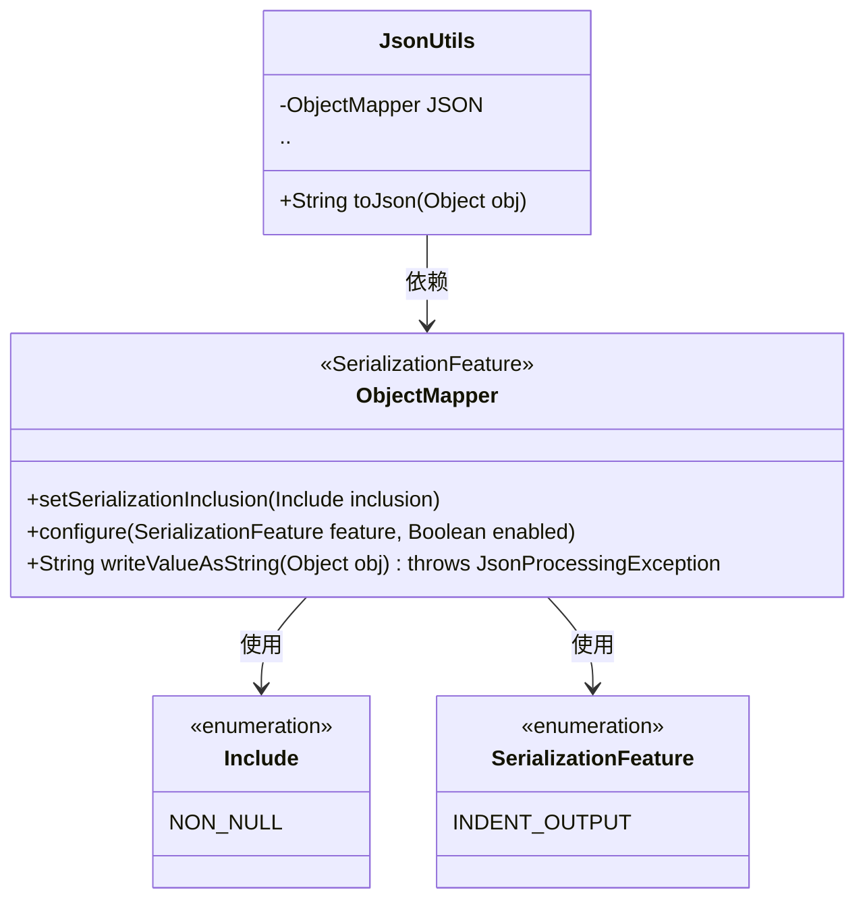
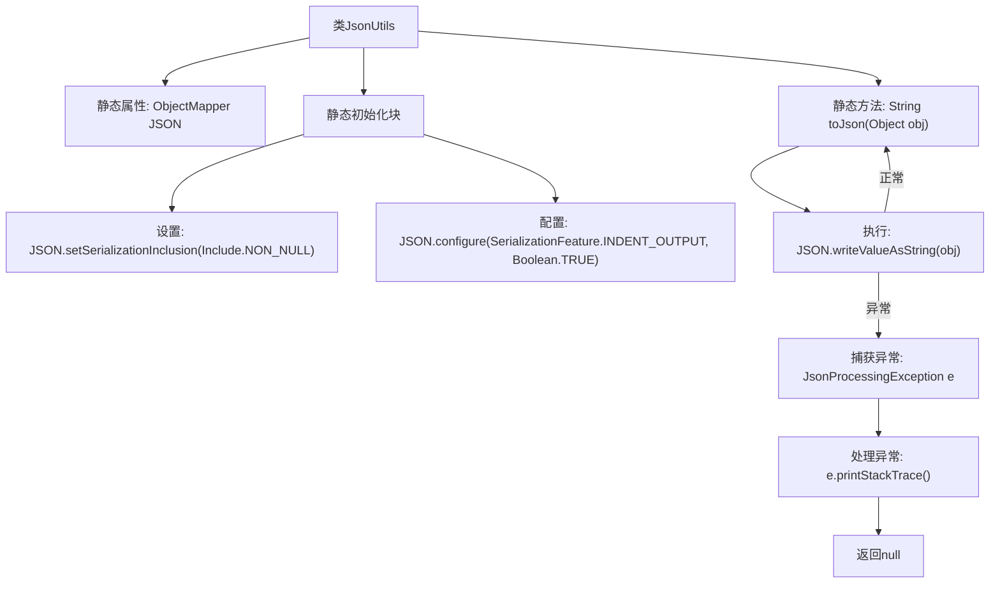

# 基础信息

|      |      |
|------|------|
| 名称 | JsonUtils |
| 编码语言 | .java |
| 代码路径 | weixin-java-miniapp-demo/src/main/java/com/github/binarywang/demo/wx/miniapp/utils/JsonUtils.java |
| 包名 | com.github.binarywang.demo.wx.miniapp.utils |
| 依赖项 | ['com.fasterxml.jackson.annotation.JsonInclude.Include', 'com.fasterxml.jackson.core.JsonProcessingException', 'com.fasterxml.jackson.databind.ObjectMapper', 'com.fasterxml.jackson.databind.SerializationFeature'] |
| 概述说明 | JsonUtils类提供静态方法toJson，使用ObjectMapper将对象转为JSON字符串，自动忽略null值并格式化输出。 |

# 说明

JsonUtils是一个工具类，用于处理JSON序列化。它使用ObjectMapper作为核心组件，并在静态初始化块中配置了两个关键选项：忽略空值字段和启用缩进格式化输出。该类提供了一个静态方法toJson，用于将任意对象转换为JSON字符串。若转换过程中发生JsonProcessingException异常，会打印异常堆栈并返回null。整个类设计为简洁实用的JSON序列化工具。

# 类列表 Class Summary

| 名称   | 类型  | 说明 |
|-------|------|-------------|
| JsonUtils | class | JsonUtils类提供静态方法toJson，使用ObjectMapper将对象转为JSON字符串，忽略null值并格式化输出。异常时返回null。 |

## 类 JsonUtils

|      |      |
|------|------|
| 访问范围 | public |
| 类型 | class |
| 名称 | JsonUtils |
| 说明 | JsonUtils类提供静态方法toJson，使用ObjectMapper将对象转为JSON字符串，忽略null值并格式化输出。异常时返回null。 |

### UML类图

这段代码展示了一个JSON工具类`JsonUtils`，它使用`ObjectMapper`进行对象序列化操作。类图中包含四个主要部分：`JsonUtils`作为工具类封装了核心方法`toJson()`；`ObjectMapper`是Jackson库的核心序列化类，配置了非空值过滤和缩进输出特性；`Include`和`SerializationFeature`是枚举类型，用于配置序列化行为。整个结构体现了工具类对第三方库的封装模式，通过静态初始化块进行全局配置，并处理了可能出现的`JsonProcessingException`异常。

### 内部方法调用关系图

这段代码流程图展示了JsonUtils工具类的结构和工作流程。该类通过静态ObjectMapper实例实现JSON序列化功能，在静态初始化块中配置了忽略null值和美化输出的特性。核心方法toJson通过writeValueAsString转换对象为JSON字符串，并处理可能出现的JsonProcessingException异常。流程图清晰呈现了从类初始化到方法调用的完整路径，包括正常流程和异常处理分支。

### 字段列表 Field List

| 名称  | 类型  | 说明 |
|-------|-------|------|
| JSON = new ObjectMapper() | ObjectMapper | 定义私有静态不可变JSON对象映射器实例。 |

### 方法列表

| 名称  | 类型  | 说明 |
|-------|-------|------|
| toJson | String | 将对象转为JSON字符串，失败返回null。 |

