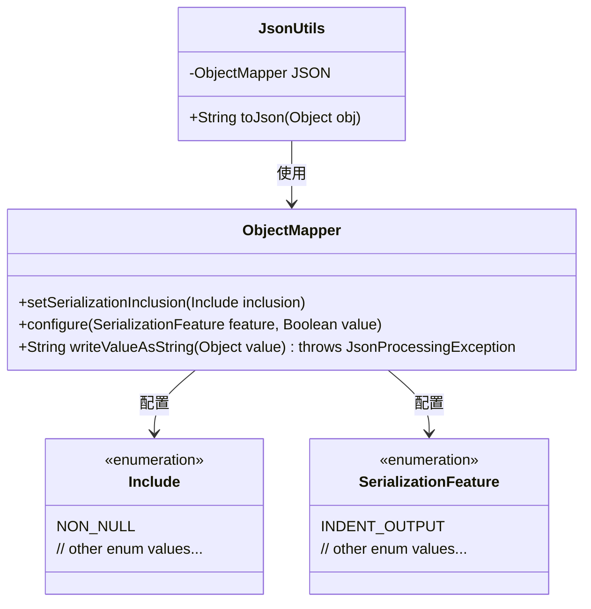
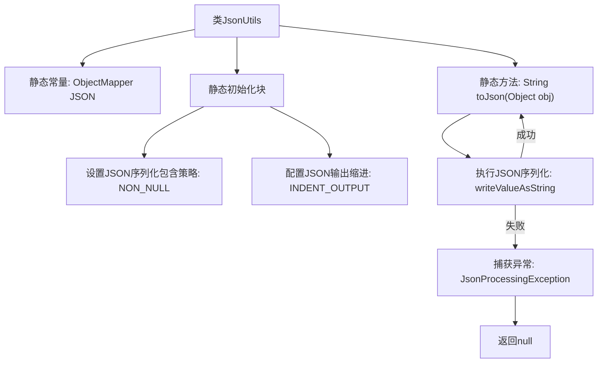

# 基础信息

|      |      |
|------|------|
| 名称 | JsonUtils |
| 编码语言 | .java |
| 代码路径 | weixin-java-miniapp-demo/src/main/java/com/github/binarywang/demo/wx/miniapp/utils/JsonUtils.java |
| 包名 | com.github.binarywang.demo.wx.miniapp.utils |
| 依赖项 | ['com.fasterxml.jackson.annotation.JsonInclude.Include', 'com.fasterxml.jackson.core.JsonProcessingException', 'com.fasterxml.jackson.databind.ObjectMapper', 'com.fasterxml.jackson.databind.SerializationFeature'] |
| 概述说明 | JsonUtils工具类，使用ObjectMapper配置非NULL字段序列化和格式化输出，提供toJson方法将对象转为JSON字符串，异常时返回null。 |

# 说明

JsonUtils是一个工具类，用于处理JSON序列化。它使用ObjectMapper进行配置，静态初始化时设置序列化规则为排除空值字段，并启用格式化输出。提供了toJson方法将对象转为JSON字符串，内部调用writeValueAsString方法。若转换失败会打印异常并返回null。

# 类列表 Class Summary

| 名称   | 类型  | 说明 |
|-------|------|-------------|
| JsonUtils | class | JsonUtils类提供静态方法toJson，使用ObjectMapper将对象转为JSON字符串，自动忽略null值并格式化输出，异常时返回null。 |

## 类 JsonUtils

|      |      |
|------|------|
| 访问范围 | public |
| 类型 | class |
| 名称 | JsonUtils |
| 说明 | JsonUtils类提供静态方法toJson，使用ObjectMapper将对象转为JSON字符串，自动忽略null值并格式化输出，异常时返回null。 |

### UML类图

这段类图展示了JsonUtils工具类与Jackson库核心组件的关系。JsonUtils通过静态ObjectMapper实例提供JSON序列化功能，配置了非空值过滤和缩进输出特性。ObjectMapper依赖于枚举类Include和SerializationFeature来实现序列化配置。该设计封装了JSON处理的复杂性，但异常处理直接打印堆栈可能不够完善，适合简单场景使用。

### 内部方法调用关系图

该流程图展示了JsonUtils工具类的核心结构，包含静态初始化块配置ObjectMapper实例，以及toJson方法的执行流程。静态初始化阶段设置非空值序列化和缩进输出，toJson方法尝试将对象转为JSON字符串，失败时打印异常并返回null。整个设计体现了JSON处理的健壮性和配置灵活性。

### 字段列表 Field List

| 名称  | 类型  | 说明 |
|-------|-------|------|
| JSON = new ObjectMapper() | ObjectMapper | 创建静态不可变的JSON对象映射器实例。 |

### 方法列表

| 名称  | 类型  | 说明 |
|-------|-------|------|
| toJson | String | 静态方法toJson将对象转为JSON字符串，失败时打印异常并返回null。 |

