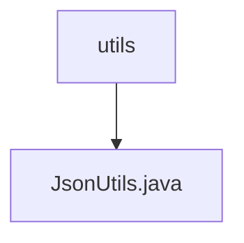

# 基础信息

|      |      |
|------|------|
| 名称 | utils |
| 编码语言 | .java |
| 代码路径 | weixin-java-miniapp-demo/src/main/java/com/github/binarywang/demo/wx/miniapp/utils |
| 包名 | docs.src.main.java.com.github.binarywang.demo.wx.miniapp.utils |
| 概述说明 | JsonUtils工具类，使用ObjectMapper配置非NULL字段序列化和格式化输出，提供toJson方法将对象转为JSON字符串，异常时返回null。 |

# 说明

JsonUtils是一个工具类，用于处理JSON序列化。它使用ObjectMapper进行配置，静态初始化时设置序列化规则为排除空值字段，并启用格式化输出。提供了toJson方法将对象转为JSON字符串，内部调用writeValueAsString方法。若转换失败会打印异常并返回null。

### 包内部结构视图

该流程图展示了微信小程序demo项目中工具类目录的结构关系。顶层节点是utils目录，其下包含一个JsonUtils.java工具类文件。这种简洁的层级结构体现了工具类模块的典型组织方式，通常将相关工具方法集中存放在utils目录下，便于统一管理和调用。

# 文件列表

| 名称   | 类型  | 说明 |
|-------|------|-------------|
| [JsonUtils.java](JsonUtils.md) | file | JsonUtils工具类，使用ObjectMapper配置非NULL字段序列化和格式化输出，提供toJson方法将对象转为JSON字符串，异常时返回null。 |

