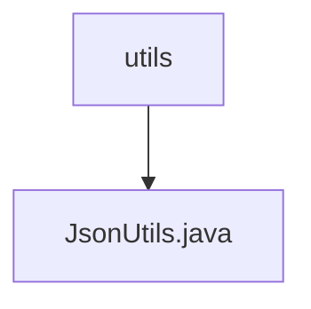

# 基础信息

|      |      |
|------|------|
| 名称 | utils |
| 编码语言 | .java |
| 代码路径 | weixin-java-miniapp-demo/src/main/java/com/github/binarywang/demo/wx/miniapp/utils |
| 包名 | docs.src.main.java.com.github.binarywang.demo.wx.miniapp.utils |
| 概述说明 | JsonUtils类提供静态JSON序列化方法，使用ObjectMapper配置忽略null值并格式化输出，异常时返回null。 |

# 说明

JsonUtils是一个工具类，用于处理JSON序列化。它使用ObjectMapper作为核心组件，并在静态初始化块中配置了两个关键选项：一是设置序列化时忽略null值，二是启用缩进输出以提高可读性。该类提供了一个静态方法toJson，用于将任意对象转换为JSON字符串。若转换过程中发生JsonProcessingException异常，会打印异常堆栈并返回null。整个类设计简洁，专注于JSON序列化的基础功能。

### 包内部结构视图

该流程图展示了微信小程序demo项目中工具类的层级关系。顶层节点是utils目录，其下包含一个JsonUtils.java工具类文件，用于处理JSON相关操作。这种简洁的层级结构是典型工具类模块的组织方式，便于集中管理通用功能组件。

# 文件列表

| 名称   | 类型  | 说明 |
|-------|------|-------------|
| [JsonUtils.java](JsonUtils.md) | file | JsonUtils类提供静态JSON序列化方法，使用ObjectMapper配置忽略null值并格式化输出，异常时返回null。 |

