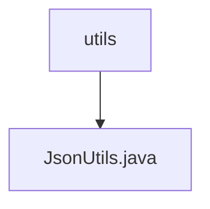

# 基础信息

|      |      |
|------|------|
| 名称 | utils |
| 编码语言 | .java |
| 代码路径 | weixin-java-miniapp-demo/src/main/java/com/github/binarywang/demo/wx/miniapp/utils |
| 包名 | docs.src.main.java.com.github.binarywang.demo.wx.miniapp.utils |
| 概述说明 | JsonUtils工具类使用ObjectMapper实现对象转JSON字符串，自动忽略null值并格式化输出，异常时返回null。 |

# 说明

JsonUtils是一个工具类，用于处理JSON序列化。它使用ObjectMapper作为核心组件，并在静态初始化块中配置了两个关键选项：忽略空值字段和启用缩进格式化输出。该类提供了一个静态方法toJson，可将任意对象转换为JSON字符串。若转换过程中发生JsonProcessingException异常，会打印异常堆栈并返回null。整个类设计简洁，专注于JSON序列化功能。

### 包内部结构视图

该流程图展示了微信小程序demo项目中utils目录与JsonUtils.java文件的层级关系。utils作为目录节点包含一个子节点JsonUtils.java，表示这是一个工具类文件位于utils目录下，用于处理JSON相关操作。整个结构简洁明了，符合Java项目典型目录结构。

# 文件列表

| 名称   | 类型  | 说明 |
|-------|------|-------------|
| [JsonUtils.java](JsonUtils.md) | file | JsonUtils工具类使用ObjectMapper实现对象转JSON字符串，自动忽略null值并格式化输出，异常时返回null。 |

