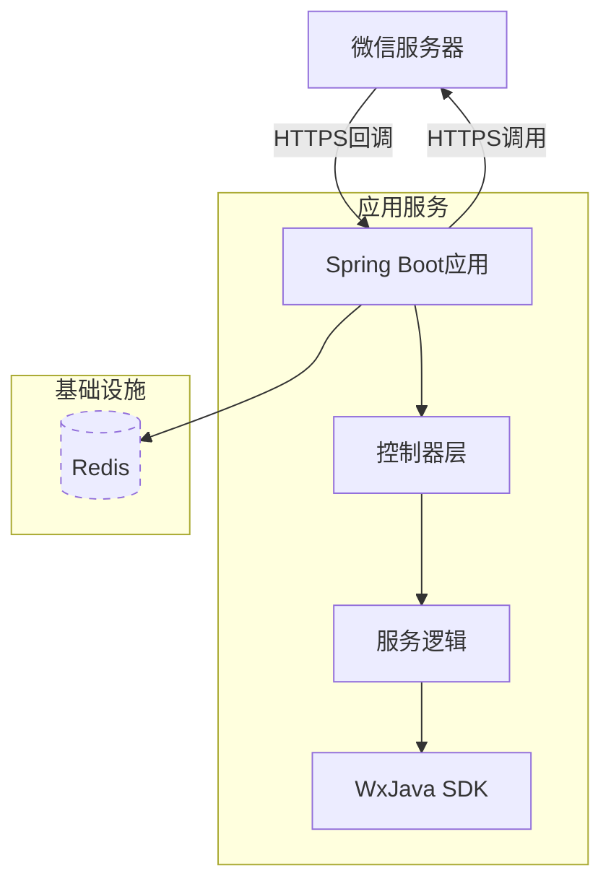

# 系统架构

## 系统概览

该后端项目是一个基于微信小程序生态的Java服务端实现，专注于为微信小程序提供后端支持。核心功能围绕微信小程序的API对接和消息处理展开，包括小程序配置管理、消息服务器处理和基础服务接口。

* **项目核心功能与业务领域：** 作为微信小程序的后端服务，主要处理小程序配置、消息服务器交互和API对接。业务领域属于社交平台服务集成，特别针对微信生态的小程序开发场景。
* **架构模式：** 采用**单体应用架构**，基于Spring Boot框架实现。
* **架构模式支撑依据：**
    * 部署配置中仅包含单一Docker服务定义，对应一个可执行JAR包
    * 项目结构显示为标准Maven单体项目布局，无多服务目录结构
    * 配置文件中集中管理所有小程序相关配置
    * 使用Spring Boot作为全功能框架，未体现服务拆分迹象

## 核心组件与功能图谱

系统采用经典的三层架构设计，但数据访问层直接集成在应用服务中。由于项目性质特殊，部分传统分层组件在此场景下有所简化。

* **流量入口层 (Traffic Entry Layer)：**
    * **组件与职责：** 直接由Spring Boot内嵌Tomcat容器承担，处理所有HTTP/HTTPS请求。作为微信服务器与业务逻辑间的唯一入口，负责请求路由和响应返回。
    * **实现考量：** 单体架构下通常直接使用应用服务器的网络能力，无需额外API网关。微信小程序要求的HTTPS通信由内嵌容器支持。

* **应用服务层 (Application Service Layer)：**
    * **核心服务：**
        * **微信小程序对接服务**
            * **主要职责：** 实现微信小程序服务器配置验证、消息加解密、API调用凭证管理
            * **技术基座：** Java 8 + Spring Boot + WxJava SDK
            * **内部结构：** 基于Spring MVC模式，包含：
                - `controller/`: 处理微信服务器推送和API端点
                - `service/`: 核心业务逻辑和微信API封装
                - `config/`: 小程序配置管理
        
    * **异步任务处理：** 当前架构未见显式异步处理设计。考虑到微信模板消息等场景，未来可能引入：
        - 消息队列（RabbitMQ/Kafka）处理异步通知
        - 定时任务刷新API访问令牌

* **数据管理层 (Data Management Layer)：**
    * **数据存储：** 当前配置未显式声明持久化存储。根据微信小程序对接需求，可能需要：
        - 关系型数据库（MySQL）存储用户会话信息
        - Redis缓存微信API访问令牌和临时数据
    * **数据策略：** 微信部分接口要求服务器IP白名单，需要稳定的网络出口配置

## 容器配置概览

系统采用最小化的容器部署方案，仅包含核心应用服务。数据库等基础设施可能通过外部服务提供。

| 服务名称 | 容器镜像 | 暴露端口 | 挂载卷 | 关键环境变量 | 启动命令/入口点 |
|----------|----------|----------|--------|--------------|-----------------|
| 主应用服务 | openjdk:8-jdk-alpine构建 | 未显式声明 | /tmp | JAVA安全配置 | java -jar /app.jar |

## 服务间协作与数据流转

系统交互模式相对简单，主要涉及与微信服务器的双向通信：

1. **微信服务器推送**：通过配置的服务器地址，微信服务器发送验证请求和消息事件
2. **API调用**：服务主动调用微信接口（如发送模板消息、获取用户信息）
3. **数据流特点**：
    - 使用JSON作为主要数据格式
    - 依赖微信自定义的加密协议（AES-128-CBC）
    - 敏感配置（appid/secret）通过环境变量或配置文件注入

## 整体架构概览图

## 架构师核心洞察与未来展望

* **弹性扩展：** 当前单体架构适合初期阶段，如需扩展可考虑：
    - 水平复制应用实例配合负载均衡
    - 将令牌管理等有状态服务外移到Redis集群

* **安全加固：**
    - 实现配置信息的密钥管理（如Vault）
    - 增强请求签名验证防御重放攻击
    - 微信消息加密密钥的轮换机制

* **可观测性：**
    - 集成Spring Boot Actuator暴露健康指标
    - 微信API调用失败告警
    - 消息处理耗时监控

* **演进方向：**
    1. 将微信多小程序管理功能模块化
    2. 增加BFF层适配不同终端
    3. 引入事件总线处理跨小程序交互
    4. 对接微信云开发实现混合部署

该架构当前聚焦最小可行实现，在保持轻量级优势的同时，各扩展点已预留技术空间。随着业务复杂度的提升，可逐步向模块化方向演进而不需要立即转向微服务架构。

