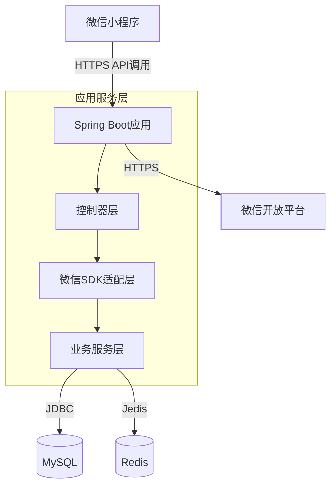

# 系统架构

## 系统概览

* **项目核心功能与业务领域：** 该项目是一个基于微信小程序生态的后端服务，核心功能围绕微信小程序的API集成和消息处理展开。主要业务领域包括微信小程序的身份认证、消息服务器配置和基础服务对接。
* **架构模式：** 采用**单体应用**架构模式。
* **架构模式支撑依据：**
    * 部署配置中仅包含单个Docker容器定义，对应一个可执行的Spring Boot应用JAR包。
    * 项目结构未显示微服务特有的目录划分（如`services/`或独立服务模块）。
    * 应用配置集中在一个`application.yml`文件中，未出现多服务配置分离的情况。
    * 技术栈统一采用Java/Spring Boot框架，无多语言混合迹象。

## 核心组件与功能图谱

* **流量入口层 (Traffic Entry Layer)：**
    * **组件与职责：** 直接由Spring Boot内嵌的Tomcat服务器作为HTTP端点，处理来自微信小程序平台的API请求和消息推送。未使用额外API网关层。
    * **实现考量：** 单体架构下内嵌Web容器可简化部署，微信小程序官方要求的HTTPS通信由Spring Boot自动支持。

* **应用服务层 (Application Service Layer)：**
    * **服务清单与核心功能：**
        * **微信小程序集成服务**：
            * **主要职责：** 实现微信小程序服务端API对接，包括：
                - 小程序登录态校验（`wx.login`接口后端验证）
                - 消息服务器配置验证（处理微信服务器GET请求）
                - 消息加解密（AES-128-CBC算法实现）
                - 模板消息推送等增值功能
            * **技术基座：** Java 8 + Spring Boot框架，依赖`wx-java-miniapp` SDK处理微信协议。
            * **内部结构洞察：** 典型Spring MVC分层：
                - `@RestController`处理HTTP端点
                - 服务层实现业务逻辑
                - `wx-java-miniapp` SDK封装微信API调用
    * **异步任务与后台处理：** 未显式配置消息队列或异步处理器，但微信模板消息发送等场景可能存在异步优化空间。

* **数据管理层 (Data Management Layer)：**
    * **数据存储组件识别与职责：** 配置中未明确数据库依赖，但微信小程序业务通常需要：
        - **关系型数据库**（MySQL）：存储用户OpenID、会话密钥等持久化数据
        - **Redis缓存**：维护用户登录态（如3rd_session机制）
    * **数据职责与选型考量：** 微信生态要求敏感数据（如session_key）需服务端安全存储，MySQL提供ACID保障，Redis支撑高并发会话校验。

## 容器配置概览

| 服务名称 | 容器镜像 | 暴露端口 | 挂载卷 | 关键环境变量 | 启动命令/入口点 |
|---------|----------|----------|--------|--------------|-----------------|
| 主应用服务 | 基于`openjdk:8-jdk-alpine`构建 | 隐含8080（Spring Boot默认） | `/tmp`卷用于临时文件 | 通过JVM参数`-Djava.security.egd`加速熵源 | `java -jar /app.jar` |

## 服务间协作与数据流转

* **核心通信路径：**
    1. 微信小程序客户端 → HTTPS → Spring Boot应用（消息处理/API响应）
    2. 应用服务 → HTTPS → 微信开放平台API（主动调用如模板消息发送）
* **交互模式与协议：**
    - 同步HTTP(S)通信为主，遵循微信小程序服务端开发规范
    - 消息加密采用微信自定义的AES-128-CBC模式
* **共享与隔离：** 单体架构下所有模块共享同一数据源，无服务间数据隔离需求。

## 整体架构概览图

## 架构师核心洞察与未来展望

* **弹性与扩展性策略：** 当前单体架构可通过增加Pod副本实现无状态部分水平扩展，但数据库可能成为瓶颈。建议引入读写分离和连接池优化。
* **高可用性与韧性设计：** 需确保微信消息服务器的多实例验证通过（相同token/aesKey），建议配置中心化存储密钥。
* **安全防御体系：** 关键风险点在于微信会话密钥管理，需：
    - 实现自动化的密钥轮换机制
    - 禁止日志记录敏感参数
    - 启用Spring Security防护管理端点
* **运维可观测性与自动化：** 当前缺乏监控指标暴露，建议集成：
    - Micrometer + Prometheus监控微信API调用延迟
    - 集中式日志收集微信消息处理异常
* **性能优化潜力：** 
    - 高频接口（如登录校验）可增加二级缓存
    - 微信API调用应配置连接池（如Apache HttpClient）
* **技术栈合理性评估：** Java 8技术栈成熟稳定，但需规划JDK升级路径。`wx-java-miniapp` SDK社区活跃度需持续关注。
* **未来演进路径：** 若业务复杂度增长，可考虑：
    - 拆分为独立的消息网关服务与业务服务
    - 引入React式编程模型应对微信生态的高并发场景
    - 集成Serverless架构处理消息推送等事件驱动型任务

