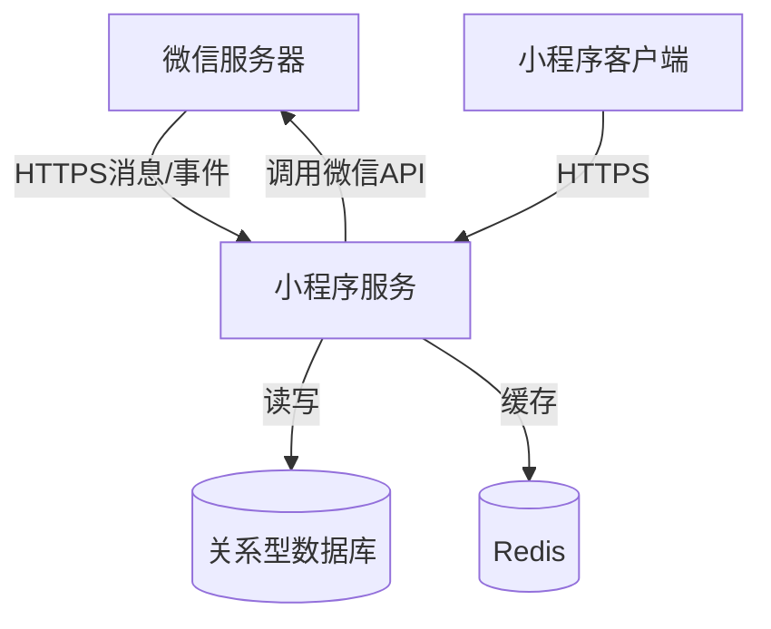

# 系统架构

## 系统概览

本节概述了微信小程序 Java 后端项目的核心功能、业务领域和架构模式。

* **项目核心功能与业务领域：**  
  该项目是一个微信小程序的后端服务，核心功能包括：
  - 微信小程序 API 集成（消息服务器配置、用户认证、数据交互）
  - 小程序业务逻辑处理
  - 微信支付集成（通过 FUNDING.yml 推断）
  业务领域属于社交/电商类小程序后端服务。

* **架构模式：**  
  **单体应用架构**  
  关键依据：
  - 单一 Dockerfile 构建一个可执行 JAR 包
  - 没有多服务定义或独立服务目录结构
  - 统一的 Spring Boot 应用配置（application.yml）
  - 单一代码库和构建流程（Maven）

## 核心组件与功能图谱

本节详细解析系统的主要组件及其职责。

* **流量入口层 (Traffic Entry Layer)：**
  * **组件与职责：**  
    直接暴露 Spring Boot 内嵌 Tomcat 服务器（默认端口 8080），处理所有微信小程序 API 请求和消息推送。
  * **实现考量：**  
    生产环境建议前置 Nginx 作为反向代理，处理 SSL 终止和负载均衡。

* **应用服务层 (Application Service Layer)：**
  * **服务清单与核心功能：**  
    - **微信小程序服务**  
      **主要职责：**
      - 处理微信服务器推送的消息和事件
      - 实现小程序后台 API（用户登录、数据获取等）
      - 微信支付回调处理
      **技术基座：**
      - Java 8 + Spring Boot
      - WxJava SDK（cn.binarywang.wx.miniapp）
      **内部结构：**
      - 控制器层处理微信消息和API请求
      - 服务层封装微信API调用逻辑
      - 配置层管理小程序凭证（appid/secret等）

* **数据管理层 (Data Management Layer)：**
  * **数据存储组件：**  
    未明确配置，但典型实现需要：
    - MySQL/PostgreSQL：存储用户数据、业务数据
    - Redis：缓存微信access_token等临时凭证
  * **数据职责：**  
    - 持久化存储用户与业务数据
    - 缓存提升高频接口性能（如凭证获取）

## 容器配置概览

| 服务名称 | 容器镜像 | 暴露端口 | 挂载卷 | 关键环境变量 | 启动命令/入口点 |
|---------|----------|----------|--------|--------------|-----------------|
| 微信小程序服务 | openjdk:8-jdk-alpine + app.jar | 8080 (默认) | /tmp | 通过JVM参数配置 | `java -jar /app.jar` |

## 服务间协作与数据流转

* **核心通信路径：**
  1. 微信服务器 → (HTTPS) → 小程序服务
  2. 小程序服务 → (HTTP API) → 微信开放平台
  3. 小程序服务 → (JDBC) → 数据库

* **交互模式：**
  - 同步HTTP请求-响应（小程序API调用）
  - 事件推送（微信服务器消息）

## 整体架构概览图

## 架构师核心洞察与未来展望

* **弹性与扩展性：**
  - 无状态设计支持水平扩展
  - 建议引入Kubernetes实现自动扩缩容

* **高可用性：**
  - 多实例部署+负载均衡
  - 数据库主从复制

* **安全防御：**
  - 必须实现HTTPS加密
  - 敏感配置（appid/secret）应使用Vault管理

* **性能优化：**
  - 微信access_token集中管理避免重复获取
  - 高频接口增加Redis缓存

* **演进方向：**
  - 拆分为独立支付服务、消息服务
  - 引入消息队列处理异步任务
  - 增加API网关统一入口

